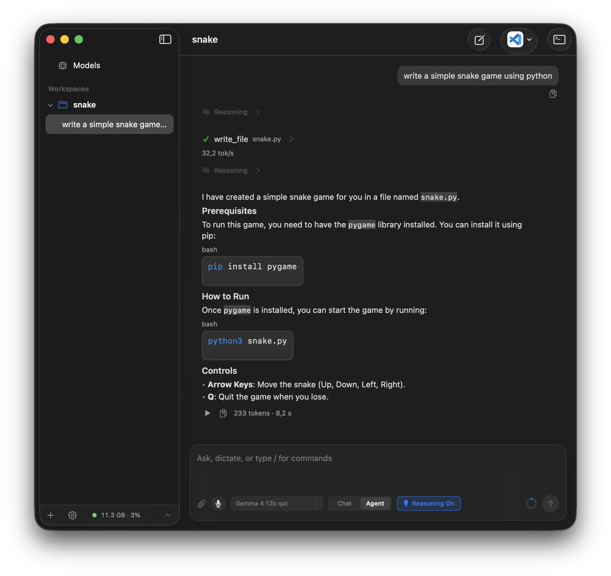
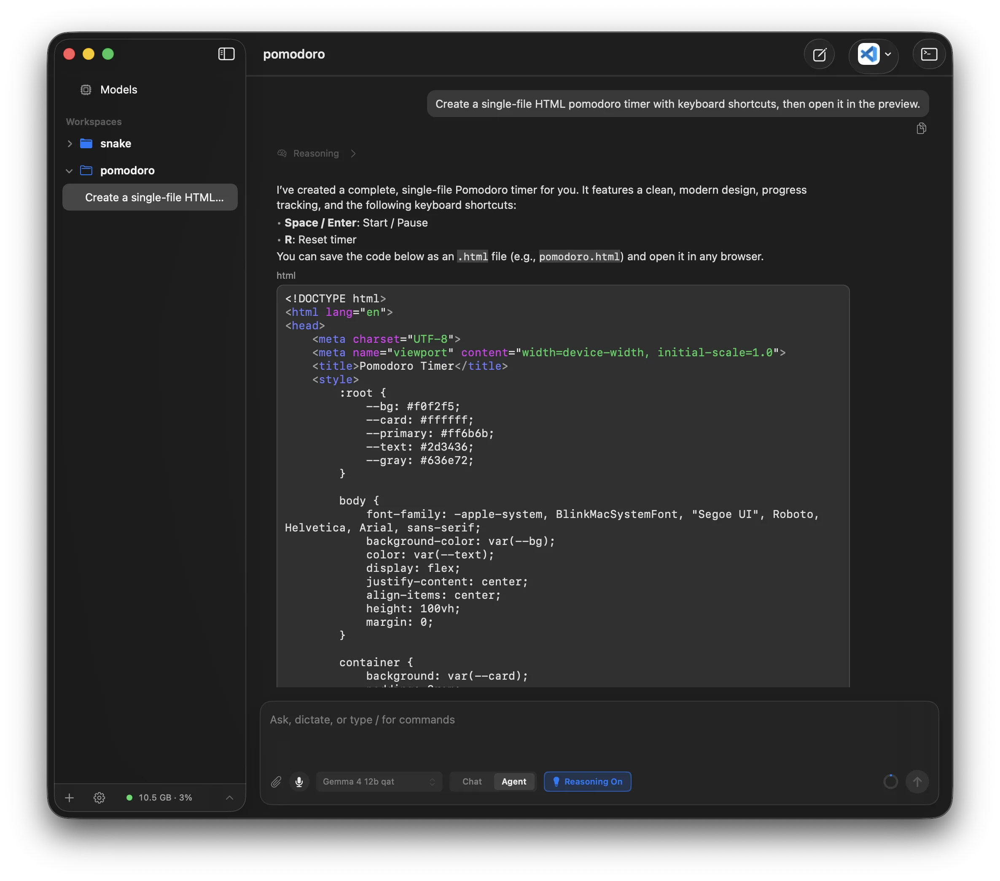
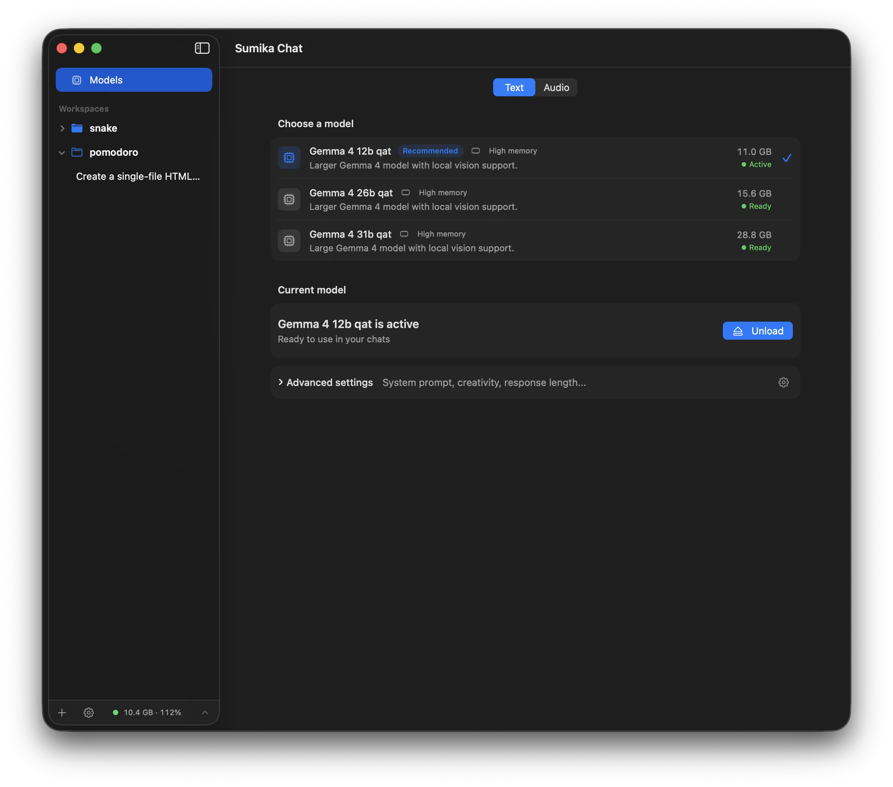

[](https://github.com/ngutech21/sumika-chat/actions/workflows/ci.yml)
[](https://github.com/ngutech21/sumika-chat/actions/workflows/macos-nightly.yml)
[](https://github.com/ngutech21/sumika-chat/actions/workflows/actions-lint.yml)
[](https://github.com/ngutech21/sumika-chat/actions/workflows/spelling.yml)

# Sumika

A self-contained, private AI assistant for your Mac. Sumika runs local models
directly through MLX — no Ollama, LM Studio, external model server, API key, or
separate runtime required.

Install the app, choose and download a model, and start chatting right away.

Use Chat mode to write, translate, summarize, research, or code. Switch to Agent
mode when you want Sumika to write code, work with your files, use approved
tools, or connect to local apps. Your conversations and model execution stay on
your Mac, and you remain in control of every action.

## Highlights

- 💬 **Everyday AI assistance**: write, brainstorm, translate, summarize,
  research, and ask questions without needing a technical background.
- 🏠 **Everything you need in one app**: download a model from the built-in
  model browser and start chatting. No Ollama, LM Studio, or separate inference
  backend is required.
- 🌟 **No recurring subscription**: use local models without paying for a
  hosted AI assistant plan.
- 🧭 **Explicit context**: attach files, focus workspace context, and inspect
  what the model sees before the workflow grows opaque.
- 🛠 **An agent that asks first**: let Sumika work with files, use connected
  tools, and run commands while you review sensitive actions.
- 🧩 **Connect local apps**: extend Agent mode through Model Context
  Protocol (MCP) servers and choose the integrations available to each session.
- ✅ **Review before action**: writes, edits, shell commands, and web access pass
  through approval instead of running as hidden automation.
- 🌐 **Bring your own search**: connect a self-hosted SearXNG instance or use the
  built-in DuckDuckGo search provider.
- 📄 **Bring your own fetcher**: keep the built-in page extractor or point fetch
  at a self-hosted Firecrawl instance.
- 🧰 **Terminal and browser built in**: run approved workspace commands and
  inspect local previews without leaving the app.
- 🖥 **Build and preview locally**: create small apps, prototypes, and HTML
  experiments, then inspect them beside the chat.
- 🗣 **Speak and dictate**: listen to assistant responses with Apple system voices
  and turn speech into prompts with local English or multilingual transcription
  models.
- 🔄 **Update checks built in**: automatically check for signed releases and
  install them through the native Sparkle update flow.
- 🧾 **Inspectable transcript**: keep prompts, assistant responses, tool calls,
  approvals, and command output visible in the chat.

## Install Sumika

1. Download the latest `Sumika-*-macos.dmg` from the
   [GitHub Releases page](https://github.com/ngutech21/sumika-chat/releases/latest).
2. Open the downloaded DMG and drag **Sumika** into **Applications**.
3. Start Sumika from the Applications folder and download a local model from
   the Models screen.
4. Open a conversation and choose Chat or Agent mode.

Release downloads are signed and notarized for macOS. Once installed, Sumika
checks automatically for new versions. When an update is available, the app
guides you through installing it, so you do not need to download another DMG.
You can also check manually from **Sumika > Check for Updates…**.

## Supported Models

All listed models run locally and support Chat mode, Agent tool calling, and
image input.

| Model | Download size |
| --- | ---: |
| [Gemma 4 E4B QAT 4-bit](https://huggingface.co/mlx-community/gemma-4-e4b-it-qat-4bit) | 6.8 GB |
| [Gemma 4 12B QAT 4-bit](https://huggingface.co/mlx-community/gemma-4-12B-it-qat-4bit) | 11.0 GB |
| [Gemma 4 26B QAT 4-bit](https://huggingface.co/mlx-community/gemma-4-26B-A4B-it-qat-4bit) | 15.6 GB |
| [Gemma 4 31B QAT 4-bit](https://huggingface.co/mlx-community/gemma-4-31B-it-qat-4bit) | 28.8 GB |
| [Qwen 3.6 27B 4-bit](https://huggingface.co/mlx-community/Qwen3.6-27B-4bit) | 16.1 GB |
| [Qwen 3.6 27B 8-bit](https://huggingface.co/mlx-community/Qwen3.6-27B-8bit) | 29.5 GB |
| [Qwen 3.6 35B A3B 4-bit](https://huggingface.co/mlx-community/Qwen3.6-35B-A3B-4bit) | 20.4 GB |
| [Qwen 3.6 35B A3B 8-bit](https://huggingface.co/mlx-community/Qwen3.6-35B-A3B-8bit) | 37.7 GB |

## Screenshots

### Agent workflow



Sumika can work in agent mode, write files through approval-aware tools, and
keep the transcript inspectable while it works.

### Local preview



Build small local HTML, CSS, and JavaScript prototypes, then inspect them in the
native preview pane.

### Local models



Download, load, and inspect local models from the macOS app without turning the
chat into a cloud workflow.

## What You Can Do

- Write and refine text, brainstorm ideas, translate languages, and summarize
  longer content.
- Ask questions about your own files and choose what the model can see.
- Research topics on the public web through reviewable search and fetch tools.
- Connect local apps and services through configured MCP integrations when you
  want Sumika to take action beyond the chat.
- Let the agent read, organize, search, and update local project files while you
  review sensitive actions.
- Build small apps, scripts, games, and UI prototypes in short, reviewable
  steps.
- Review generated file writes, file edits, shell commands, and workspace diffs
  before they run.
- Use the integrated terminal and browser preview while working through an agent
  task.
- Open local HTML previews and inspect browser state while iterating.
- Transcribe speech locally and dictate prompts in English, German, and other
  supported European languages instead of typing them.
- Listen to assistant responses with installed Apple voices.
- Receive automatic update checks and install signed releases from the app.
- Follow prompts, assistant responses, tool calls, approvals, and command output
  in one visible transcript.

## Interaction Modes

Choose how much Sumika can do in each conversation:

- **Chat**: talk, write, translate, summarize, and research the public web. Chat
  mode cannot access local files, run commands, or make changes.
- **Agent**: let Sumika work with a selected folder, connected tools, commands,
  and browser previews. Sensitive actions remain subject to approval.

You select the mode yourself. Sumika never grants itself access because of how
a prompt is worded.

## No Cloud Account Required

Sumika is designed as a private alternative to subscription-based cloud
assistants.

- No recurring AI subscription or hosted workspace account is required.
- No telemetry, prompts, transcripts, commands, or workspace contents are
  exported by the app.
- Model execution, chat history, speech output, and dictation stay on your Mac.
- Network access is explicit: web search and fetch tools only run when available
  in the selected mode and approved by policy.
- You can use the built-in DuckDuckGo search provider or point Sumika at your
  own SearXNG instance. Fetch uses the built-in extractor by default and can
  optionally use a self-hosted Firecrawl instance without storing an API key.

## Voice And Dictation

Sumika includes two local voice surfaces:

- **Assistant speech** adds play controls to completed text responses. It uses
  Apple system voices installed on the Mac, supports language and voice
  selection, and lets you tune speech rate.
- **Speech-to-text and composer dictation** record and transcribe prompts on the
  Mac. Choose the small, fast English model for English prompts or the larger
  multilingual Parakeet model to capture prompts in German and other supported
  European languages.

## MCP Servers

The Model Context Protocol (MCP) lets AI assistants use tools provided by other
apps and services. Configure MCP servers globally in Settings using stdio or
Streamable HTTP, then choose the servers available to each Agent session from
the composer. MCP tools stay out of Chat mode, and every MCP tool call requires
approval before execution.

## Why Local First

Most AI assistants send conversations to cloud models and charge a recurring
subscription. Sumika takes a different approach:

- Local-first model execution on macOS
- Everyday assistance without requiring technical knowledge
- No recurring AI subscription
- User-controlled workspace context
- Reviewable agent steps instead of hidden automation
- Approval-gated tool and shell execution
- Visible transcripts and tool states for review
- Native macOS workflows instead of a browser-first interface

## The Name

`sumika` means "dwelling" or "place to live" in Japanese. `sumika.chat` is meant
as a local home for AI agents: close to your files, explicit about what context
they see, and reviewable before they act.

## Project Status

Sumika is an evolving prototype. It is useful for local conversations, everyday
AI assistance, and agent workflows, but APIs, persisted data, and workflows are
still changing.

## Architecture

The project uses one Swift package with three production modules and a thin
native Xcode app target:

- `SumikaCore` owns provider-neutral domain models, agent/workflow logic,
  persistence, tools, and runtime interfaces.
- `SumikaRuntimeMLX` implements the local MLX/Hugging Face runtime behind the
  core interfaces.
- `SumikaApp` owns SwiftUI/AppKit, launch composition, and macOS integrations
  such as Sparkle.
- `sumika/` contains only the native app launcher, resources, entitlements, and
  bundle metadata.

Dependencies point one-way: `SumikaApp` -> `SumikaRuntimeMLX` ->
`SumikaCore`; `SumikaApp` may also use `SumikaCore` directly. All external
Swift package dependencies are declared in the root `Package.swift`; the Xcode
app target links only the local `SumikaApp` product.

- [Tool Runtime](docs/tool-runtime.md): core flow for adding type-safe tools,
  permissions, registries, and model-facing tool calls.
- [Chat Runtime](docs/chat-runtime.md): chat turn lifecycle, cancellation,
  transcript state, and model-context filtering.

## Development

Install the local task runner, linter, and formatter:

```sh
brew install just swiftlint swift-format
```

Build the app locally:

```sh
just build
open "build/DerivedData/Build/Products/Debug/Sumika.app"
```

Build an unsigned release app:

```sh
just release-unsigned
open "build/DerivedData/Build/Products/Release/Sumika.app"
```

Build and export a Developer ID-signed release archive:

```sh
DEVELOPER_ID_APPLICATION="Developer ID Application: …" just release-signed
```

The signed release command verifies the exported app, including the embedded
Sparkle framework, updater, XPC helpers, update feed configuration, nested
signatures, signing team, hardened runtime, and release entitlements.

You can also build from Xcode by opening `Sumika.xcodeproj` and running the
`Sumika` scheme for macOS.

Common development tasks:

```sh
just test
just lint
just format
just final-check
```

`just build` and `just release-unsigned` run the `Sumika` Xcode scheme with a
stable DerivedData path under `build/DerivedData`. `just test` combines the
headless SwiftPM core/generator tests with the Xcode-hosted app and MLX runtime
unit tests. `just lint` runs SwiftLint using `.swiftlint.yml`. `just format`
checks Swift sources with `swift-format`. `just final-check` runs the broader
local verification suite before review.

`just resolve-packages` resolves both the root SwiftPM graph and the Xcode app
graph. Commit both `Package.resolved` files after dependency changes.
`just check-package-locks` disables automatic dependency updates and verifies
that both committed lockfiles still satisfy their graph. The two files
represent different resolver roots and are not expected to be byte-identical.
If a Dependabot PR changes the root graph and this check reports a stale Xcode
lockfile, run `just resolve-packages` and commit the regenerated Xcode
`Package.resolved` file to the PR.

## License

Licensed under the [Apache License 2.0](LICENSE).
