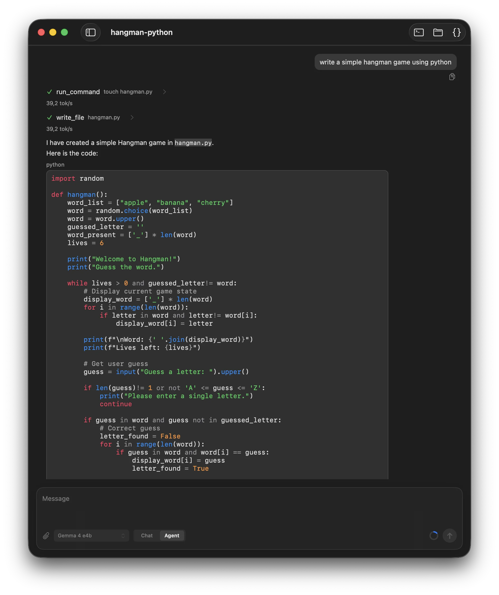

# sumika-chat

A local-first macOS app for running private, inspectable AI agents on your own
machine.

[](https://github.com/ngutech21/sumika-chat/actions/workflows/ci.yml)
[](https://github.com/ngutech21/sumika-chat/actions/workflows/macos-nightly.yml)
[](https://github.com/ngutech21/sumika-chat/actions/workflows/actions-lint.yml)
[](https://github.com/ngutech21/sumika-chat/actions/workflows/spelling.yml)



## What It Is

sumika-chat is a native macOS app for working with local AI agents. It runs small
Gemma models through MLX and focuses on private, inspectable workflows:
explicit context, short agent steps, approval-gated actions, and traceable
execution.

Coding is the first deep workflow, but the app is designed as a general local
agent environment rather than a coding-only assistant.

## Use Cases

sumika-chat is meant for work where you want agent help without giving up local
control or inspectability:

- Research a topic with web search and web fetch, while keeping web access
  explicit and policy-gated.
- Build small local apps, prototypes, scripts, and UI experiments in short,
  reviewable steps.
- Ask questions about a workspace by letting the agent read, list, search, and
  summarize local files.
- Run commands, inspect diagnostics, and review diffs with approval before
  side-effecting actions.
- Iterate on local HTML previews with browser refresh and inspection tools.
- Keep a trace of model requests, responses, tool calls, approvals, and command
  results for debugging and review.

## The Name

`sumika` means "dwelling" or "place to live" in Japanese. `sumika.chat` is meant
as a local home for AI agents: close to your files, explicit about what context
they see, and reviewable before they act.

## Why

Many agent products assume cloud models, opaque context selection, and broad
implicit access to your data or tools. sumika-chat explores a different
direction:

- Local-first model execution on macOS
- User-controlled context and workspace access
- Reviewable agent steps instead of hidden automation
- Approval-gated tool and shell execution
- Inspectable traces for debugging and trust
- Native macOS workflows instead of a browser-first interface

## Current Capabilities

- Chat with a local Gemma model
- Use explicit workspace interaction modes
- Provide local context to the model
- Search and fetch the public web through policy-gated agent tools
- Read, list, search, and summarize local workspace files
- Run shell commands only through approval-aware execution
- Review workspace diffs and command diagnostics
- Inspect local HTML previews through browser tools
- Run typed tools through an approval-aware runtime
- Inspect model requests, responses, tool calls, and turn traces
- Use coding-agent workflows for local repositories
- Keep core agent logic testable in a headless SwiftPM package

## Project Status

sumika-chat is an unreleased prototype. The app is useful for experimentation,
but APIs, persisted data, and workflows are still changing.

## Architecture

The project is split into a headless SwiftPM core library and a macOS app
target. Reusable agent, runtime, persistence, and workflow logic lives in
`SumikaCore`; the app target owns SwiftUI/AppKit views, launch wiring, platform
services, and MLX-backed implementations.

- [Tool Runtime](docs/tool-runtime.md): core flow for adding type-safe tools,
  permissions, registries, and model-facing tool calls.
- [Chat Runtime](docs/chat-runtime.md): chat turn lifecycle, cancellation,
  transcript state, and model-context filtering.

## Development

Install the local task runner, linter, and formatter:

```sh
brew install just swiftlint swift-format
```

Common tasks:

```sh
just build
just test
just lint
just format
just final-check
```

`just build` and `just test` run the `Sumika` Xcode scheme with a stable
DerivedData path under `build/DerivedData`. `just lint` runs SwiftLint using
`.swiftlint.yml`. `just format` formats Swift sources with `swift-format`.
`just final-check` runs the broader local verification suite before review.

## License

Licensed under the [Apache License 2.0](LICENSE).
