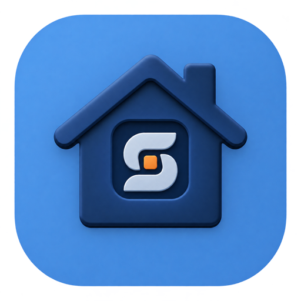
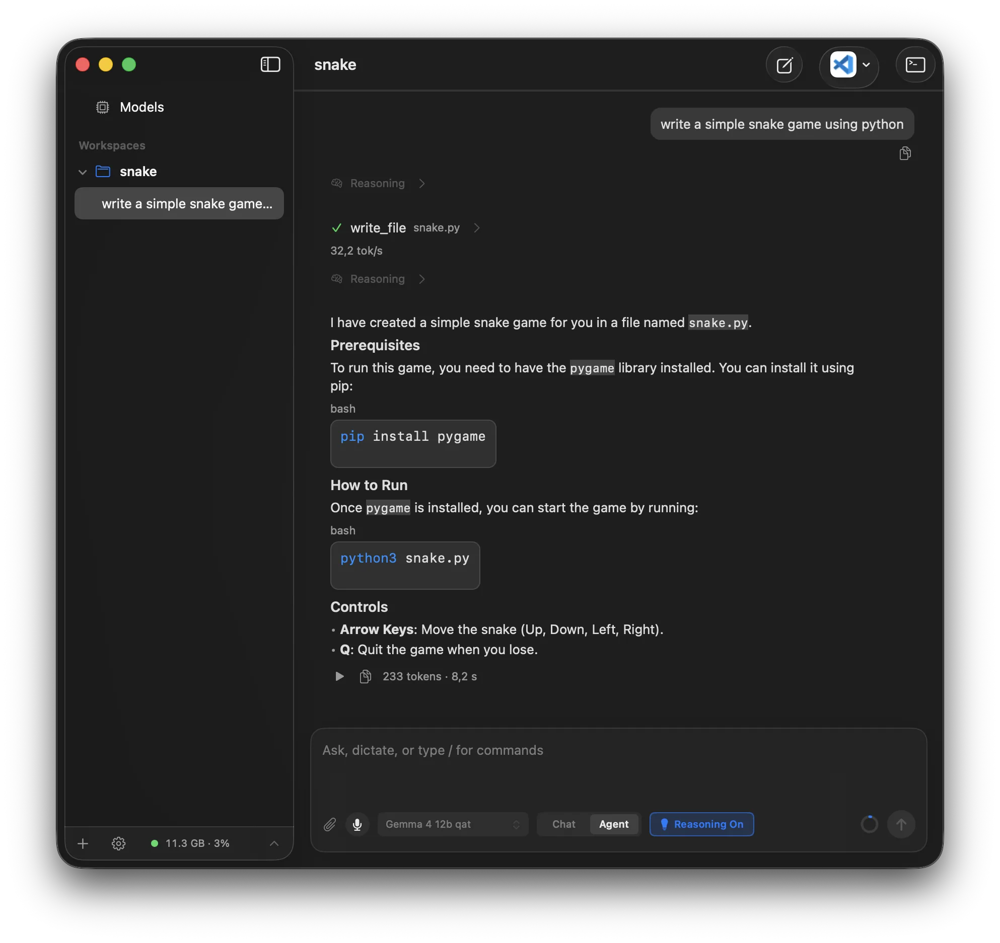
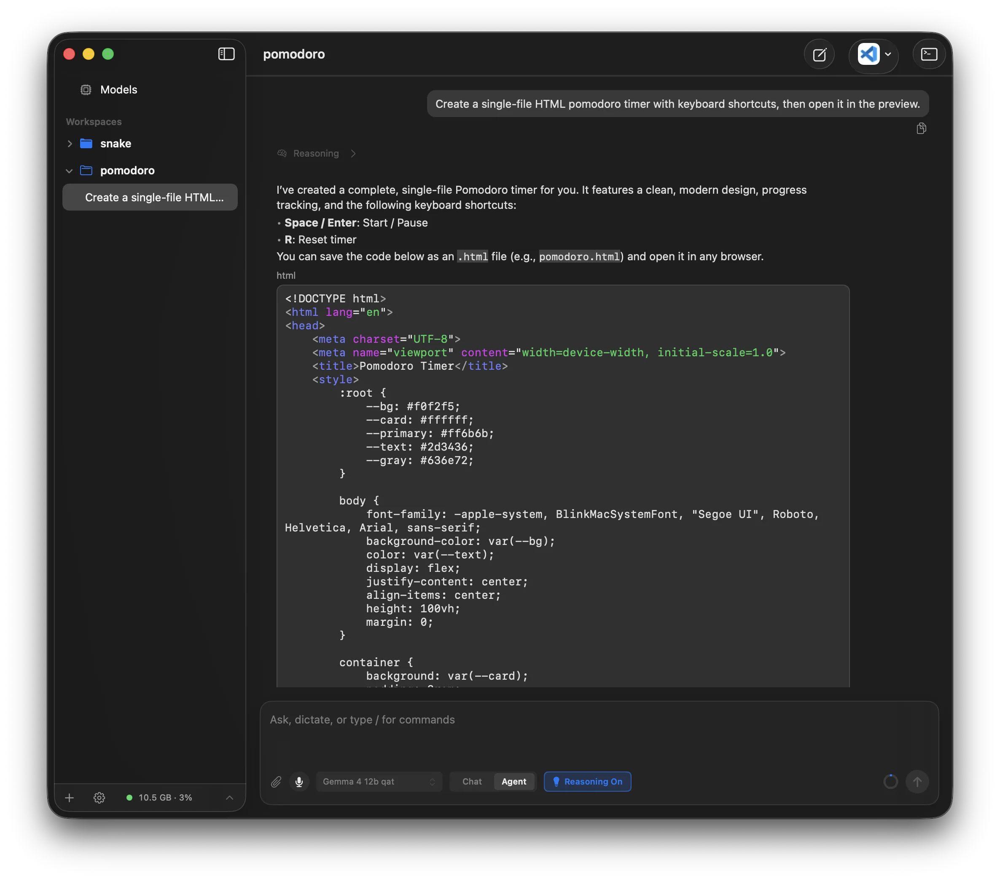
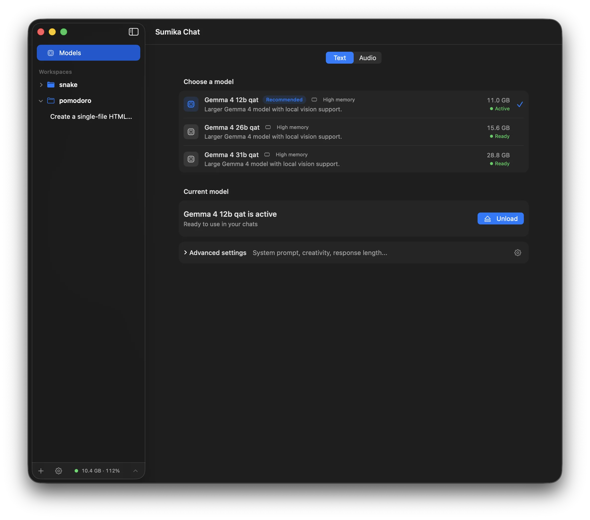

<p align="center">
  
</p>

<h1 align="center">Sumika</h1>

<p align="center">
  <strong>Your private AI assistant for Mac.</strong>
</p>

<p align="center">
  Write, translate, summarize, and work with your files using models running locally on your Mac.<br>
  Install Sumika, download a model in the app, and start chatting.<br>
  No recurring AI subscription required.
</p>

<p align="center">
  <a href="https://github.com/ngutech21/sumika-chat/actions/workflows/ci.yml"></a>
  <a href="https://github.com/ngutech21/sumika-chat/actions/workflows/macos-nightly.yml"></a>
  <a href="https://github.com/ngutech21/sumika-chat/actions/workflows/actions-lint.yml"></a>
  <a href="https://github.com/ngutech21/sumika-chat/actions/workflows/spelling.yml"></a>
</p>

<p align="center">
  <a href="https://github.com/ngutech21/sumika-chat/releases/latest"><strong>Download Sumika for Mac</strong></a><br>
  <sub>For Apple silicon Macs running macOS 15 or later.</sub>
</p>

<p align="center">
  <a href="#install-sumika">Install</a> ·
  <a href="#features">Features</a> ·
  <a href="#privacy">Privacy</a> ·
  <a href="#architecture">Architecture</a> ·
  <a href="#development">Development</a> ·
  <a href="#license">License</a>
</p>

## Screenshots

<table>
  <tr>
    <td align="center" valign="top">
      <a href="screenshots/snake.webp"></a>
    </td>
    <td align="center" valign="top">
      <a href="screenshots/pomodoro.webp"></a>
    </td>
    <td align="center" valign="top">
      <a href="screenshots/models.webp"></a>
    </td>
  </tr>
</table>


## Install Sumika

[Download Sumika for Mac](https://github.com/ngutech21/sumika-chat/releases/latest).

Open Sumika, download a recommended model from **Models**, and start chatting
in **Chat** mode. The initial model download requires an internet connection.

Once installed, Sumika
checks automatically for new versions. When an update is available, the app
guides you through installing it, so you do not need to download another DMG.
You can also check manually from **Sumika > Check for Updates…**.


## Features

- **Analyze documents and spreadsheets.** Attach Word documents, Excel
  spreadsheets, PowerPoint presentations, and PDFs. Get summaries and ask questions
  about their contents. Built-in AnyDoc reads the documents locally.
- **Search the web and read pages.** Find information through web search and ask
  Sumika to read public web pages for summaries or follow-up questions. Web access
  is optional and off by default.
- **Connect apps and services.** Use compatible MCP servers to bring tools from
  other apps and services into Work mode. Choose which connections each
  conversation can use.
- **Write, translate, and brainstorm.** Draft emails, improve your writing,
  translate text, or develop ideas in Chat mode.
- **Create and preview local projects.** Use Work mode to write code, edit text
  files, run commands, and preview HTML projects beside the conversation.
- **Speak and listen.** Dictate prompts with local speech recognition and hear
  responses using Apple system voices.

### Chat and Work

- **Chat**: ask questions, draft text, and discuss attached documents. Translate,
  brainstorm, or research the public web. No workspace access, commands, or file
  changes.
- **Work**: work with files, run commands, and use connected tools. Choose a
  workspace folder for coding and file tasks. Build local prototypes with an
  integrated terminal and browser preview.

Choose the files and folder you share with Sumika. Inspect model context, tool
actions, approvals, and command output in the conversation.

Manual approval is the default for file changes, commands, and MCP calls. Enable
Auto-approve in the composer's **Options** for a session, or change the default for
new sessions in Settings.

### Document Attachments

Ask about Word, PDF, PowerPoint, Excel (including legacy XLS), OpenDocument, RTF,
EPUB, CSV, and text files. Sumika reads documents locally with AnyDoc and reads CSV
and text files directly. Work mode can also read supported documents from the
selected workspace.

Attach up to **eight files**, with **32,000 extracted characters total per
message** and **64 MiB per document**. Accepted text is supplied in full; these
limits do not cap conversation history or response length. Scanned PDFs need
OCR first; Sumika does not perform it.

### Voice And Dictation

Listen to responses with Apple system voices, or dictate prompts using local
English or multilingual transcription models. Choose the voice and speech rate
in Settings.

### Web Access

Web access is off by default. Enable it in **Settings > Web Access**, with
**Ask each time** or **Allow**. Search uses DuckDuckGo or your SearXNG instance;
page fetching uses the built-in extractor or self-hosted Firecrawl.

### MCP Servers

Connect apps and services through Model Context Protocol (MCP) servers. Configure
stdio or Streamable HTTP servers in Settings, then select them per Work session.
MCP tools follow the session's approval policy and are unavailable in Chat.

For Python servers, use `uvx` or `uv`: Sumika includes uv and downloads Python
and dependencies on first use, then reuses them. Setup may need internet access.
See [MCP runtime details](docs/tool-runtime.md#mcp-tools) for paths, command
handling, and offline configuration.

### Project Instructions And Skills

Work mode reads the workspace-root `AGENTS.md` before each turn. Type `$` to
browse skills or `$name` to activate one. Skills come from project and user
`.agents/skills`, `.claude/skills`, and `.cursor/skills` folders, in that order;
project skills take precedence over user skills.

## Privacy

Your chats, attachments, and settings are stored on your Mac. AI responses,
document reading, dictation, and speech run locally. Sumika has no built-in
telemetry or hosted AI service receiving your conversations.

### Where Your Data Is Stored

Most app data lives in `~/Library/Application Support/Sumika/`:

| Folder or file | Contents |
| --- | --- |
| `WorkspaceLibrary/` | Workspace records and chat history, including messages, extracted document text, and tool results. |
| `Attachments/` | Copies of files you attach to conversations. |
| `Models/` | Downloaded AI models. |
| `Workspaces/Personal/` | Files in the default Personal workspace. Other workspaces use the folders you select. |
| `app-behavior-settings.json`, `model-settings.json`, `web-access-settings.json`, `mcp-servers.json` | App preferences, model settings, web access settings, and MCP server configurations. |
| `MCP/` | Managed Python installations and environments for MCP servers. |
| `debug/` | Optional local diagnostic traces, which can include prompts, responses, and tool arguments. Tracing is off by default. |

Dictation models are stored separately in
`~/Library/Application Support/FluidAudio/Models/`. Python and package downloads
for MCP servers are cached in `~/Library/Caches/Sumika/MCP/uv/`.

To open these locations in Finder, choose **Go > Go to Folder** and paste the
path. `~` means your home folder. macOS manages UI preferences and system voices
separately. See [Persistence](docs/persistence.md) for storage details.

### When Sumika Uses the Network

AI and dictation model downloads, update checks, and initial MCP dependency setup
contact their download sources. They do not require uploading your conversations.

Web access is off by default. When enabled, search sends queries to your selected
search provider, and page fetching sends URLs to the requested site or your
configured Firecrawl service. MCP calls pass tool arguments to the selected
server; connected services may receive the data you ask them to use.

Work commands and HTML previews can also make network requests, depending on the
code you run or load. The Web Access setting controls Sumika's built-in web tools;
it does not block network access for commands, previews, or MCP servers.

## The Name

Sumika means "dwelling" or "place to live" in Japanese. It's a home for AI on
your Mac.

## Supported Models

All listed models run locally and support Chat mode and tool calling in Work mode.
The model browser groups them by use case, highlights recommended choices, and
marks whether a model accepts images or text only.

Download sizes are estimates of storage space, not the memory required to run a
model. Larger models need more memory, and memory usage also grows with the length
of the conversation. Start with a smaller model if your Mac has limited memory.

| Model | Download size |
| --- | ---: |
| [Gemma 4 E4B QAT 4-bit](https://huggingface.co/mlx-community/gemma-4-e4b-it-qat-4bit) | 6.8 GB |
| [Gemma 4 12B QAT 4-bit](https://huggingface.co/mlx-community/gemma-4-12B-it-qat-4bit) | 11.0 GB |
| [Gemma 4 26B A4B QAT 4-bit](https://huggingface.co/mlx-community/gemma-4-26B-A4B-it-qat-4bit) | 15.6 GB |
| [Gemma 4 31B QAT 4-bit](https://huggingface.co/mlx-community/gemma-4-31B-it-qat-4bit) | 28.8 GB |
| [Qwen 3.6 35B A3B 4-bit](https://huggingface.co/mlx-community/Qwen3.6-35B-A3B-4bit) | 20.4 GB |
| [Qwen 3.6 35B A3B OptiQ 4-bit](https://huggingface.co/mlx-community/Qwen3.6-35B-A3B-OptiQ-4bit) | 24.7 GB |
| [Qwen 3.6 35B A3B 8-bit](https://huggingface.co/mlx-community/Qwen3.6-35B-A3B-8bit) | 37.7 GB |
| [Qwen 3.6 27B 4-bit](https://huggingface.co/mlx-community/Qwen3.6-27B-4bit) | 16.1 GB |
| [Qwen 3.6 27B OptiQ 4-bit](https://huggingface.co/mlx-community/Qwen3.6-27B-OptiQ-4bit) | 20.0 GB |
| [Qwen 3.6 27B 8-bit](https://huggingface.co/mlx-community/Qwen3.6-27B-8bit) | 29.5 GB |
| [Qwen 3.8 27B OptiQ 4-bit](https://huggingface.co/mlx-community/Qwen3.8-27B-OptiQ-4bit) | 20.0 GB |
| [Swift-1.5 4-bit](https://huggingface.co/ukisai/Swift-1.5-4bit-MLX) | 15.8 GB |
| [Qwen 3.6 40B uncensored 8-bit](https://huggingface.co/mlx-community/Qwen3.6-40B-Claude-4.6-Opus-Deckard-Heretic-Uncensored-Thinking-8bit) | 41.5 GB |

## Project Status

Sumika is an evolving prototype. It is useful for local conversations, everyday
AI assistance, and agent workflows, but APIs, persisted data, and workflows are
still changing.

## Architecture

The project uses one Swift package with three production modules and a thin
native Xcode app target:

- `SumikaCore` owns provider-neutral domain models, agent/workflow logic,
  persistence, tools, and runtime interfaces.
- `SumikaRuntimeMLX` implements the local MLX/Hugging Face runtime behind the
  core interfaces.
- `SumikaApp` owns SwiftUI/AppKit, launch composition, and macOS integrations
  such as Sparkle.
- `sumika/` contains only the native app launcher, resources, entitlements, and
  bundle metadata.

Dependencies point one-way: `SumikaApp` -> `SumikaRuntimeMLX` ->
`SumikaCore`; `SumikaApp` may also use `SumikaCore` directly. All external
product dependencies are declared in the root `Package.swift`; the isolated
SwiftLint tool package lives under `script/swiftlint`. The Xcode app target
links only the local `SumikaApp` product.

- [Tool Runtime](docs/tool-runtime.md): core flow for adding type-safe tools,
  permissions, registries, and model-facing tool calls.
- [Chat Runtime](docs/chat-runtime.md): chat turn lifecycle, cancellation,
  transcript state, and model-context filtering.
- [Contributing](CONTRIBUTING.md): contribution and pull request expectations.
- [Development](docs/development.md): requirements, architecture, and dependencies.
- [Testing](docs/testing.md): verification, sanitizer limitations, and benchmarks.
- [Security](SECURITY.md): supported versions and private vulnerability
  reporting.
- [Changelog](CHANGELOG.md): release history and notable changes.
- [Release Process](docs/release.md): signing, packaging, notarization, and
  update-feed publication.

## Development

Development requires the Apple toolchain recorded in
[versions.env](.github/actions/setup-apple-toolchain/versions.env), a macOS version
supported by that Xcode release, and Homebrew.

Install the development tools and build the app from the repository root:

```sh
brew version-install just@1.58.0
brew version-install typos-cli@1.50.0
just deps
just build
open "build/DerivedData/Build/Products/Debug/Sumika.app"
```

You can also open `Sumika.xcodeproj` and run the `Sumika` scheme for macOS.
The first Xcode build may ask you to approve the pinned `MLXHuggingFaceMacros`
package macro. Review and approve it in Xcode.

See [Development](docs/development.md) for setup and architecture,
[Testing](docs/testing.md) for tests and verification, and the
[Release Process](docs/release.md) for signing and packaging.
Use `just release-unsigned` to build an unsigned release app.
Run `just --list` to see available tasks and `just final-check` before review.

### Package lockfiles

After changing product dependencies, run `just resolve-packages` and
`just check-package-locks`, then commit both root and Xcode `Package.resolved`
files. The root lockfile is the canonical package selection; the Xcode lockfile
retains workspace-specific metadata. They are not expected to be byte-identical.
For the separate SwiftLint package, run `just resolve-swiftlint` and commit
`script/swiftlint/Package.resolved`.

## License

Licensed under the [Apache License 2.0](LICENSE).
