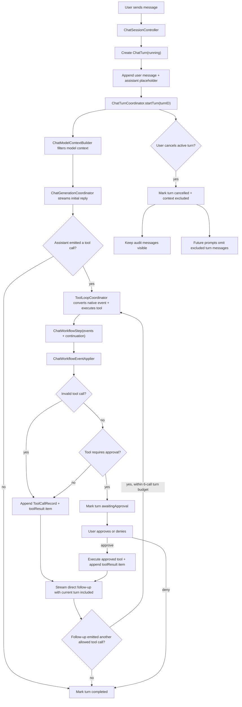

# Chat Runtime

The chat runtime is the boundary between the user's transcript, the model-facing
context, and the asynchronous work needed to answer a prompt. A visible transcript
is not the same thing as model context: cancelled turns can remain visible for
auditability while being excluded from future model prompts.

## Flow

## Roles

- `ChatSessionController` is the SwiftUI-facing state adapter. It owns observable
  draft, transcript, context usage, and error state. Tool-loop, approval, denial,
  and turn-state transcript mutations flow through typed `ChatWorkflowEvent`
  values instead of controller-specific mutation branches.
- `ChatTurnCoordinator` owns the active chat-turn task and `turnID`. It gates
  completion so stale async work from a cancelled or replaced turn cannot reset
  current UI state.
- `ChatTurn` is the persisted turn audit record: status, model-context
  policy, ordered `ChatTurnItem` values, and timestamps.
- `ChatTurnItem` is the canonical transcript/UI item. User and assistant items
  store typed `UserTurnMessage` and `AssistantTurnMessage` payloads directly.
  Tool-call and tool-result items store only `ToolCallRecord.ID`.
- `AssistantTurnMessage.deliveryStatus` distinguishes complete assistant
  messages from streaming or cancelled partial output.
- `ChatModelContextBuilder` turns `ChatSession` into the model context
  `ModelContextSnapshot`. It excludes entries belonging to turns whose
  `modelContextPolicy` is `.excluded`, except while that same turn is actively
  generating its direct follow-up response.
- `ChatGenerationCoordinator` streams model events into transcript chunks,
  native tool-call events, and metrics. Native tool calls are carried as
  structured stream events rather than parsed from assistant text.
- `ToolLoopCoordinator` handles model-emitted native tool actions. Read-only tools run
  immediately; tools that require approval can attach an approval preview and
  return an awaiting-approval continuation without appending a normal tool
  result. Text that merely looks like an old tool protocol is normal assistant
  prose and is not reparsed as a tool call.
- `ChatWorkflowEventApplier` applies typed workflow events to `ChatSession`
  using `ChatTranscriptMutator`. These events are not persisted; persistence
  stores only the resulting turns, turn items, and tool-call records.
- `ContextUsageCoordinator` computes token usage from the same filtered frozen
  model-facing transcript used for generation.

## Turn Lifecycle

1. `sendMessage` creates a `ChatTurn` with status `.running` and
   `modelContextPolicy == .included`.
2. The user message and assistant placeholder are appended with the new `turnID`.
3. `ChatTurnCoordinator` starts the async operation for that turn.
4. Initial generation streams into the assistant placeholder.
5. If the assistant output is an allowed tool call, `ToolLoopCoordinator` returns
   a `ChatWorkflowStep`. The controller applies its events, then follows the
   continuation. Read-style tools append a second assistant placeholder and
   stream the direct follow-up response. Each follow-up is inspected for another
   tool call until the turn budget of six tool calls is exhausted. Failed tools,
   unknown tools, and invalid tool-call observations also count against this
   budget and are returned to the model as observations so it can choose the
   next step. Successful `write_file` and `edit_file` calls switch to a final
   no-tools follow-up instead of continuing the normal tool loop.
6. If the tool call requires approval, workflow events record the call and mark
   the turn `.awaitingApproval`; active generation ends until the user approves
   or denies the call.
7. Approval executes the same validated tool request and appends a real tool
   result. Successful `write_file` and `edit_file` approvals stream one final
   no-tools assistant response; other successful tools resume the normal tool
   loop with a direct follow-up response.
8. Denial appends a denied tool result, performs no local side effect, and
   streams one final no-tools assistant response so the model can acknowledge
   the denial.
9. A successful turn is marked `.completed`.
10. A failed turn is marked `.failed` and excluded from future model context.
11. A cancelled turn is marked `.cancelled` and excluded from future model
   context.

## Cancellation Rules

- Cancel only affects the active turn. Older async callbacks must check the
  active `turnID` before mutating transcript, context usage, persistence state,
  or `isGenerating`.
- Empty streaming assistant placeholders are transient and are removed on
  cancellation.
- Non-empty streaming assistant messages are marked `deliveryStatus ==
  .cancelled` so partial output remains inspectable instead of masquerading as a
  completed answer.
- Completed tool calls keep their own `ToolCallStatus.completed`; cancelling the
  follow-up response cancels the surrounding chat turn, not the already-finished
  tool call.
- Tool calls and tool results from a cancelled turn stay visible as audit data.
  Future independent prompts exclude those messages from model context.
- The currently active turn is allowed to include its own tool result while
  generating the direct follow-up response.
- Direct follow-up responses may emit another tool call within the controller's
  six-call turn budget. When the budget is exhausted, the final follow-up prompt
  disables tools and any remaining tool attempt is recorded as a structured
  `toolBudgetExceeded` failure observation.
- Final no-tools follow-ups after approved write/edit tools or denied tools also
  disable tools. Any remaining tool attempt is recorded as a structured
  `finalModeToolAttempt` failure observation.
- Cancel should schedule a normal context-usage refresh with the latest filtered
  snapshot. It must not block turn cancellation on synchronous token counting.

## Model Context Rules

- Always build model input through `ChatModelContextBuilder`; do not pass the
  raw transcript directly to the model runtime from new code.
- `ModelContextSnapshot` is the source for runtime generation and context
  usage. Each `ModelContextEntry` stores typed intent in `body` and the
  byte-stable rendered role/content in `frozenContent`.
- Derive model role from the ADT body. Persisted entries whose body role and
  frozen rendered role disagree are invalid and must be rejected or explicitly
  repaired by a migration.
- Freeze rendered content when appending user prompts, assistant outputs, tool
  observations, and terminal tool results. Do not reconstruct old model-facing
  history from mutable UI state, focused context, current tool prompt mode, or
  attachments.
- `ModelContextSnapshot` is the only persisted model context ledger.
  Runtime calls consume the full-history projection of that ledger; rendering
  is append-only so the cached KV prefix stays a byte-stable prefix of every
  later generation.
- Same-turn tool follow-ups must not treat `toolObservation` entries as new user
  instructions. The follow-up form is frozen into the entry at creation time:
  the original user request, an assistant tool-call marker, the untrusted tool
  observation, and a continue instruction. Each observation carries only its
  own result; earlier observations stay in history as their own messages and
  are never re-rendered into later prompts. An observation created without a
  resolvable original user request freezes the bare observation form instead.
- Receipt compaction (`compactedHistoryForLaterTurns`) is not applied by the
  runtime. It remains a model-level projection reserved for a future explicit
  compaction boundary, because rewriting past observations invalidates the
  cached KV prefix after every tool turn.
- Legacy model-context messages are not stored or backfilled.
- Completed turns are included by default.
- Cancelled and failed turns with `modelContextPolicy == .excluded` are omitted
  from future prompts and context-usage calculations.
- The UI transcript remains the audit source. The frozen ledger is the
  model-facing prompt and cache-correctness source.

## Gemma/MLX Cache Rules

`GemmaMLXRuntime` keeps an in-memory `ChatSession` cache for the rendered
model-facing prefix that MLX has actually consumed. The cache is valid only when
the Swift-side prefix and the MLX session state describe the same bytes.

- Exact history reuse is safe when the cached prefix, rendered context
  signature, generation settings, native tool schema identity, and clean
  session state all match the current model-facing history.
- Tool-loop follow-ups should keep the previously consumed frozen entries as
  exact history and render the new observation or final tool result as the
  current prompt. That path should trace `session_reused` instead of
  `invalidated_history_appended` when the cached prefix is clean.
- Append-only history is reusable only through the MLX structured-message append
  path. If current history is the cached prefix plus new model-facing messages,
  `GemmaMLXRuntime` reuses the existing `ChatSession`, sends only the appended
  history delta plus the current prompt through `streamDetails(to messages:)`,
  and traces `append_only_delta_reused`.
- Native Gemma 4 tool calls are not assistant prose. The runtime records them
  as a canonical non-visible assistant boundary generated
  from the native tool name and sorted arguments, with no call IDs or timestamps.
  The cached session may remain clean only when the Core model context projects
  the exact same boundary before the tool observation; the following
  continuation can then trace `append_only_delta_reused`.
- Image prompts stay cacheable. The content signatures of the images consumed
  with a user prompt are frozen into the entry (`UserPromptContext.imageSignatures`)
  and carried through the projection into the prefix snapshots, so identical
  rendered text with different prefilled images can never reuse a cached
  session. Signatures are bookkeeping only and are never sent to the model.
  The image tokens stay in the reused KV cache; after a full re-prefill from
  text-only history the image is no longer part of the model context.
- Dirty states stay conservative. Cancelled turns, interrupted streams, runtime
  errors, and non-tool downstream termination invalidate reuse.
- Trace fields such as `cacheMode`, `cacheReason`, `appendOnly`,
  `reusedMessageCount`, `appendedMessageCount`, `mismatchReason`,
  `firstMismatchIndex`, and `toolLoopIteration` are the source of truth for
  diagnosing cache behavior. UI generation time alone cannot prove a cache hit.
- For native Gemma 4 tool calling, the active tool schema identity is part of
  the rendered context signature. Reuse across different tool registries is
  invalid even when the visible frozen history is unchanged.

The native Gemma 4 fast path preserves the assistant tool-call boundary as
Gemma 4 native tool-call text.

## Persistence Rules

- `ChatSession` persists `messages`, `modelContextSnapshot`, `toolCalls`,
  and `turns`.
- Sessions without a stored `modelContextSnapshot` do not decode.
- New Codable fields use defaults so sessions saved before turn metadata decode
  successfully.
- `ChatTurn.messageIDs` and `toolCallIDs` are audit links. They should be
  updated whenever a turn appends a new transcript message or records a tool
  call.
- Clearing a chat transcript removes messages, tool calls, turns, and
  attachments, but keeps session settings such as system prompt and generation
  settings.

## Adding Chat Workflow Behavior

1. Decide whether the behavior belongs to the visible transcript, model context,
   or both.
2. For tool-loop, approval, denial, or turn-state changes, emit
   `ChatWorkflowEvent` values and apply them through `ChatWorkflowEventApplier`.
   Use `ChatTranscriptMutator` directly only for primitive transcript operations
   that are not part of a workflow transition.
3. Gate async mutations with the active `turnID`.
4. Use `ChatModelContextBuilder` for generation and context-usage snapshots.
5. Add tests for cancelled turns, stale async results, persistence defaults, and
   model-context filtering when the behavior touches turn state.
