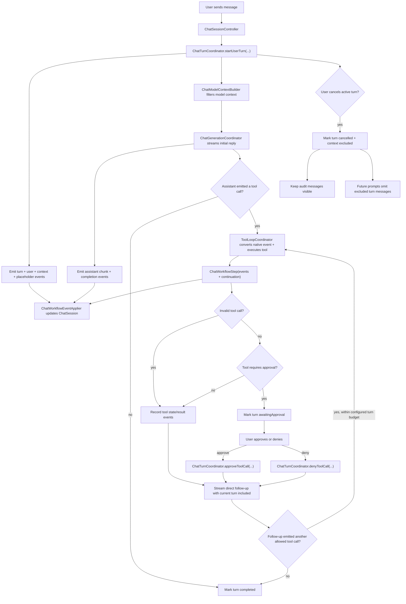

# Chat Runtime

The chat runtime is the boundary between the user's transcript, the model-facing
context, and the asynchronous work needed to answer a prompt. A visible transcript
is not the same thing as model context: cancelled turns can remain visible for
auditability while being excluded from future model prompts.

## Flow

## Roles

- `ChatSessionController` is the SwiftUI-facing state adapter. It owns observable
  draft, transcript, context usage, and error state. It delegates turn start,
  cancellation, approval, denial, and `ask_user` answers to
  `ChatTurnCoordinator`, applies emitted `ChatWorkflowEvent` values, and mirrors
  finished or paused turns back into UI state.
- `ChatTurnCoordinator` is the UI-free turn loop runner. It owns the active
  chat-turn task and `turnID`, builds start/resume event sequences, streams
  assistant chunks, runs `ToolLoopCoordinator`, handles approval/denial/answer
  resumes through `ToolResumeCoordinator`, and emits completion/cancel/failure
  events. It gates completion so stale async work from a cancelled or replaced
  turn cannot reset current UI state.
- `ChatTurn` is the persisted turn audit record. Its canonical state is the
  turn status, model-context policy, and ordered `ChatTurnItem` values.
  Membership is append-only: items are not deleted or duplicated into parallel
  collections. Existing assistant/tool items may update only their own lifecycle
  fields, such as streaming delivery status, assistant content, or tool state.
- `ChatTurnItem` is the transcript/UI projection. User and assistant items store
  typed `UserTurnMessage` and `AssistantTurnMessage` payloads directly.
  A single tool item embeds the `ToolCallRecord`; the same item represents the
  pending call and its eventual result state.
- `AssistantTurnMessage.deliveryStatus` distinguishes complete assistant
  messages from streaming or cancelled partial output.
- `ChatModelContextBuilder` turns `ChatSession` into the model context
  `ModelContextSnapshot`. It excludes entries belonging to turns whose
  `modelContextPolicy` is `.excluded`, except while that same turn is actively
  generating its direct follow-up response.
- `ChatGenerationCoordinator` streams model events into assistant chunks,
  native tool-call events, and metrics. `ChatTurnCoordinator` converts the
  stream callbacks into `ChatWorkflowEvent` values. Native tool calls are
  carried as structured stream events rather than parsed from assistant text.
- `ToolLoopCoordinator` handles model-emitted native tool actions. Read-only tools run
  immediately; tools that require approval can attach an approval preview and
  return an awaiting-approval continuation without appending a normal tool
  result. Text that merely looks like an old tool protocol is normal assistant
  prose and is not reparsed as a tool call.
- `ToolResumeCoordinator` builds the structured event sequences for approved
  tools, denied tools, and answered `ask_user` calls. The turn coordinator owns
  the async continuation that follows those events.
- `ChatWorkflowEventApplier` applies typed workflow events to `ChatSession`
  using `ChatTranscriptMutator`. These events are not persisted; persistence
  stores only the resulting turns, turn items, and tool-call records.
- `ContextUsageCoordinator` computes token usage from the same filtered frozen
  model-facing transcript used for generation.

## Turn Lifecycle

1. `sendMessage` validates UI-facing state, clears the draft and pending
   attachments, then calls `ChatTurnCoordinator.startUserTurn`.
2. `ChatTurnCoordinator` emits events that create a `ChatTurn` with status
   `.running`, append the user message, append the frozen model-context entry,
   and append the assistant placeholder.
3. `ChatTurnCoordinator` starts the async operation for that turn.
4. Initial generation streams into the assistant placeholder.
5. If the assistant output is an allowed tool call, `ToolLoopCoordinator` returns
   a `ChatWorkflowStep`. The turn coordinator emits its events, then follows the
   continuation. Read-style tools append a second assistant placeholder and
   stream the direct follow-up response. Each follow-up is inspected for another
   tool call until the configured turn budget is exhausted. Failed
   tools, unknown tools, and invalid tool-call observations also count against
   this budget and are returned to the model as observations so it can choose the
   next step. The last budgeted follow-up disables tools; if it produces no
   visible assistant text, the coordinator appends an internal no-tools
   finalization instruction and forces one text-only summary or deterministic
   fallback. Successful `write_file` and `edit_file` calls switch to a final
   no-tools follow-up instead of continuing the normal tool loop.
6. If the tool call requires approval, workflow events record the call and mark
   the turn `.awaitingApproval`; active generation ends until the user approves
   or denies the call.
7. Approval delegates to `ChatTurnCoordinator.approveToolCall`, which executes
   the same validated tool request and appends a real tool
   result. Successful `write_file` and `edit_file` approvals stream one final
   no-tools assistant response; other successful tools resume the normal tool
   loop with a direct follow-up response.
8. Answering `ask_user` delegates to
   `ChatTurnCoordinator.answerAskUserToolCall`, appends the compact answer
   receipt, and resumes generation plus the normal tool loop.
9. Denial delegates to `ChatTurnCoordinator.denyToolCall`, appends a denied
   tool result, performs no local side effect, and streams one final no-tools
   assistant response so the model can acknowledge the denial.
10. A successful turn is marked `.completed`.
11. A failed turn is marked `.failed` and excluded from future model context.
12. A cancelled turn is marked `.cancelled` and excluded from future model
   context.

## Cancellation Rules

- Cancel only affects the active turn. Older async callbacks must check the
  active `turnID` before mutating transcript, context usage, persistence state,
  or `isGenerating`.
- Empty streaming assistant placeholders are marked cancelled and filtered from
  visible transcript projections. They remain in persisted turn items as audit
  state instead of being removed.
- Non-empty streaming assistant messages are marked `deliveryStatus ==
  .cancelled` so partial output remains inspectable instead of masquerading as a
  completed answer.
- Completed tool calls keep their own `ToolCallStatus.completed`; cancelling the
  follow-up response cancels the surrounding chat turn, not the already-finished
  tool call.
- Tool items from a cancelled turn stay visible as audit data. Future independent prompts exclude those messages from model context.
- The currently active turn is allowed to include its own tool result while
  generating the direct follow-up response.
- Direct follow-up responses may emit another tool call within the turn
  coordinator's configured turn budget. When the budget is exhausted, the final
  follow-up prompt disables tools. If that final generation has no visible
  assistant text, the coordinator runs one additional `.disabled` finalization
  generation and falls back to a deterministic visible assistant message if the
  model still emits no text.
- Final no-tools follow-ups after approved write/edit tools or denied tools also
  disable tools. If the model still emits a native tool attempt, the caller
  treats the follow-up as final and does not execute another tool.
- Cancel should schedule a normal context-usage refresh with the latest filtered
  snapshot. It must not block turn cancellation on synchronous token counting.

## Model Context Rules

- Always build model input through `ChatModelContextBuilder`; do not pass the
  raw transcript directly to the model runtime from new code.
- `ModelContextSnapshot` is the source for runtime generation and context
  usage. Each `ModelContextEntry` stores typed intent in `body` and the
  byte-stable rendered role/content in `frozenContent`.
- Derive model role from the ADT body. Persisted entries whose body role and
  frozen rendered role disagree are invalid and must be rejected or explicitly
  repaired by a migration.
- Freeze rendered content when appending user prompts, assistant outputs, tool
  observations, and terminal tool results. Do not reconstruct old model-facing
  history from mutable UI state, focused context, current tool prompt mode, or
  attachments.
- `ModelContextSnapshot` is the only persisted model context ledger.
  Runtime calls consume the full-history projection of that ledger; rendering
  is append-only so the cached KV prefix stays a byte-stable prefix of every
  later generation.
- Same-turn tool follow-ups must not treat `toolObservation` entries as new user
  instructions. The follow-up form is frozen into the entry at creation time:
  the original user request, an assistant tool-call marker, the untrusted tool
  observation, and a continue instruction. Each observation carries only its
  own result; earlier observations stay in history as their own messages and
  are never re-rendered into later prompts. An observation created without a
  resolvable original user request freezes the bare observation form instead.
- Receipt compaction (`compactedHistoryForLaterTurns`) is not applied by the
  runtime. It remains a model-level projection reserved for a future explicit
  compaction boundary, because rewriting past observations invalidates the
  cached KV prefix after every tool turn.
- Legacy model-context messages are not stored or backfilled.
- Completed turns are included by default.
- Cancelled and failed turns with `modelContextPolicy == .excluded` are omitted
  from future prompts and context-usage calculations.
- The UI transcript remains the audit source. The frozen ledger is the
  model-facing prompt and cache-correctness source.

## Gemma/MLX Cache Rules

`GemmaMLXRuntime` keeps an in-memory `ChatSession` cache for the rendered
model-facing prefix that MLX has actually consumed. The cache is valid only when
the Swift-side prefix and the MLX session state describe the same bytes.

- Exact history reuse is safe when the cached prefix, rendered context
  signature (excluding decode-time-only fields), generation settings, and clean
  session state all match the current model-facing history.
- Tool-loop follow-ups should keep the previously consumed frozen entries as
  exact history and render the new observation or final tool result as the
  current prompt. That path should trace `session_reused` instead of
  `invalidated_history_appended` when the cached prefix is clean.
- Append-only history is reusable only through the MLX structured-message append
  path. If current history is the cached prefix plus new model-facing messages,
  `GemmaMLXRuntime` reuses the existing `ChatSession`, sends only the appended
  history delta plus the current prompt through `streamDetails(to messages:)`,
  and traces `append_only_delta_reused`.
- Simple text-only user prompts still use the MLX prompt fast path. Prompt
  batches that contain tool metadata use structured `Chat.Message` input instead,
  because a prompt can be a `tool` result followed by a compact user continuation.
- Native Gemma 4 tool calls are not assistant prose in the MLX session. Core
  still stores a canonical non-visible assistant boundary plus the typed raw
  arguments in `ModelContextSnapshot`, but the Gemma renderer replays that ledger
  as structured assistant `tool_calls` with stable `call_<uuid>` IDs and matching
  `tool` result messages. Consecutive tool results after one assistant boundary
  become consecutive `tool` messages followed by one continuation user message.
  The continuation restates the original user request and tool-result trust
  boundary without duplicating the tool output.
- The Gemma renderer version is part of the rendered context signature. It must
  be bumped whenever the MLX wire form changes, including changes to role/tool
  metadata, so old text-boundary cache prefixes cannot be compared to new
  structured history.
- Image prompts stay cacheable. The content signatures of the images consumed
  with a user prompt are frozen into the entry (`UserPromptContext.imageSignatures`)
  and carried through the projection into the prefix snapshots, so identical
  rendered text with different prefilled images can never reuse a cached
  session. Signatures are bookkeeping only and are never sent to the model.
  The image tokens stay in the reused KV cache; after a full re-prefill from
  text-only history the image is no longer part of the model context.
- Dirty states stay conservative. Cancelled turns, interrupted streams, runtime
  errors, and non-tool downstream termination invalidate reuse.
- Trace fields such as `cacheMode`, `cacheReason`, `appendOnly`,
  `reusedMessageCount`, `appendedMessageCount`, `mismatchReason`,
  `firstMismatchIndex`, and `toolLoopIteration` are the source of truth for
  diagnosing cache behavior. UI generation time alone cannot prove a cache hit.
- The cache history signature includes structured message metadata that MLX sees:
  assistant tool-call IDs, tool names, canonical raw arguments, and `tool`
  result call IDs. A plain UUID alone is not enough because the cache must prove
  that the entire provider-facing message shape still matches the session state.
- The active native tool schema is recorded in the rendered context signature
  for diagnostics (`nativeToolSchemaHash`) but does NOT gate prefix reuse. The
  Gemma chat template never renders tool specs into the prompt, so `session.tools`
  is a decode-time-only parameter (tool-call parsing) that does not change the
  prefilled bytes. Tool-loop iterations that change the active registry — most
  importantly the final answer dropping to an empty registry — therefore reuse
  the cached prefix instead of re-prefilling the whole context. "No more tools"
  is enforced by the prompt instruction plus passing empty tools at decode time.

The native Gemma 4 fast path preserves the assistant tool-call boundary in Core
while replaying it to MLX as native structured tool-call metadata.

## Persistence Rules

- `ChatSession` persists `modelContextSnapshot` and `turns`. Tool-call records
  live only inside `ChatTurn.items` and `ChatSession.toolCalls` is a derived
  projection, not a second persisted list.
- Sessions without a stored `modelContextSnapshot` do not decode.
- `ChatSession.turns` is the transcript and tool-state source of truth. Append
  new turn items for new user, assistant, and tool facts; update existing items
  only for their own lifecycle fields. Do not persist workflow event logs,
  derived tool lists, or UI caches as session state.
- `ModelContextSnapshot` is intentionally persisted as a frozen model-facing
  copy. It is separate from the UI transcript so prompt bytes and cache prefixes
  stay stable after later transcript projections change.
- Clearing a chat transcript removes turns, derived tool-call projections, and
  attachments, but keeps session settings such as per-mode system prompts and
  generation settings.

## Adding Chat Workflow Behavior

1. Decide whether the behavior belongs to the visible transcript, model context,
   or both.
2. For turn start, streaming chunks, tool-loop, approval, `ask_user` answers,
   denial, cancellation, failure, or completion, emit `ChatWorkflowEvent` values
   and apply them through `ChatWorkflowEventApplier`. Use `ChatTranscriptMutator`
   directly only for primitive transcript operations that are not part of a
   workflow transition.
3. Put UI-free async loop behavior in `ChatTurnCoordinator`. UI facades should
   provide existing state and callbacks, not duplicate the loop.
4. Gate async mutations with the active `turnID`.
5. Use `ChatModelContextBuilder` for generation and context-usage snapshots.
6. Add tests for cancelled turns, stale async results, persistence defaults, and
   model-context filtering when the behavior touches turn state.
