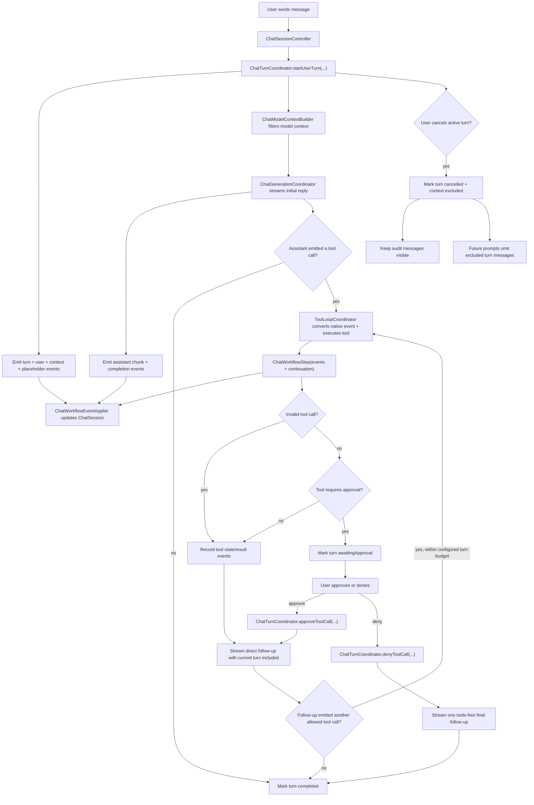

# Chat Runtime

The chat runtime is the boundary between the user's transcript, the model-facing
context, and the asynchronous work needed to answer a prompt. A visible transcript
is not the same thing as model context: cancelled turns can remain visible for
auditability while being excluded from future model prompts.

## Flow



## Roles

- `ChatSessionController` is the SwiftUI-facing state adapter. It owns observable
  draft, transcript, context usage, and error state. It delegates turn start,
  cancellation, approval, denial, and `ask_user` answers to
  `ChatTurnCoordinator`, applies emitted `ChatWorkflowEvent` values, and mirrors
  finished or paused turns back into UI state.
- `ChatTurnCoordinator` is the UI-free turn loop runner. It owns the active
  chat-turn task and `turnID`, builds start/resume event sequences, streams
  assistant chunks, runs `ToolLoopCoordinator`, handles approval/denial/answer
  resumes through `ToolResumeCoordinator`, and emits completion/cancel/failure
  events. It gates completion so stale async work from a cancelled or replaced
  turn cannot reset current UI state.
- `ChatTurn` is the persisted turn audit record. Its canonical state is the
  turn status, model-context policy, and ordered `ChatTurnItem` values.
  Membership is append-only: items are not deleted or duplicated into parallel
  collections. Existing assistant/tool items may update only their own lifecycle
  fields, such as streaming delivery status, assistant content, or tool state.
- `ChatTurnItem` is the transcript/UI projection. User and assistant items store
  typed `UserTurnMessage` and `AssistantTurnMessage` payloads directly.
  A single tool item embeds the `ToolCallRecord`; the same item represents the
  pending call and its eventual result state.
- `AssistantTurnMessage.deliveryStatus` distinguishes complete assistant
  messages from streaming or cancelled partial output.
- `AssistantTurnMessage.modelProjectionPolicy` controls how that visible
  assistant content is reintroduced to the model. Normal messages use
  `.visibleContent`; direct tool display responses can use `.override(...)` to
  keep rich UI output out of model context, or `.excluded` to omit a message.
- `ChatModelContextBuilder` turns `ChatSession.turns` into a non-persisted
  `ModelPromptProjection`. It excludes entries belonging to turns whose
  `modelContextPolicy` is `.excluded`, except while that same turn is actively
  generating its direct follow-up response.
- `ChatGenerationCoordinator` streams model events into assistant chunks,
  native tool-call events, and metrics. `ChatTurnCoordinator` converts the
  stream callbacks into `ChatWorkflowEvent` values. Native tool calls are
  carried as structured stream events rather than parsed from assistant text.
- `ToolLoopCoordinator` handles model-emitted native tool actions. Read-only tools run
  immediately; tools that require approval can attach an approval preview and
  return an awaiting-approval continuation without appending a normal tool
  result. Text that merely looks like an old tool protocol is normal assistant
  prose and is not reparsed as a tool call.
- `ToolResumeCoordinator` builds the structured event sequences for approved
  tools, denied tools, and answered `ask_user` calls. The turn coordinator owns
  the async continuation that follows those events.
- `ChatWorkflowEventApplier` applies typed workflow events to `ChatSession`
  using `ChatTranscriptMutator`. These events are not persisted; persistence
  stores only the resulting turns, turn items, and tool-call records.
- `ContextUsageSnapshot` computes the byte-based token-usage estimate from the
  same derived model-facing projection used for generation;
  `ChatSessionController` builds and publishes it directly.

## Turn Lifecycle

1. `sendMessage` validates UI-facing state, clears the draft and pending
   attachments, then calls `ChatTurnCoordinator.startUserTurn`.
2. `ChatTurnCoordinator` computes the current prompt context, then emits events
   that create a `ChatTurn` with status `.running`, append the user message with
   its frozen `promptContext`, and append the assistant placeholder.
3. `ChatTurnCoordinator` starts the async operation for that turn.
4. Initial generation streams into the assistant placeholder.
5. If the assistant output is an allowed tool call, `ToolLoopCoordinator` returns
   a `ChatWorkflowStep`. The turn coordinator emits its events, then follows the
   continuation. Normal tool results, including successful `write_file` and
   `edit_file` results, append a second assistant placeholder and stream the
   direct follow-up response. Each follow-up is inspected for another tool call
   until the configured turn budget is exhausted. Failed
   tools, unknown tools, and invalid tool-call observations also count against
   this budget and are returned to the model as observations so it can choose the
   next step. A failed tool observation must force recovery or an explicit
   failure report; the model must not claim the requested task completed from
   that failed result. Before each follow-up generation,
   `ToolFollowUpNoticePolicy` writes exactly one model-facing notice to the
   target `ToolCallRecord`, and the already-updated record is emitted before any
   prompt or history projection runs. The last budgeted follow-up sends an empty
   native tool schema and final/no-tools guidance as that tool notice; the
   stable `ChatSession.instructions` prompt does not change. Successful
   `write_file` and `edit_file` calls remain in the normal tool loop with the
   active tool schema while budget remains. Their follow-up may verify the
   change or request another independent mutation, but every later side effect
   must pass validation and approval again. The model should not echo generated
   file contents, code blocks, diffs, or tool arguments unless the user
   explicitly asked to display them in chat, and it must not say files changed
   unless a successful `write_file` or `edit_file` result exists in the turn;
   failed or invalid write/edit results mean no workspace change happened.
   A successful Agent-only `finish_task` takes a separate direct-response path:
   its validated `summary` is appended as the final visible assistant message,
   the workflow returns `.stopTurn`, and no placeholder or follow-up model
   generation is created. The call must be the only tool call in its native
   batch; mixed batches are rejected before any sibling executes and receive one
   compact invalid observation for repair.
6. If the tool call requires approval, workflow events record the call and mark
   the turn `.awaitingApproval`; active generation ends until the user approves
   or denies the call.
7. Approval delegates to `ChatTurnCoordinator.approveToolCall`, which executes
   the same validated tool request and appends a real tool
   result. Successful `write_file` and `edit_file` approvals resume the normal
   tool loop just like other successful tools. Another generated mutation is a
   new approval-sensitive call; approval never carries across calls. If an
   approved `run_command` process
   exits unsuccessfully, the direct follow-up receives a failed-command notice on
   the command's `ToolCallRecord` and must recover with tools when possible or
   report the command failure without inferring command-specific side effects.
   If the *same* command fails on two consecutive `run_command` records in the
   turn (`RunCommandRepeatPolicy`, a small model looping on a malformed command it
   cannot fix), the approval resume forces the tools-stripped final mode and the
   notice escalates to the user — naming the failing command and error and asking
   the user to run/fix it manually or rephrase — instead of looping. The brake
   fires only on the second consecutive identical failure, leaving one
   self-correction attempt.
   If that follow-up has no tool call and makes an unqualified completion claim,
   Sumika replaces the visible text with a generic failed-command response
   instead of completing the turn with a false success summary. Each tool
   follow-up receives at most one prioritized tool-record notice: final/no-tools
   guidance, failed `run_command`, repeated same-command `run_command`,
   listing/read-loop escalation, duplicate replay guidance, or the generic
   same-turn follow-up. Follow-up notices apply in both agent and chat (web)
   sessions; the final/no-tools guidance is profile-aware — agent sessions get the
   workspace wording, chat (web) sessions get web wording with no file/workspace
   references.
8. Answering `ask_user` delegates to
   `ChatTurnCoordinator.answerAskUserToolCall`, appends the compact answer
   receipt, and resumes generation plus the normal tool loop.
   `finish_task(status:summary:)` is not a pause: all three valid statuses
   (`done`, `blocked`, and `needs_user`) complete the current turn, while the
   status remains available as structured completion metadata.
9. Denial delegates to `ChatTurnCoordinator.denyToolCall`, appends a denied
   tool result, performs no local side effect, and streams one final no-tools
   assistant response so the model can acknowledge the denial.
10. A successful turn is marked `.completed`.
11. A failed turn is marked `.failed` and excluded from future model context.
12. A cancelled turn is marked `.cancelled` and excluded from future model
   context.

## Cancellation Rules

- Cancel only affects the active turn. Older async callbacks must check the
  active `turnID` before mutating transcript, context usage, persistence state,
  or `isGenerating`.
- Empty streaming assistant placeholders are marked cancelled and filtered from
  visible transcript projections. They remain in persisted turn items as audit
  state instead of being removed.
- Non-empty streaming assistant messages are marked `deliveryStatus ==
  .cancelled` so partial output remains inspectable instead of masquerading as a
  completed answer.
- Completed tool calls keep their own `ToolCallStatus.completed`; cancelling the
  follow-up response cancels the surrounding chat turn, not the already-finished
  tool call.
- Tool items from a cancelled turn stay visible as audit data. Future independent prompts exclude those messages from model context.
- The currently active turn is allowed to include its own tool result while
  generating the direct follow-up response.
- Direct follow-up responses may emit another tool call within the turn
  coordinator's configured turn budget. When the budget is exhausted — or when a
  second consecutive identical duplicate is blocked — the final follow-up sends no
  tool specs and adds the profile-appropriate final/no-tools guidance to the latest
  tool record's `modelFollowUpNotice` (agent vs chat-web variant). If that final
  generation has no visible assistant text, the turn fails with an empty-response
  diagnostic.
- Final no-tools follow-ups selected after denied tools or another force-final
  rule disable tools. If the model still emits a native tool attempt, the caller
  treats the follow-up as final and does not execute another tool.
- Cancel should schedule a normal context-usage refresh with the latest filtered
  projection. It must not block turn cancellation on synchronous token counting.

## Model Context Rules

- Always build model input through `ChatModelContextBuilder`; do not pass the
  raw transcript directly to the model runtime from new code.
- `ChatSession.turns` and `ChatTurn.items` are the persisted source of truth for
  chat history, assistant output, and tool lifecycle state. `ModelPromptProjection`
  is a derived read model, not session state.
- Prompt-affecting data must live with its canonical owner. User prompts carry
  their frozen `UserTurnMessage.promptContext` and attachments, assistant items
  carry assistant text, and tool items carry `ToolCallRecord` plus the completed
  result payload and any `modelFollowUpNotice`.
- `ModelPromptProjection` renders typed `ModelContextEntry` values from turns at
  generation time. Each entry stores typed intent in `body` and the byte-stable
  rendered role/content in `frozenContent` for that request.
- Tool follow-ups are rendered as provider-native role sequences, not synthetic
  user continuations. A completed native tool call projects as assistant
  `tool_calls` metadata with a stable call ID followed by one or more `tool`
  result messages with the matching `tool_call_id`. The tool message content is
  a byte-stable hybrid body: one valid `TOOL_RESULT_JSON` object followed by one
  readable `CONTENT` section. The JSON object carries compact control metadata
  such as `ok`, `tool`, `status`, `kind`, `duplicate`, affected paths,
  tool-specific counts/flags, and short `next_allowed_actions`. Long file
  contents, command stdout/stderr, HTML, Markdown, diffs, logs, fetched pages,
  and other raw bodies stay outside JSON in `CONTENT`. Duplicate replay metadata
  is derived structurally from `DuplicateToolCallResult`; duplicate headers use
  `kind: "duplicate_replay"`, `duplicate: true`, `not_reexecuted: true`, and
  `forbidden_repeat: true`, with `replayed_result_kind` present only when a
  replayed observation exists. Native `tool_call_id` remains in the provider
  message field, not in the rendered content. If `modelFollowUpNotice` exists on
  the record, it renders inside the JSON header as `next_step`, not as a
  transient user prompt or trailing prose block. Rebuilds must read this from the
  current `ChatTurn.items` state, not from an old prompt ledger or reused
  `ModelContextEntry`.
- Empty or cancelled streaming placeholders and assistant-thinking items are
  skipped. Completed turns are included by default.
- Cancelled and failed turns with `modelContextPolicy == .excluded` are omitted
  from future prompts and context-usage calculations.
- The UI/debug model-context pane renders the same derived projection that the
  runtime receives, so the debug view cannot drift from generation input.

## MLX Cache Rules

By default, `MLXChatRuntime` treats `MLXLMCommon.ChatSession` as the KV-cache
owner. Sumika keeps only a minimal shadow ledger: the last accepted
`MLXMessageSnapshot` prefix, a small prefill identity, and a conservative
clean/in-flight/dirty state. The opt-in e4b experiment described below instead
uses an app-owned, in-memory prompt checkpoint for its narrowly gated requests.

- Reuse is safe when the cached session is clean, the prefill identity matches,
  and the cached prefix is a prefix of the current model-facing history.
- The prefill identity contains only values that affect bytes already consumed by
  MLX: normalized stable runtime instructions, projection mode, `maxKVSize`, and
  reasoning/template context. Sampling settings, `maxTokens`, and the active
  native tool schema are decode-time inputs and do not rebuild the session.
- Each user turn freezes one stable `ChatRuntimePromptPlan.stableInstructions`
  value. The same text is used for `ChatSession.instructions` and
  `cacheIdentityInstructions`; final/no-tools guidance and tool-loop nudges are
  rendered as tool-record follow-up notices instead of system instructions. Todo
  state remains transient runtime context and is not part of the stable system
  prompt.
- All generation requests use the MLX structured-message path. First requests
  send only the current prompt to a new `ChatSession(history:)`; reused requests
  send either the current prompt or the appended history delta plus the current
  prompt through `streamDetails(to messages:)`.
- Reused MLX sessions must not set `ChatSession.instructions`: the system prompt
  is already encoded in the KV cache, so re-sending instructions before a tool
  result corrupts the continuation.
- Native MLX tool calls are not assistant prose in the MLX session. Core
  stores only the canonical turn/tool records. `ChatModelContextBuilder` derives
  a transient assistant tool-call boundary and the MLX renderer sends it as
  structured assistant `tool_calls` with stable `call_<uuid>` IDs and matching
  `tool` result messages. No persisted user-role continuation message is
  synthesized after a tool result. Tool follow-up guidance is stored on
  `ToolCallRecord` and rendered inside the matching `tool` message; runtime-only
  prompt-plan suffixes are limited to non-tool context such as todo state. The
  JSON debug trace records the final provider-facing messages.
- Image prompts stay cacheable. The content signatures of the images consumed
  with a user prompt are derived from the user message attachments and carried
  through the projection into the prefix snapshots, so identical
  rendered text with different prefilled images can never reuse a cached
  session. Signatures are bookkeeping only and are never sent to the model.
  The image tokens stay in the reused KV cache; after a full re-prefill from
  text-only history the image is no longer part of the model context.
- Dirty states stay conservative. Cancelled turns, interrupted streams, runtime
  errors, downstream termination, model changes, manual context clearing, and
  non-append-only history rebuild the MLX session.
- Cache debug now reports coarse states: `new_session`, `reused_session`,
  `append_delta`, and `dirty_rebuild`, with compact reason/count fields.
- The cache history signature includes structured message metadata that MLX sees:
  assistant tool-call IDs, tool names, canonical raw arguments, and `tool`
  result call IDs. A plain UUID alone is not enough because the cache must prove
  that the entire provider-facing message shape still matches the session state.
- The active native tool schema is applied through `session.tools` immediately
  before decode. It is not part of prefix comparison because MLX owns the active
  model's chat template and native tool rendering. Final no-tools follow-ups
  clear `session.tools` without changing `ChatSession.instructions` or the cache
  identity.

The native MLX tool path preserves the assistant tool-call boundary as a derived
projection while replaying it to MLX as native structured tool-call metadata.

### Opt-in e4b Prefix Checkpoint

`SUMIKA_MLX_PREFIX_REUSE=1` enables the first production prefix-reuse step. The
environment flag is necessary but not sufficient: the loaded `ManagedModel`
must also declare `prefixReusePolicy == .cacheOnly`. The catalog currently grants
that policy only to the parity-tested `gemma4-e4b-qat-4bit` entry. Model names,
architectures, and reasoning formats do not implicitly enable reuse.

The experimental path is further limited to requests with a non-empty native
tool schema, no image attachments, and `maxKVSize == nil`. This applies equally
to explicit Agent tools and public web tools in Chat mode; interaction mode is
not a cache-identity input. A request that does not satisfy every condition
continues through the existing `ChatSession` path. In particular, the experiment
does not cover ordinary tool-free chat, vision prompts, rotating caches requested
through `maxKVSize`, other Gemma variants, or Qwen continuation state.

For this experimental path only, transient todo runtime context is appended to
the system instructions at a stable position instead of being injected as a
new trailing user message on every follow-up. An unchanged plan therefore keeps
P2 as a prefix of P3; a changed plan changes the prefix identity and deliberately
causes one cold rebuild. The established `ChatSession` path keeps its existing
prompt placement.

For an admitted request, Sumika renders and tokenizes the complete canonical
provider prompt before generation. The checkpoint contains those token IDs, the
prefill identity and an independent `KVCache.copy()` materialized immediately
after prompt prefill and before decode starts. It remains in-flight during
decode. A normal assistant completion discards it; only a successfully completed
native tool-call boundary publishes it as the clean checkpoint for the following
tool result. Cancellation, interruption, downstream termination, runtime errors,
model changes, context clearing, and stale generation callbacks never publish a
checkpoint.

On the next eligible tool follow-up, the previous checkpoint token IDs must be
an exact, strict prefix of the newly rendered full prompt. Identity equality is
also required. If both checks pass, MLX receives only the new token suffix while
the repetition- and presence-penalty processor is initialized with the complete
new prompt. This distinction is required for output parity: the KV cache avoids
recomputing the prefix, but decode-time processors must still observe all prompt
tokens.

The path is fail-closed. A missing checkpoint, changed identity, token mismatch,
or empty suffix never performs warm reuse and instead evaluates the full prompt
as a cold prefix checkpoint. If preparing the experimental path itself fails,
Sumika abandons that checkpoint and falls back to the established `ChatSession`
full-rebuild path. Cancellation is propagated instead of starting fallback
generation. The existing `tool_follow_up_rebuild` behavior therefore remains the
compatibility fallback rather than being removed globally.

Trace rows distinguish the two experimental outcomes:

- `prefix_checkpoint_cold` with reasons `prefix_checkpoint_missing`,
  `prefix_checkpoint_identity_changed`, `token_prefix_mismatch`, or
  `token_prefix_empty_suffix`;
- `prefix_checkpoint_suffix` with reason `token_prefix_suffix_reuse`.

`runtime_prefill`, `runtime_ttft`, `runtime_decode`, and related memory-clear rows
may carry `fullPromptTokens`, `reusedPrefixTokens`, and `suffixTokens`.
`runtime_prefill.promptTokens` remains MLX's actual evaluated token count, so it
equals the suffix size on a warm run rather than the hypothetical full prompt.
For a cold prefix run, reused tokens are zero and suffix tokens equal the full
prompt size.
The performance report aggregates the three prefix fields per generation and per
turn and reports the reused-prefix percentage separately from decode throughput.

Run the model-specific Release parity check before evaluating the experiment:

```sh
just test-cache-parity e4b
```

It loads only the locally installed catalog model, never downloads one, and
writes `.perf/cache-parity/gemma-e4b-cache-parity.json`. Runtime performance must
also be evaluated in Release, for example with
`SUMIKA_MLX_PREFIX_REUSE=1 ./script/build_and_run.sh --release-trace`, followed by
the printed trace path in `script/trace_performance_report.swift`.

### Prefill Diagnostics

The debug trace separates model prompt work from user-visible latency. A
`runtime_prefill` row records MLX's `promptTokenCount`, `promptTime`, and prompt
tokens per second from `GenerateCompletionInfo`. The matching `runtime_decode`
row uses MLX's generation time and generated-token count; `runtime_ttft` remains
the wall-clock delay until the first streamed text or native tool-call event.

MLX memory is sampled immediately before `ChatSession.streamDetails`, when the
first generated event reaches Sumika, and when generation completes. The
first-event value is only an after-prefill proxy: the public `ChatSession` API
does not expose a prefill-completed callback, its stream is buffered, and the
sample can therefore include decode work. `Memory.peakMemory` is a
process-lifetime MLX peak and can be dominated by model loading or an earlier
generation; active and cache memory are the useful point-in-time comparisons.
Use `./script/build_and_run.sh --release-trace` for performance comparisons.
Each invocation writes a separate timestamped `release-trace.jsonl` under the
debug `traces` directory; Debug traces are diagnostic only. Pass the printed
path to `xcrun swift script/trace_performance_report.swift <trace-path> --limit all`
to create the JSON and Markdown report. The performance report keeps older
wall-clock `runtime_decode` rows in a separate legacy section instead of
combining them with MLX `generateTime` totals.

`just test-cache-parity` is an opt-in Release test that never downloads models.
It writes content-free Gemma and Qwen reports under `.perf/cache-parity`, comparing
a cold structured tool follow-up with a copied prompt KV cache plus token suffix.
`just test-cache-parity gemma12b` targets the catalog's Gemma 12B model explicitly,
exercising the VLM loader used when image input is enabled instead of silently
falling back to the preferred small Gemma model. This compatibility check may
exit nonzero while still writing its model-specific report; it is not part of
normal app or CI tests.

The 12B scenario remains text-only: it validates tool-follow-up prefix reuse
through the VLM loader, not prefix reuse for prompts containing images.
An independently recomputed P1-plus-suffix control uses the same forward-call
partition as the copied-cache path. The harness compares that control strictly
with the copy and reports full-prompt versus split-prompt numerical drift
separately; shape-dependent BF16 or quantized-kernel drift therefore cannot be
misclassified as a broken `KVCache.copy()`.
Gemma also runs a prompt beyond its 512-token sliding window. When P1 produces
`LMOutput.State`, the harness separately measures cache-only reuse and reuse with
that continuation state, so the report can distinguish the required strategy.
The report also records cache types, layer offsets, state shapes, copy count,
copy isolation, and signed MLX-memory deltas after materializing the copies.
Those immediate copy deltas describe eager allocation only: MLX may retain lazy
array views and allocate later while the original decode advances. They are not
a production peak-memory estimate; use the Release runtime trace's before-prefill,
after-prefill, and after-generation snapshots for that decision.
For the exact e4b target, the harness first performs a discarded warm-up and
then compares a 16-token decode without a retained checkpoint against the same
decode while a materialized checkpoint copy stays alive. It records
before-prefill, after-prefill, after-copy, and after-decode snapshots. Each path
is normalized to its own before-prefill value; `startingMemoryDifference` makes
remaining allocator drift visible and `withCopyMinusBaselineGrowth` reports the
signed difference between the two growth curves. Active-plus-cache memory is
the useful retained-memory comparison; a zero peak delta only means that both
paths reached the same larger transient MLX peak.
The e4b run additionally exercises `MLXPrefixGenerator` itself as cold P1, cold
P2, and warm P2. The report calls this `prefixGeneratorPath` and explicitly
labels its scope `prefix_generator_only`: it verifies producer draining,
checkpoint lifetime, evaluated suffix size, stop reason, and streamed-output
parity, but it does not claim that the model emitted a nonempty tool call or
that `MLXChatRuntime` published the checkpoint at that boundary. Model-free
stream-processor and cache-state tests cover that boundary transition.
Every JSON report includes its UTC creation time, Git commit and dirty status,
the Xcode `Package.resolved` hash, and the resolved `mlx-swift` and
`mlx-swift-lm` revisions. These identify the tested checkout and dependencies;
a dirty checkout still needs its diff, and the catalog model ID is not a hash of
the local model files, so the JSON alone is not a standalone reproducibility
artifact.
The currently resolved MLX `ChatSession` retains only KV caches, while Qwen 3.5's
public low-level model API returns position information in opaque
`LMOutput.State`; the test-only harness keeps that state explicitly instead of
assuming the high-level session already provides a complete Qwen checkpoint.
The parity harness remains test-only. The production e4b path above consumes its
cache-only result behind the separate model policy and environment gate; Qwen
and unlisted Gemma models remain on the established cache behavior.

## MLX Tool Format Coverage

Sumika enables native tools by passing the active registry through
`ChatRuntimeToolContext` and setting `session.tools` before decode. Core tracks
only whether native MLX tool calling is enabled and whether multiple tool calls
are allowed; it does not select a model-family parser.

The pinned MLX revision infers Gemma 4 `gemma4_unified` as `.gemma4` and
`qwen3_5*`/`qwen3_next*` as `.xmlFunction`. This covers the experimental
Qwen3.6 35B A3B MLX export, which reports the `qwen3_5_moe` architecture. Plain
`qwen2` and `qwen3` currently infer `nil`, so broader Qwen text generation can
be prepared separately, but native Qwen tool calling remains limited to the
families MLX can infer or explicitly configure.

Thought streaming is model-capability driven through `ManagedModel`'s
`reasoningTraceFormat`. The MLX stream processor maps Gemma thought-channel
markers and Qwen `<think>...</think>` traces into `thinkingChunk` events before
the UI sees the response. Qwen parsing starts in the thinking state when
reasoning is enabled because the Qwen chat template can place the opening
`<think>` marker in the prompt instead of the generated stream. The
`enable_thinking` additional-context key remains generic and parser selection
stays outside SwiftUI.

## Persistence Rules

- `ChatSession.turns` is the transcript and tool-state source of truth. Append
  new turn items for new user, assistant, and tool facts; update existing items
  only for their own lifecycle fields. Do not persist workflow event logs,
  derived tool lists, or UI caches as session state.
- `ChatSession.toolCalls` is a derived projection from `ChatTurn.items`, not a
  second persisted list.
- User messages persist `promptContext` so the model-facing prompt can be
  re-derived byte-stably without a parallel prompt ledger.
- Assistant messages persist their model projection policy so direct tool
  display responses can remain rich in the UI while projecting only a compact
  receipt back to the model.
- Tool records persist `modelFollowUpNotice` once it has been consumed by the
  model. It must not be deleted or folded into `ToolResultPayload`, because
  later MLX history rebuilds need the same `tool` message bytes for cache reuse.
- `ModelPromptProjection` is never persisted on `ChatSession`; generation,
  context usage, debug panels, and traces rebuild it from turns.
- Clearing a chat transcript removes turns, derived tool-call projections, and
  attachments, but keeps session settings such as per-mode system prompts and
  generation settings.

## Adding Chat Workflow Behavior

1. Decide whether the behavior belongs to the visible transcript, model context,
   or both.
2. For turn start, streaming chunks, tool-loop, approval, `ask_user` answers,
   denial, cancellation, failure, or completion, emit `ChatWorkflowEvent` values
   and apply them through `ChatWorkflowEventApplier`. Use `ChatTranscriptMutator`
   directly only for primitive transcript operations that are not part of a
   workflow transition.
3. Put UI-free async loop behavior in `ChatTurnCoordinator`. UI facades should
   provide existing state and callbacks, not duplicate the loop.
4. Gate async mutations with the active `turnID`.
5. Use `ChatModelContextBuilder` for generation and context-usage projections.
6. Add tests for cancelled turns, stale async results, persistence defaults, and
   model-context filtering when the behavior touches turn state.
