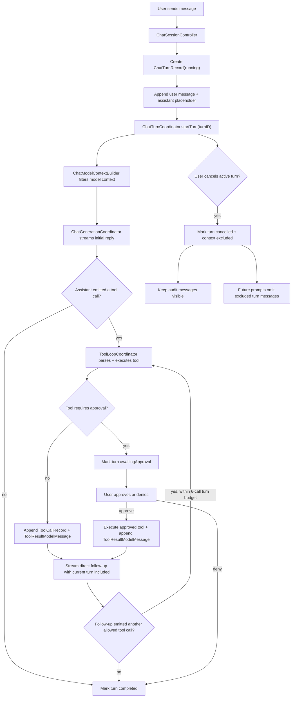

# Chat Runtime

The chat runtime is the boundary between the user's transcript, the model-facing
context, and the asynchronous work needed to answer a prompt. A visible transcript
is not the same thing as model context: cancelled turns can remain visible for
auditability while being excluded from future model prompts.

## Flow

## Roles

- `ChatSessionController` is the SwiftUI-facing state adapter. It owns observable
  draft, transcript, context usage, and error state, and applies transcript
  mutations through `ChatTranscriptMutator`.
- `ChatTurnCoordinator` owns the active chat-turn task and `turnID`. It gates
  completion so stale async work from a cancelled or replaced turn cannot reset
  current UI state.
- `ChatTurnRecord` is the persisted turn audit record: status, model-context
  policy, message IDs, tool-call IDs, and timestamps.
- `ChatMessage.turnID` links transcript messages to a turn. Legacy messages
  without a turn ID are treated as included context.
- `ChatMessage.deliveryStatus` distinguishes complete assistant messages from
  streaming or cancelled partial output.
- `ChatModelContextBuilder` turns `ChatSessionState` into the model-facing
  message list. It excludes messages belonging to turns whose
  `modelContextPolicy` is `.excluded`, except while that same turn is actively
  generating its direct follow-up response.
- `ChatGenerationCoordinator` streams model events into transcript chunks and
  metrics.
- `ToolLoopCoordinator` handles model-emitted tool actions. Read-only tools run
  immediately; tools that require approval can attach an approval preview and
  return an awaiting-approval outcome without appending a normal tool result.
- `ContextUsageCoordinator` computes token usage from the same filtered model
  context used for generation.

## Turn Lifecycle

1. `sendMessage` creates a `ChatTurnRecord` with status `.running` and
   `modelContextPolicy == .included`.
2. The user message and assistant placeholder are appended with the new `turnID`.
3. `ChatTurnCoordinator` starts the async operation for that turn.
4. Initial generation streams into the assistant placeholder.
5. If the assistant output is an allowed tool call, the controller records the
   `ToolCallRecord` and appends the tool result. Read-style tools append a
   second assistant placeholder and stream the direct follow-up response. Each
   follow-up is inspected for another tool call until the turn budget of six
   tool calls is exhausted. Successful `write_file` and `edit_file` calls
   complete the turn without a follow-up model response.
6. If the tool call requires approval, the controller records the call, marks
   the turn `.awaitingApproval`, and ends active generation until the user
   approves or denies the call.
7. Approval executes the same validated tool request and appends a real tool
   result. Successful `write_file` and `edit_file` approvals complete the turn
   without a follow-up model response; other successful tools resume the turn
   with a direct follow-up response.
8. Denial appends a denied tool result and completes the turn without a local
   side effect.
9. A successful turn is marked `.completed`.
10. A failed turn is marked `.failed` and excluded from future model context.
11. A cancelled turn is marked `.cancelled` and excluded from future model
   context.

## Cancellation Rules

- Cancel only affects the active turn. Older async callbacks must check the
  active `turnID` before mutating transcript, context usage, persistence state,
  or `isGenerating`.
- Empty streaming assistant placeholders are transient and are removed on
  cancellation.
- Non-empty streaming assistant messages are marked `deliveryStatus ==
  .cancelled` so partial output remains inspectable instead of masquerading as a
  completed answer.
- Completed tool calls keep their own `ToolCallStatus.completed`; cancelling the
  follow-up response cancels the surrounding chat turn, not the already-finished
  tool call.
- Tool calls and tool results from a cancelled turn stay visible as audit data.
  Future independent prompts exclude those messages from model context.
- The currently active turn is allowed to include its own tool result while
  generating the direct follow-up response.
- Direct follow-up responses may emit another tool call within the controller's
  six-call turn budget. When the budget is exhausted, the final follow-up prompt
  disables tools and any remaining raw action markup is replaced with a tool
  limit message.
- Cancel should schedule a normal context-usage refresh with the latest filtered
  snapshot. It must not block turn cancellation on synchronous token counting.

## Model Context Rules

- Always build model input through `ChatModelContextBuilder`; do not pass the
  raw transcript directly to the model runtime from new code.
- Legacy messages without `turnID` are included so old saved sessions continue
  to work.
- Completed turns are included by default.
- Cancelled and failed turns with `modelContextPolicy == .excluded` are omitted
  from future prompts and context-usage calculations.
- The transcript remains the audit source. The filtered model context is the
  prompt source.

## Persistence Rules

- `CodingSession` persists `messages`, `toolCalls`, and `turns`.
- New Codable fields use defaults so sessions saved before turn metadata decode
  successfully.
- `ChatTurnRecord.messageIDs` and `toolCallIDs` are audit links. They should be
  updated whenever a turn appends a new transcript message or records a tool
  call.
- Clearing a chat transcript removes messages, tool calls, turns, and
  attachments, but keeps session settings such as system prompt and generation
  settings.

## Adding Chat Workflow Behavior

1. Decide whether the behavior belongs to the visible transcript, model context,
   or both.
2. Add transcript mutations through `ChatTranscriptMutator`.
3. Gate async mutations with the active `turnID`.
4. Use `ChatModelContextBuilder` for generation and context-usage snapshots.
5. Add tests for cancelled turns, stale async results, persistence defaults, and
   model-context filtering when the behavior touches turn state.
