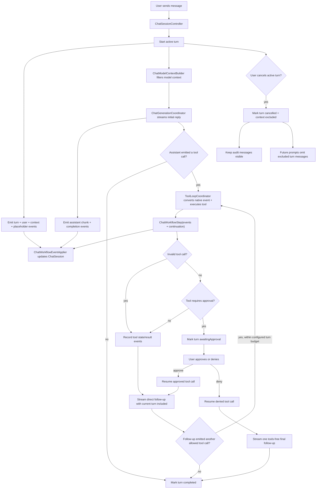

# Chat Runtime

The chat runtime is the boundary between the user's transcript, the model-facing
context, and the asynchronous work needed to answer a prompt. A visible transcript
is not the same thing as model context: cancelled turns can remain visible for
auditability while being excluded from future model prompts.

## Flow

## Roles

- `ChatSessionController` is the canonical live conversation owner. It owns the
  `ChatSession`, observable generation state, active task and `turnID`, frozen
  tool registry, workflow-event application, cancellation, pause, continuation,
  and finalization. These lifecycle facts are updated together instead of being
  synchronized through callbacks between peer modules.
- `ChatTurnExecutionCoordinator` is an internal implementation module behind
  that owner. It builds prompt plans, streams assistant output, and invokes
  `ToolLoopCoordinator`, but it does not own session or active-turn state.
- `ChatTurn` is the persisted turn audit record. Its canonical state is the
  turn status, model-context policy, and ordered `ChatTurnItem` values.
  Membership is append-only: items are not deleted or duplicated into parallel
  collections. Existing assistant/tool items may update only their own lifecycle
  fields, such as streaming delivery status, assistant content, or tool state.
- `ChatTurnItem` is the transcript/UI projection. User and assistant items store
  typed `UserTurnMessage` and `AssistantTurnMessage` payloads directly.
  A single tool item embeds the `ToolCallRecord`; the same item represents the
  pending call and its eventual result state.
- `AssistantTurnMessage.deliveryStatus` distinguishes complete assistant
  messages from streaming or cancelled partial output.
- `AssistantTurnMessage.modelProjectionPolicy` controls how that visible
  assistant content is reintroduced to the model. Normal messages use
  `.visibleContent`; direct tool display responses can use `.override(...)` to
  keep rich UI output out of model context, or `.excluded` to omit a message.
- `ChatModelContextBuilder` turns `ChatSession.turns` into a non-persisted
  `ModelPromptProjection`. It excludes entries belonging to turns whose
  `modelContextPolicy` is `.excluded`, except while that same turn is actively
  generating its direct follow-up response.
- `ChatGenerationCoordinator` streams model events into assistant chunks,
  native tool-call events, and metrics. The conversation owner converts the
  stream callbacks into `ChatWorkflowEvent` values. Native tool calls are
  carried as structured stream events rather than parsed from assistant text.
- `ToolLoopCoordinator` handles model-emitted native tool actions. Read-only tools run
  immediately; tools that require approval can attach an approval preview and
  return an awaiting-approval continuation without appending a normal tool
  result. Text that merely looks like an old tool protocol is normal assistant
  prose and is not reparsed as a tool call.
- `ToolResumeCoordinator` builds the structured event sequences for approved
  tools, denied tools, and answered `ask_user` calls. The conversation owner
  owns the async continuation that follows those events.
- `ChatWorkflowEventApplier` applies typed workflow events to `ChatSession`
  using `ChatTranscriptMutator`. These events are not persisted; persistence
  stores only the resulting turns, turn items, and tool-call records.
- `ContextUsageSnapshot` computes the byte-based token-usage estimate from the
  same derived model-facing projection used for generation;
  `ChatSessionController` builds and publishes it directly.

## Turn Lifecycle

1. `sendMessage` validates UI-facing state, clears the draft and pending
   attachments, then starts the active turn.
2. The conversation owner computes the current prompt context, then emits events
   that create a `ChatTurn` with status `.running`, append the user message with
   its frozen `promptContext`, and append the assistant placeholder.
3. The same owner starts the async operation for that turn.
4. Initial generation streams into the assistant placeholder.
5. If the assistant output is an allowed tool call, `ToolLoopCoordinator` returns
   a `ChatWorkflowStep`. The turn coordinator emits its events, then follows the
   continuation. Normal tool results, including successful `write_file` and
   `edit_file` results, append a second assistant placeholder and stream the
   direct follow-up response. Each follow-up is inspected for another tool call
   until the configured turn budget is exhausted. Failed
   tools, unknown tools, and invalid tool-call observations also count against
   this budget and are returned to the model as observations so it can choose the
   next step. A failed tool observation must force recovery or an explicit
   failure report; the model must not claim the requested task completed from
   that failed result. Before each follow-up generation,
   `ToolFollowUpNoticePolicy` writes exactly one model-facing notice to the
   target `ToolCallRecord`, and the already-updated record is emitted before any
   prompt or history projection runs. The last budgeted follow-up sends an empty
   native tool schema and final/no-tools guidance as that tool notice; the
   stable `ChatSession.instructions` prompt does not change. Successful
   `write_file` and `edit_file` calls remain in the normal tool loop with the
   active tool schema while budget remains. Their follow-up may verify the
   change or request another independent mutation, but every later side effect
   must pass validation and approval again. The model should not echo generated
   file contents, code blocks, diffs, or tool arguments unless the user
   explicitly asked to display them in chat, and it must not say files changed
   unless a successful `write_file` or `edit_file` result exists in the turn;
   failed or invalid write/edit results mean no workspace change happened.
   A successful Agent-only `finish_task` takes a separate direct-response path:
   its validated `summary` is appended as the final visible assistant message,
   the workflow returns `.stopTurn`, and no placeholder or follow-up model
   generation is created. The call must be the only tool call in its native
   batch; mixed batches are rejected before any sibling executes and receive one
   compact invalid observation for repair.
6. If the tool call requires approval, workflow events record the call and mark
   the turn `.awaitingApproval`; active generation ends until the user approves
   or denies the call.
7. Approval resumes the active conversation lifecycle, which executes
   the same validated tool request and appends a real tool
   result. Successful `write_file` and `edit_file` approvals resume the normal
   tool loop just like other successful tools. Another generated mutation is a
   new approval-sensitive call; approval never carries across calls. If an
   approved `run_command` process
   exits unsuccessfully, the direct follow-up receives a failed-command notice on
   the command's `ToolCallRecord` and must recover with tools when possible or
   report the command failure without inferring command-specific side effects.
   If the *same* command fails on two consecutive `run_command` records in the
   turn (`RunCommandRepeatPolicy`, a small model looping on a malformed command it
   cannot fix), the approval resume forces the tools-stripped final mode and the
   notice escalates to the user — naming the failing command and error and asking
   the user to run/fix it manually or rephrase — instead of looping. The brake
   fires only on the second consecutive identical failure, leaving one
   self-correction attempt.
   If that follow-up has no tool call and makes an unqualified completion claim,
   Sumika replaces the visible text with a generic failed-command response
   instead of completing the turn with a false success summary. Each tool
   follow-up receives at most one prioritized tool-record notice: final/no-tools
   guidance, failed `run_command`, repeated same-command `run_command`,
   listing/read-loop escalation, duplicate replay guidance, or the generic
   same-turn follow-up. Follow-up notices apply in both agent and chat (web)
   sessions; the final/no-tools guidance is profile-aware — agent sessions get the
   workspace wording, chat (web) sessions get web wording with no file/workspace
   references.
8. Answering `ask_user` appends the compact answer
   receipt, and resumes generation plus the normal tool loop.
   `finish_task(status:summary:)` is not a pause: all three valid statuses
   (`done`, `blocked`, and `needs_user`) complete the current turn, while the
   status remains available as structured completion metadata.
9. Denial appends a denied
   tool result, performs no local side effect, and streams one final no-tools
   assistant response so the model can acknowledge the denial.
10. A successful turn is marked `.completed`.
11. A failed turn is marked `.failed` and excluded from future model context.
12. A cancelled turn is marked `.cancelled` and excluded from future model
   context.

## Cancellation Rules

- Cancel only affects the active turn. Older async callbacks must check the
  active `turnID` before mutating transcript, context usage, persistence state,
  or `isGenerating`.
- Empty streaming assistant placeholders are marked cancelled and filtered from
  visible transcript projections. They remain in persisted turn items as audit
  state instead of being removed.
- Non-empty streaming assistant messages are marked `deliveryStatus ==
  .cancelled` so partial output remains inspectable instead of masquerading as a
  completed answer.
- Completed tool calls keep their own `ToolCallStatus.completed`; cancelling the
  follow-up response cancels the surrounding chat turn, not the already-finished
  tool call.
- Tool items from a cancelled turn stay visible as audit data. Future independent prompts exclude those messages from model context.
- The currently active turn is allowed to include its own tool result while
  generating the direct follow-up response.
- Direct follow-up responses may emit another tool call within the turn
  coordinator's configured turn budget. When the budget is exhausted — or when a
  second consecutive identical duplicate is blocked — the final follow-up sends no
  tool specs and adds the profile-appropriate final/no-tools guidance to the latest
  tool record's `modelFollowUpNotice` (agent vs chat-web variant). If that final
  generation has no visible assistant text, the turn fails with an empty-response
  diagnostic.
- Final no-tools follow-ups selected after denied tools or another force-final
  rule disable tools. If the model still emits a native tool attempt, the caller
  treats the follow-up as final and does not execute another tool.
- Cancel should schedule a normal context-usage refresh with the latest filtered
  projection. It must not block turn cancellation on synchronous token counting.

## Model Context Rules

- Always build model input through `ChatModelContextBuilder`; do not pass the
  raw transcript directly to the model runtime from new code.
- `ChatSession.turns` and `ChatTurn.items` are the persisted source of truth for
  chat history, assistant output, and tool lifecycle state. `ModelPromptProjection`
  is a derived read model, not session state.
- Prompt-affecting data must live with its canonical owner. User prompts carry
  their frozen `UserTurnMessage.promptContext` and attachments, assistant items
  carry assistant text, and tool items carry `ToolCallRecord` plus the completed
  result payload and any `modelFollowUpNotice`.
- `ModelPromptProjection` renders typed `ModelContextEntry` values from turns at
  generation time. Each entry stores typed intent in `body` and the byte-stable
  rendered role/content in `frozenContent` for that request.
- `ProviderPromptProjection` is the Core-owned normalization boundary consumed
  by MLX. It performs final role merging, structured assistant tool-call
  grouping, and tool-result projection once. Its byte ledger counts each final
  provider field exactly once: role, content, `tool_call_id`, and canonical
  sorted JSON for structured tool calls. Image signatures and source-entry IDs
  remain cache/provenance metadata and do not count as provider text.
- Focused-file prompt reuse is a derived projection only. The complete typed
  `UserTurnMessage.promptContext` remains persisted. A snapshot is eligible only
  when it came from an unpaginated, untruncated, unredacted `read_file` result
  whose complete content fits the 4,000-character snapshot budget. The first
  eligible occurrence is full; one identical occurrence may use the compact
  reminder while no more than 8,000 normalized provider bytes intervene; the
  next occurrence is full again. Focused-file hashes stay internal and are not
  rendered to the model.
- `write_file`, `edit_file`, partial reads, attachments, and unknown snapshot
  sources are never compacted. Workspace mutations, commands, MCP and invalid
  tools, excluded turns, incomplete reads, and a different focused snapshot
  conservatively reset the reuse anchor. This policy does not revalidate files
  in the workspace; "same known snapshot" means the most recent complete
  `read_file` state known to Sumika, not a guarantee against external changes.
- Tool follow-ups are rendered as provider-native role sequences, not synthetic
  user continuations. A completed native tool call projects as assistant
  `tool_calls` metadata with a stable call ID followed by one or more `tool`
  result messages with the matching `tool_call_id`. The tool message content is
  a byte-stable hybrid body: one valid, single-line `TOOL_RESULT_JSON` object
  followed by one readable `CONTENT` section. The sparse JSON object always
  carries `tool`, `status`, and `kind`; default and empty metadata is omitted,
  non-empty `next_allowed_actions` provide local routing, and positive control
  signals such as truncation, redaction, duplicate replay, and forbidden
  repetition stay explicit. Long file contents, command stdout/stderr, HTML,
  Markdown, diffs, logs, fetched pages, and other raw bodies stay outside JSON in
  `CONTENT`. Duplicate replay metadata
  is derived structurally from `DuplicateToolCallResult`; duplicate headers use
  `kind: "duplicate_replay"`, `duplicate: true`, `not_reexecuted: true`, and
  `forbidden_repeat: true`, with `replayed_result_kind` present only when a
  replayed observation exists. Native `tool_call_id` remains in the provider
  message field, not in the rendered content. If `modelFollowUpNotice` exists on
  the record, it renders inside the JSON header as `next_step`, not as a
  transient user prompt or trailing prose block. Rebuilds must read this from the
  current `ChatTurn.items` state, not from an old prompt ledger or reused
  `ModelContextEntry`.
- Empty or cancelled streaming placeholders and assistant-thinking items are
  skipped. Completed turns are included by default.
- Cancelled and failed turns with `modelContextPolicy == .excluded` are omitted
  from future prompts and context-usage calculations.
- The UI/debug model-context pane renders the same derived projection that the
  runtime receives, so the debug view cannot drift from generation input.

## MLX Cache Rules

`MLXChatRuntime` treats `MLXLMCommon.ChatSession` as the KV-cache owner. Sumika
keeps only a minimal shadow ledger: the last accepted `ProviderPromptMessage`
prefix, a small prefill identity, and a conservative clean/in-flight/dirty state.

- Reuse is safe when the cached session is clean, the prefill identity matches,
  and the cached prefix is a prefix of the current model-facing history.
- The prefill identity contains only values that affect bytes already consumed by
  MLX: normalized cache identity instructions, projection mode, `maxKVSize`, and
  reasoning/template context. The cache identity instructions extend the visible
  stable runtime instructions with a cache-only fingerprint of the native tool
  schema. Sampling settings and `maxTokens` remain decode-time inputs and do not
  rebuild the session.
- Each user turn freezes one stable `ChatRuntimePromptPlan.stableInstructions`
  value for `ChatSession.instructions`; `cacheIdentityInstructions` adds only the
  tool-schema fingerprint. Final/no-tools guidance and tool-loop nudges are
  rendered as tool-record follow-up notices instead of system instructions. Todo
  state remains transient runtime context and is not part of the stable system
  prompt.
- All generation requests use the MLX structured-message path. First requests
  send only the current prompt to a new `ChatSession(history:)`; reused requests
  send either the current prompt or the appended history delta plus the current
  prompt through `streamDetails(to messages:)`.
- Reused MLX sessions must not set `ChatSession.instructions`: the system prompt
  is already encoded in the KV cache, so re-sending instructions before a tool
  result corrupts the continuation.
- Native MLX tool calls are not assistant prose in the MLX session. Core
  stores only the canonical turn/tool records. `ChatModelContextBuilder` derives
  a transient assistant tool-call boundary and the MLX renderer sends it as
  structured assistant `tool_calls` with stable `call_<uuid>` IDs and matching
  `tool` result messages. No persisted user-role continuation message is
  synthesized after a tool result. Tool follow-up guidance is stored on
  `ToolCallRecord` and rendered inside the matching `tool` message; runtime-only
  prompt-plan suffixes are limited to non-tool context such as todo state. The
  JSON debug trace records the final provider-facing messages.
- Image prompts stay cacheable. The content signatures of the images consumed
  with a user prompt are derived from the user message attachments and carried
  through the projection into the prefix snapshots, so identical
  rendered text with different prefilled images can never reuse a cached
  session. Signatures are bookkeeping only and are never sent to the model.
  The image tokens stay in the reused KV cache; after a full re-prefill from
  text-only history the image is no longer part of the model context.
- Dirty states stay conservative. Cancelled turns, interrupted streams, runtime
  errors, downstream termination, model changes, manual context clearing, and
  non-append-only history rebuild the MLX session.
- Cache debug now reports coarse states: `new_session`, `reused_session`,
  `append_delta`, and `dirty_rebuild`, with compact reason/count fields.
- The cache history signature includes structured message metadata that MLX sees:
  assistant tool-call IDs, tool names, canonical raw arguments, and `tool`
  result call IDs. A plain UUID alone is not enough because the cache must prove
  that the entire provider-facing message shape still matches the session state.
- The active native tool schema is applied through `session.tools` immediately
  before decode. A deterministic SHA-256 fingerprint of the ordered,
  model-facing schemas is included in the cache identity but not in the visible
  system prompt. Schema changes therefore invalidate stale MLX prefixes without
  spending model tokens on a repeated tool-name list. Final no-tools follow-ups
  use the same registry fingerprint while clearing `session.tools`, preserving
  the established cache identity across terminal generation.

The native MLX tool path preserves the assistant tool-call boundary as a derived
projection while replaying it to MLX as native structured tool-call metadata.

## Prompt Cost Regression

`just prompt-cost` runs four model-free Core tool-loop fixtures that cover
`list_files -> read_file`, `read_file -> edit_file -> run_command`, a failed
command followed by `workspace_diagnostics`, and a longer nine-tool loop. The
fixtures use the production prompt projection, agent system prompt, default
coding-agent tool schemas with optional `todo_write` disabled, native tool-call
arguments, and frozen tool-result observations.

The same command also runs a paired focused-file fixture with four turns and a
complete 4,000-character `read_file` snapshot. It compares disabled and
production reuse policies, pins the expected `full -> compact -> full -> compact`
sequence, and records exact provider-byte and `/4` token-estimate checkpoints
after every turn.

The report pins exact UTF-8 byte counts for the system prompt, tool schemas,
conversation content, native tool-call payloads, and tool-result content. It also
reports the same stable `ceil(bytes / 4)` estimate used for model-free context
usage, including cumulative checkpoints after each tool. This is a deterministic
CI regression metric, not tokenizer-exact model accounting: provider chat-template
syntax and model-specific tokenization require a separate opt-in local-model
measurement. Intentional prompt changes update the baseline in the same patch so
the byte and estimated-token delta remains reviewable.

## MLX Tool Format Coverage

Sumika enables native tools by passing the active registry through
`ChatRuntimeToolContext` and setting `session.tools` before decode. Core tracks
only whether native MLX tool calling is enabled and whether multiple tool calls
are allowed; it does not select a model-family parser.

The pinned MLX revision infers Gemma 4 `gemma4_unified` as `.gemma4` and
`qwen3_5*`/`qwen3_next*` as `.xmlFunction`. This covers the experimental
Qwen3.6 35B A3B MLX export, which reports the `qwen3_5_moe` architecture. Plain
`qwen2` and `qwen3` currently infer `nil`, so broader Qwen text generation can
be prepared separately, but native Qwen tool calling remains limited to the
families MLX can infer or explicitly configure.

Thought streaming is model-capability driven through `ManagedModel`'s
`reasoningTraceFormat`. The MLX stream processor maps Gemma thought-channel
markers and Qwen `<think>...</think>` traces into `thinkingChunk` events before
the UI sees the response. Qwen parsing starts in the thinking state when
reasoning is enabled because the Qwen chat template can place the opening
`<think>` marker in the prompt instead of the generated stream. The
`enable_thinking` additional-context key remains generic and parser selection
stays outside SwiftUI.

## Persistence Rules

- `ChatSession.turns` is the transcript and tool-state source of truth. Append
  new turn items for new user, assistant, and tool facts; update existing items
  only for their own lifecycle fields. Do not persist workflow event logs,
  derived tool lists, or UI caches as session state.
- `ChatSession.toolCalls` is a derived projection from `ChatTurn.items`, not a
  second persisted list.
- User messages persist `promptContext` so the model-facing prompt can be
  re-derived byte-stably without a parallel prompt ledger.
- Assistant messages persist their model projection policy so direct tool
  display responses can remain rich in the UI while projecting only a compact
  receipt back to the model.
- Tool records persist `modelFollowUpNotice` once it has been consumed by the
  model. It must not be deleted or folded into `ToolResultPayload`, because
  later MLX history rebuilds need the same `tool` message bytes for cache reuse.
- `ModelPromptProjection` is never persisted on `ChatSession`; generation,
  context usage, debug panels, and traces rebuild it from turns.
- Clearing a chat transcript removes turns, derived tool-call projections, and
  attachments, but keeps session settings such as per-mode system prompts and
  generation settings.

## Adding Chat Workflow Behavior

1. Decide whether the behavior belongs to the visible transcript, model context,
   or both.
2. For turn start, streaming chunks, tool-loop, approval, `ask_user` answers,
   denial, cancellation, failure, or completion, emit `ChatWorkflowEvent` values
   and apply them through `ChatWorkflowEventApplier`. Use `ChatTranscriptMutator`
   directly only for primitive transcript operations that are not part of a
   workflow transition.
3. Put UI-free async loop behavior behind the canonical conversation owner.
   Internal implementation modules receive that owner directly instead of
   reconstructing session and lifecycle state through callback bundles.
4. Gate async mutations with the active `turnID`.
5. Use `ChatModelContextBuilder` for generation and context-usage projections.
6. Add tests for cancelled turns, stale async results, persistence defaults, and
   model-context filtering when the behavior touches turn state.
