# SumikaCore Data Model

Generated by `just data-model`. Do not edit this file by hand.

## Overview

```mermaid
%%{init: {"themeVariables": {"fontSize": "18px"}, "flowchart": {"nodeSpacing": 60, "rankSpacing": 80}}}%%
flowchart TD
  ChatModelConfiguration --> ReasoningTraceFormat
  DuplicateToolCallResult --> ToolModelObservation
  DuplicateToolCallResult --> WorkspaceRelativePath
  FunctionToolSchema --> ToolJSONSchemaObject
  InvalidToolInput --> InvalidToolCallReason
  InvalidToolInput --> ToolCallArguments
  InvalidToolResult --> InvalidToolCallReason
  MCPServerConfig --> MCPServerTransportConfiguration
  ManagedModel --> ManagedModelStability
  ManagedModel --> ReasoningTraceFormat
  ManagedModel --> ToolCallingPolicy
  ManagedModelCatalog --> ManagedModel
  MissingPathSuggestion --> WorkspaceRelativePath
  NoopTurnTracer --> TurnTracing
  ProjectionLimit --> ProjectionLimitStrategy
  RawToolCallRequest --> ToolCallArguments
  RawToolCallRequest --> ToolName
  RawToolCallRequest --> Workspace
  ReadKey --> WorkspaceRelativePath
  RecoveryHint --> WorkspaceRelativePath
  SearchFileMatch --> WorkspaceRelativePath
  ToolCallArguments --> ToolArgumentValue
  ToolCallModelMessage --> ToolCallArguments
  ToolCallModelMessage --> ToolCallModelArgument
  ToolCallModelMessage --> ToolName
  ToolCallParseOutput --> RawToolCallRequest
  ToolCallParseOutput --> ToolCallModelMessage
  ToolCallPayload --> InvalidToolInput
  ToolCallRecord --> ToolApprovalSource
  ToolCallRecord --> ToolCallRequest
  ToolCallRecord --> ToolCallState
  ToolCallRecord --> ToolPermissionEvaluation
  ToolCallRequest --> RawToolCallRequest
  ToolCallRequest --> ToolCallPayload
  ToolCallState --> ToolResultPayload
  ToolCallState --> ToolResultPreview
  ToolDefinition --> ToolArgumentValue
  ToolDefinition --> ToolCapability
  ToolDefinition --> ToolName
  ToolDefinition --> ToolParameterDefinition
  ToolDefinition --> ToolRiskLevel
  ToolDisplayPayload --> SearchFileMatch
  ToolDisplayPayload --> ToolResultStatus
  ToolDisplayPayload --> ToolTextOutput
  ToolDisplayPayload --> WorkspaceFileEntry
  ToolDisplayPayload --> WorkspaceRelativePath
  ToolFailure --> RecoveryHint
  ToolFailure --> ToolFailureReason
  ToolFailure --> ToolName
  ToolFailure --> WorkspaceRelativePath
  ToolFailureReason --> InvalidToolCallReason
  ToolFailureReason --> MissingPathSuggestion
  ToolFailureReason --> ToolName
  ToolFailureReason --> WorkspaceRelativePath
  ToolJSONSchemaObject --> ToolJSONSchemaProperty
  ToolJSONSchemaProperty --> ToolArgumentValue
  ToolJSONSchemaProperty --> ToolJSONSchemaObject
  ToolJSONSchemaProperty --> ToolParameterValueType
  ToolModelObservation --> ToolName
  ToolModelObservation --> ToolObservationBlock
  ToolModelObservation --> ToolResultStatus
  ToolModelObservation --> WorkspaceRelativePath
  ToolObservationBlock --> SearchFileMatch
  ToolObservationBlock --> ToolTextOutput
  ToolObservationBlock --> WorkspaceFileEntry
  ToolObservationBlock --> WorkspaceRelativePath
  ToolParameterDefinition --> ToolArgumentValue
  ToolParameterDefinition --> ToolJSONSchemaObject
  ToolParameterDefinition --> ToolParameterValueType
  ToolPermissionEvaluation --> ToolPermissionDecision
  ToolPermissionEvaluation --> ToolRiskLevel
  ToolPermissionEvaluation --> WorkspaceRelativePath
  ToolRegistry --> ToolDefinition
  ToolResultModelMessage --> ToolName
  ToolResultModelMessage --> ToolResultPayload
  ToolResultModelMetadata --> ToolResultModelMetadataField
  ToolResultModelMetadataField --> ToolResultModelMetadataValue
  ToolResultPayload --> DuplicateToolCallResult
  ToolResultPayload --> InvalidToolResult
  ToolResultPayload --> ToolFailure
  ToolResultPreview --> ToolResultPayload
  ToolResultPreview --> ToolResultStatus
  ToolResultProjection -. derives .-> ToolDisplayPayload
  ToolResultProjection -. derives .-> ToolModelObservation
  ToolResultProjection -. derives .-> ToolResultModelMetadata
  ToolResultProjectionPolicy --> ProjectionLimit
  TurnTraceContext --> TurnTraceMetadata
  TurnTraceEvent --> ToolArgumentTrace
  TurnTraceEvent --> TurnTracePhase
  TurnTraceMetadata --> TurnTracing
  WorkspaceDiagnostic --> WorkspaceDiagnosticSeverity
  WorkspaceDiagnostic --> WorkspaceDiagnosticSource
  WorkspaceDiagnostic --> WorkspaceRelativePath
  WorkspaceFileEntry --> WorkspaceFileKind
  WorkspaceFileEntry --> WorkspaceRelativePath
  WorkspaceInstructionsPromptContext --> WorkspaceInstructionsRemoval
  WorkspaceInstructionsPromptContext --> WorkspaceInstructionsSnapshot
  WorkspaceInstructionsRemoval --> WorkspaceRelativePath
  WorkspaceInstructionsSnapshot --> ContextBudget
  WorkspaceInstructionsSnapshot --> PromptContextExcerpt
  WorkspaceInstructionsSnapshot --> PromptContextTruncation
  WorkspaceInstructionsSnapshot --> WorkspaceRelativePath
  WorkspaceLibrary --> Workspace
```

## Models

### ChatGenerationConfigPreset

- Kind: `struct`
- Source: `Sources/SumikaCore/Models/ChatModelConfiguration.swift`
- Conforms to: `Equatable`, `Sendable`

Properties:

- `repetitionPenalty: Double?`
- `temperature: Double?`
- `topK: Int?`
- `topP: Double?`

### ChatGenerationSettings

- Kind: `struct`
- Source: `Sources/SumikaCore/Models/ChatGenerationSettings.swift`
- Conforms to: `Codable`, `Equatable`, `Sendable`

Properties:

- `maxKVSize: Int?`
- `maxTokens: Int`
- `presencePenalty: Double`
- `reasoningEnabled: Bool`
- `repetitionContextSize: Int`
- `repetitionPenalty: Double`
- `temperature: Double`
- `topK: Int`
- `topP: Double`

### ChatModelConfiguration

- Kind: `struct`
- Source: `Sources/SumikaCore/Models/ChatModelConfiguration.swift`
- Conforms to: `Equatable`, `Sendable`

Properties:

- `contextTokenLimit: Int?`
- `localModelDirectory: URL`
- `reasoningTraceFormat: ReasoningTraceFormat`
- `supportsImageInput: Bool`

Relations:

- `ReasoningTraceFormat`

### ContextBudget

- Kind: `struct`
- Source: `Sources/SumikaCore/Models/PromptContext.swift`
- Conforms to: `Codable`, `Equatable`, `Sendable`

Properties:

- `maxCharacters: Int`

### DuplicateToolCallResult

- Kind: `struct`
- Source: `Sources/SumikaCore/Models/ToolCall.swift`
- Conforms to: `Codable`, `Equatable`, `Sendable`

Properties:

- `affectedPaths: [WorkspaceRelativePath]`
- `blocked: Bool`
- `message: String`
- `previousCallID: UUID`
- `replayedObservation: ToolModelObservation?`

Relations:

- `ToolModelObservation`
- `WorkspaceRelativePath`

### FunctionToolSchema

- Kind: `struct`
- Source: `Sources/SumikaCore/Models/ToolDefinition.swift`
- Conforms to: `Codable`, `Equatable`, `Sendable`

Properties:

- `description: String`
- `name: String`
- `parameters: ToolJSONSchemaObject`
- `strict: Bool?`
- `type: String`

Relations:

- `ToolJSONSchemaObject`

### InvalidToolCallReason

- Kind: `enum`
- Source: `Sources/SumikaCore/Models/ToolCall.swift`
- Conforms to: `Codable`, `Equatable`, `Error`, `Sendable`

Cases:

- `emptyOldText`
- `emptyPath`
- `invalidArgumentType(name: String, expected: String)`
- `invalidPagination(String)`
- `invalidTimeout(String)`
- `invalidTodoItems(String)`
- `missingRequiredArgument(String)`
- `parserError(String)`
- `unavailableToolName(String)`
- `unknownArguments([String])`
- `unknownToolName(String)`

### InvalidToolInput

- Kind: `struct`
- Source: `Sources/SumikaCore/Models/ToolCall.swift`
- Conforms to: `Codable`, `Equatable`, `Sendable`

Properties:

- `originalName: String?`
- `rawArguments: ToolCallArguments`
- `reason: InvalidToolCallReason`

Relations:

- `InvalidToolCallReason`
- `ToolCallArguments`

### InvalidToolResult

- Kind: `struct`
- Source: `Sources/SumikaCore/Models/ToolCall.swift`
- Conforms to: `Codable`, `Equatable`, `Sendable`

Properties:

- `originalName: String?`
- `reason: InvalidToolCallReason`

Relations:

- `InvalidToolCallReason`

### LocalModelDirectory

- Kind: `enum`
- Source: `Sources/SumikaCore/Models/ChatModelConfiguration.swift`

### MCPServerConfig

- Kind: `struct`
- Source: `Sources/SumikaCore/Models/MCPServerConfig.swift`
- Conforms to: `Codable`, `Equatable`, `Identifiable`, `Sendable`
- Summary: User-configured external MCP server using stdio or Streamable HTTP.

Properties:

- `id: UUID`
- `isEnabled: Bool`
- `name: String`
- `transport: MCPServerTransportConfiguration`

Relations:

- `MCPServerTransportConfiguration`

### MCPServerEndpointError

- Kind: `enum`
- Source: `Sources/SumikaCore/Models/MCPServerConfig.swift`
- Conforms to: `Equatable`, `LocalizedError`, `Sendable`

Cases:

- `embeddedCredentials`
- `fragmentNotAllowed`
- `insecureRemoteHTTP`
- `invalidURL`
- `unsupportedScheme`

### MCPServerTransportConfiguration

- Kind: `enum`
- Source: `Sources/SumikaCore/Models/MCPServerConfig.swift`
- Conforms to: `Codable`, `Equatable`, `Sendable`

Cases:

- `stdio(command: String, arguments: [String], environment: [String: String])`
- `streamableHTTP(endpoint: URL)`

### ManagedModel

- Kind: `struct`
- Source: `Sources/SumikaCore/Features/ModelManagement/Models/ManagedModel.swift`
- Conforms to: `Equatable`, `Identifiable`, `Sendable`

Properties:

- `defaultContextTokenLimit: Int`
- `defaultModeSettings: ChatModeSettingsSet`
- `detail: String`
- `displayName: String`
- `enabled: Bool`
- `estimatedDownloadSize: String`
- `huggingFaceRepoID: String`
- `id: String`
- `isRecommended: Bool`
- `localDirectoryName: String`
- `reasoningTraceFormat: ReasoningTraceFormat`
- `requiresLargeMemory: Bool`
- `stability: ManagedModelStability`
- `supportsImageInput: Bool`
- `toolCallingPolicy: ToolCallingPolicy`

Relations:

- `ManagedModelStability`
- `ReasoningTraceFormat`
- `ToolCallingPolicy`

### ManagedModelCatalog

- Kind: `enum`
- Source: `Sources/SumikaCore/Features/ModelManagement/Models/ManagedModel.swift`

Properties:

- `models: [ManagedModel]`

Relations:

- `ManagedModel`

### ManagedModelStability

- Kind: `enum`
- Source: `Sources/SumikaCore/Features/ModelManagement/Models/ManagedModel.swift`
- Conforms to: `Equatable`, `Sendable`

Cases:

- `experimental`
- `stable`

### MissingPathSuggestion

- Kind: `struct`
- Source: `Sources/SumikaCore/Models/ToolCall.swift`
- Conforms to: `Codable`, `Equatable`, `Sendable`

Properties:

- `confidence: Double`
- `path: WorkspaceRelativePath`
- `reason: String`

Relations:

- `WorkspaceRelativePath`

### ModelDownloadState

- Kind: `enum`
- Source: `Sources/SumikaCore/Features/ModelManagement/Models/ModelRuntimeState.swift`
- Conforms to: `Equatable`, `Sendable`

Cases:

- `downloaded`
- `downloading(progress: Double?)`
- `failed(String)`
- `idle`

### ModelLoadState

- Kind: `enum`
- Source: `Sources/SumikaCore/Features/ModelManagement/Models/ModelRuntimeState.swift`
- Conforms to: `Equatable`, `Sendable`

Cases:

- `failed(String)`
- `loading`
- `notLoaded`
- `ready`

### NoopTurnTracer

- Kind: `struct`
- Source: `Sources/SumikaCore/Models/TurnTraceEvent.swift`
- Conforms to: `TurnTracing`

Relations:

- `TurnTracing`

### ProcessResourceCalculator

- Kind: `enum`
- Source: `Sources/SumikaCore/Features/ModelManagement/Models/ProcessResourceUsage.swift`

### ProcessResourceSample

- Kind: `struct`
- Source: `Sources/SumikaCore/Features/ModelManagement/Models/ProcessResourceUsage.swift`
- Conforms to: `Equatable`, `Sendable`

Properties:

- `cpuTime: TimeInterval`
- `wallTime: TimeInterval`

### ProcessResourceUsage

- Kind: `struct`
- Source: `Sources/SumikaCore/Features/ModelManagement/Models/ProcessResourceUsage.swift`
- Conforms to: `Equatable`, `Sendable`

Properties:

- `cpuPercent: Double`
- `memoryBytes: UInt64`

### ProjectionLimit

- Kind: `struct`
- Source: `Sources/SumikaCore/Models/ToolResultProjection.swift`
- Conforms to: `Equatable`, `Sendable`

Properties:

- `maxCharacters: Int`
- `strategy: ProjectionLimitStrategy`

Relations:

- `ProjectionLimitStrategy`

### ProjectionLimitResult

- Kind: `struct`
- Source: `Sources/SumikaCore/Models/ToolResultProjection.swift`
- Conforms to: `Equatable`, `Sendable`

Properties:

- `text: String`
- `wasLimited: Bool`

### ProjectionLimitStrategy

- Kind: `enum`
- Source: `Sources/SumikaCore/Models/ToolResultProjection.swift`
- Conforms to: `Equatable`, `Sendable`

Cases:

- `head`
- `headTail`
- `tail`

### ProjectionLimiter

- Kind: `enum`
- Source: `Sources/SumikaCore/Models/ToolResultProjection.swift`

### PromptContextExcerpt

- Kind: `struct`
- Source: `Sources/SumikaCore/Models/PromptContext.swift`
- Conforms to: `Codable`, `Equatable`, `Sendable`

Properties:

- `text: String`
- `truncated: Bool`

### PromptContextTruncation

- Kind: `enum`
- Source: `Sources/SumikaCore/Models/PromptContext.swift`
- Conforms to: `Codable`, `Equatable`, `Sendable`, `String`

Cases:

- `byCharacterBudget`
- `none`

### RawToolCallRequest

- Kind: `struct`
- Source: `Sources/SumikaCore/Models/ToolCall.swift`
- Conforms to: `Codable`, `Equatable`, `Identifiable`, `Sendable`

Properties:

- `arguments: ToolCallArguments`
- `createdAt: Date`
- `id: UUID`
- `originalToolName: String?`
- `sessionID: ChatSession.ID`
- `toolName: ToolName`
- `workspaceID: Workspace.ID`

Relations:

- `ToolCallArguments`
- `ToolName`
- `Workspace`

### ReadKey

- Kind: `struct`
- Source: `Sources/SumikaCore/Models/ToolCall.swift`
- Conforms to: `Codable`, `Equatable`, `Hashable`, `Sendable`

Properties:

- `path: WorkspaceRelativePath`
- `range: String?`

Relations:

- `WorkspaceRelativePath`

### ReasoningTraceFormat

- Kind: `enum`
- Source: `Sources/SumikaCore/Features/ModelManagement/Models/ManagedModel.swift`
- Conforms to: `Equatable`, `Sendable`

Cases:

- `gemmaChannel`
- `none`
- `qwenThinkTags`

### RecoveryHint

- Kind: `enum`
- Source: `Sources/SumikaCore/Models/ToolCall.swift`
- Conforms to: `Codable`, `Equatable`, `Sendable`

Cases:

- `askUser(message: String)`
- `chooseOneOf(paths: [WorkspaceRelativePath])`
- `readFile(path: WorkspaceRelativePath)`
- `retryWithMoreContext(path: WorkspaceRelativePath)`
- `stop`

Relations:

- `WorkspaceRelativePath`

### RuntimeToolCallID

- Kind: `enum`
- Source: `Sources/SumikaCore/Models/ToolCall.swift`

### SearchFileMatch

- Kind: `struct`
- Source: `Sources/SumikaCore/Models/ToolCall.swift`
- Conforms to: `Codable`, `Equatable`, `Sendable`

Properties:

- `line: Int`
- `path: WorkspaceRelativePath`
- `snippet: String`

Relations:

- `WorkspaceRelativePath`

### ToolApprovalPolicy

- Kind: `enum`
- Source: `Sources/SumikaCore/Models/ToolApproval.swift`
- Conforms to: `Codable`, `Equatable`, `Sendable`, `String`

Cases:

- `automatic`
- `manual`

### ToolApprovalSource

- Kind: `enum`
- Source: `Sources/SumikaCore/Models/ToolApproval.swift`
- Conforms to: `Codable`, `Equatable`, `Sendable`, `String`

Cases:

- `automatic`
- `manual`

### ToolArgumentTrace

- Kind: `struct`
- Source: `Sources/SumikaCore/Models/TurnTraceEvent.swift`
- Conforms to: `Codable`, `Equatable`, `Sendable`

Properties:

- `name: String`
- `preview: String`
- `previewTruncated: Bool`
- `valueType: String`

### ToolArgumentValue

- Kind: `enum`
- Source: `Sources/SumikaCore/Models/ToolCall.swift`
- Conforms to: `Codable`, `Equatable`, `Sendable`

Cases:

- `array([ToolArgumentValue])`
- `bool(Bool)`
- `null`
- `number(Double)`
- `object([String: ToolArgumentValue])`
- `string(String)`

### ToolCallArguments

- Kind: `typealias`
- Source: `Sources/SumikaCore/Models/ToolCall.swift`
- Aliased type: `[String: ToolArgumentValue]`

Relations:

- `ToolArgumentValue`

### ToolCallModelArgument

- Kind: `struct`
- Source: `Sources/SumikaCore/Models/ToolCall.swift`
- Conforms to: `Codable`, `Equatable`, `Identifiable`, `Sendable`

Properties:

- `name: String`
- `value: String`

### ToolCallModelMessage

- Kind: `struct`
- Source: `Sources/SumikaCore/Models/ToolCall.swift`
- Conforms to: `Codable`, `Equatable`, `Sendable`

Properties:

- `arguments: [ToolCallModelArgument]`
- `callID: UUID`
- `rawArguments: ToolCallArguments`
- `toolName: ToolName`

Relations:

- `ToolCallArguments`
- `ToolCallModelArgument`
- `ToolName`

### ToolCallParseOutput

- Kind: `struct`
- Source: `Sources/SumikaCore/Models/ToolCall.swift`
- Conforms to: `Equatable`, `Sendable`

Properties:

- `modelMessage: ToolCallModelMessage`
- `request: RawToolCallRequest`

Relations:

- `RawToolCallRequest`
- `ToolCallModelMessage`

### ToolCallPayload

- Kind: `enum`
- Source: `Sources/SumikaCore/Models/ToolCall.swift`
- Conforms to: `Codable`, `Equatable`, `Sendable`

Cases:

- `askUser(AskUserInput)`
- `browserInspect(BrowserInspectInput)`
- `browserRefresh(BrowserRefreshInput)`
- `editFile(EditFileInput)`
- `finishTask(FinishTaskInput)`
- `globFiles(GlobFilesInput)`
- `invalid(InvalidToolInput)`
- `listFiles(ListFilesInput)`
- `mcp(MCPToolInput)`
- `readFile(ReadFileInput)`
- `runCommand(RunCommandInput)`
- `searchFiles(SearchFilesInput)`
- `showFile(ReadFileInput)`
- `todoWrite(TodoWriteInput)`
- `webFetch(WebFetchInput)`
- `webSearch(WebSearchInput)`
- `workspaceDiagnostics(WorkspaceDiagnosticsInput)`
- `workspaceDiff(WorkspaceDiffInput)`
- `writeFile(WriteFileInput)`

Relations:

- `InvalidToolInput`

### ToolCallRecord

- Kind: `struct`
- Source: `Sources/SumikaCore/Models/ToolCall.swift`
- Conforms to: `Codable`, `Equatable`, `Identifiable`, `Sendable`

Properties:

- `approvalSource: ToolApprovalSource?`
- `evaluation: ToolPermissionEvaluation`
- `modelFollowUpNotice: String?`
- `request: ToolCallRequest`
- `state: ToolCallState`

Relations:

- `ToolApprovalSource`
- `ToolCallRequest`
- `ToolCallState`
- `ToolPermissionEvaluation`

### ToolCallRequest

- Kind: `struct`
- Source: `Sources/SumikaCore/Models/ToolCall.swift`
- Conforms to: `Codable`, `Equatable`, `Identifiable`, `Sendable`

Properties:

- `payload: ToolCallPayload`
- `raw: RawToolCallRequest`

Relations:

- `RawToolCallRequest`
- `ToolCallPayload`

### ToolCallState

- Kind: `enum`
- Source: `Sources/SumikaCore/Models/ToolCall.swift`
- Conforms to: `Codable`, `Equatable`, `Sendable`

Cases:

- `awaitingApproval(preview: ToolResultPreview?)`
- `awaitingUserAnswer`
- `cancelled`
- `completed(ToolResultPayload)`
- `denied(ToolResultPayload)`
- `failed(ToolResultPayload)`
- `pending`
- `running`

Relations:

- `ToolResultPayload`
- `ToolResultPreview`

### ToolCallStatus

- Kind: `enum`
- Source: `Sources/SumikaCore/Models/ToolCall.swift`
- Conforms to: `Codable`, `Equatable`, `Sendable`, `String`

Cases:

- `awaitingApproval`
- `awaitingUserAnswer`
- `cancelled`
- `completed`
- `denied`
- `failed`
- `pending`
- `running`

### ToolCallingPolicy

- Kind: `struct`
- Source: `Sources/SumikaCore/Features/ModelManagement/Models/ManagedModel.swift`
- Conforms to: `Codable`, `Equatable`, `Sendable`

Properties:

- `allowsMultipleToolCalls: Bool`
- `isEnabled: Bool`

### ToolCapability

- Kind: `enum`
- Source: `Sources/SumikaCore/Models/ToolDefinition.swift`
- Conforms to: `Codable`, `Equatable`, `Hashable`, `Sendable`, `String`

Cases:

- `accessWeb`
- `externalService`
- `readWorkspace`
- `runCommand`
- `writeWorkspace`

### ToolDefinition

- Kind: `struct`
- Source: `Sources/SumikaCore/Models/ToolDefinition.swift`
- Conforms to: `Codable`, `Equatable`, `Identifiable`, `Sendable`

Properties:

- `capabilities: Set<ToolCapability>`
- `description: String`
- `name: ToolName`
- `parameters: [ToolParameterDefinition]`
- `rawParametersSchema: ToolArgumentValue?`
- `riskLevel: ToolRiskLevel`

Relations:

- `ToolArgumentValue`
- `ToolCapability`
- `ToolName`
- `ToolParameterDefinition`
- `ToolRiskLevel`

### ToolDisplayPayload

- Kind: `enum`
- Source: `Sources/SumikaCore/Models/ToolResultProjection.swift`
- Conforms to: `Equatable`, `Sendable`

Cases:

- `fileContent(path: WorkspaceRelativePath, content: ToolTextOutput)`
- `fileList(root: WorkspaceRelativePath, entries: [WorkspaceFileEntry], truncated: Bool)`
- `searchResults(root: WorkspaceRelativePath, pattern: String, matches: [SearchFileMatch], truncated: Bool)`
- `summary(status: ToolResultStatus, text: String, affectedPaths: [WorkspaceRelativePath])`
- `workspaceDiff(path: WorkspaceRelativePath?, content: ToolTextOutput)`

Relations:

- `SearchFileMatch`
- `ToolResultStatus`
- `ToolTextOutput`
- `WorkspaceFileEntry`
- `WorkspaceRelativePath`

### ToolFailure

- Kind: `struct`
- Source: `Sources/SumikaCore/Models/ToolCall.swift`
- Conforms to: `Codable`, `Equatable`, `Sendable`

Properties:

- `path: WorkspaceRelativePath?`
- `reason: ToolFailureReason`
- `recovery: RecoveryHint?`
- `toolName: ToolName`

Relations:

- `RecoveryHint`
- `ToolFailureReason`
- `ToolName`
- `WorkspaceRelativePath`

### ToolFailureReason

- Kind: `enum`
- Source: `Sources/SumikaCore/Models/ToolCall.swift`
- Conforms to: `Codable`, `Equatable`, `Sendable`

Cases:

- `cancelled`
- `emptyPath`
- `executionError(String)`
- `fileNotFound(path: WorkspaceRelativePath?, suggestions: [MissingPathSuggestion])`
- `finalModeToolAttempt(requestedTool: ToolName?)`
- `invalidArguments(InvalidToolCallReason)`
- `pathOutsideWorkspace`
- `permissionDenied`
- `toolBudgetExceeded(requestedTool: ToolName?, iterationLimit: Int)`
- `unsupportedFileType(String)`
- `unsupportedURLScheme(String)`
- `userDenied`

Relations:

- `InvalidToolCallReason`
- `MissingPathSuggestion`
- `ToolName`
- `WorkspaceRelativePath`

### ToolJSONSchemaObject

- Kind: `struct`
- Source: `Sources/SumikaCore/Models/ToolDefinition.swift`
- Conforms to: `Codable`, `Equatable`, `Sendable`

Properties:

- `additionalProperties: Bool`
- `properties: [String: ToolJSONSchemaProperty]`
- `required: [String]`
- `type: String`

Relations:

- `ToolJSONSchemaProperty`

### ToolJSONSchemaProperty

- Kind: `struct`
- Source: `Sources/SumikaCore/Models/ToolDefinition.swift`
- Conforms to: `Codable`, `Equatable`, `Sendable`

Properties:

- `arrayItems: ToolJSONSchemaObject?`
- `defaultValue: ToolArgumentValue?`
- `description: String`
- `enumValues: [String]?`
- `maximum: Double?`
- `minimum: Double?`
- `type: ToolParameterValueType`

Relations:

- `ToolArgumentValue`
- `ToolJSONSchemaObject`
- `ToolParameterValueType`

### ToolModelObservation

- Kind: `struct`
- Source: `Sources/SumikaCore/Models/ToolResultProjection.swift`
- Conforms to: `Codable`, `Equatable`, `Sendable`

Properties:

- `affectedPaths: [WorkspaceRelativePath]`
- `blocks: [ToolObservationBlock]`
- `status: ToolResultStatus`
- `toolName: ToolName`

Relations:

- `ToolName`
- `ToolObservationBlock`
- `ToolResultStatus`
- `WorkspaceRelativePath`

### ToolName

- Kind: `struct`
- Source: `Sources/SumikaCore/Models/ToolCall.swift`
- Conforms to: `Codable`, `Equatable`, `Hashable`, `RawRepresentable`, `Sendable`

Properties:

- `rawValue: String`

### ToolObservationBlock

- Kind: `enum`
- Source: `Sources/SumikaCore/Models/ToolResultProjection.swift`
- Conforms to: `Codable`, `Equatable`, `Sendable`

Cases:

- `commandResult(RunCommandResult)`
- `diagnostics(WorkspaceDiagnosticsResult)`
- `editReceipt(path: WorkspaceRelativePath, diffSummary: String?, matchStrategy: EditMatchStrategy?)`
- `failure(String)`
- `fileContent(path: WorkspaceRelativePath, content: ToolTextOutput)`
- `fileDisplayedToUser(path: WorkspaceRelativePath, range: String?, lineCount: Int?, byteCount: Int?, truncated: Bool, redacted: Bool)`
- `fileList(root: WorkspaceRelativePath, entries: [WorkspaceFileEntry], totalCount: Int, truncated: Bool)`
- `searchSnippets(root: WorkspaceRelativePath, pattern: String, matches: [SearchFileMatch], totalCount: Int, truncated: Bool)`
- `summary(String)`
- `webFetch(url: String, provider: WebFetchProvider?, finalURL: String, statusCode: Int, contentType: String?, content: ToolTextOutput, byteCount: Int)`
- `webSearch(query: String, provider: WebSearchProvider, results: [WebSearchResult], truncated: Bool)`

Relations:

- `SearchFileMatch`
- `ToolTextOutput`
- `WorkspaceFileEntry`
- `WorkspaceRelativePath`

### ToolParameterDefinition

- Kind: `struct`
- Source: `Sources/SumikaCore/Models/ToolDefinition.swift`
- Conforms to: `Codable`, `Equatable`, `Sendable`

Properties:

- `arrayItems: ToolJSONSchemaObject?`
- `defaultValue: ToolArgumentValue?`
- `description: String`
- `enumValues: [String]?`
- `isRequired: Bool`
- `maximum: Double?`
- `minimum: Double?`
- `name: String`
- `supportsHeredocPayload: Bool`
- `valueType: ToolParameterValueType`

Relations:

- `ToolArgumentValue`
- `ToolJSONSchemaObject`
- `ToolParameterValueType`

### ToolParameterValueType

- Kind: `enum`
- Source: `Sources/SumikaCore/Models/ToolDefinition.swift`
- Conforms to: `Codable`, `Equatable`, `Sendable`, `String`

Cases:

- `array`
- `boolean`
- `integer`
- `number`
- `object`
- `string`

### ToolPermissionDecision

- Kind: `enum`
- Source: `Sources/SumikaCore/Models/ToolCall.swift`
- Conforms to: `Codable`, `Equatable`, `Sendable`, `String`

Cases:

- `allowed`
- `denied`
- `requiresApproval`

### ToolPermissionEvaluation

- Kind: `struct`
- Source: `Sources/SumikaCore/Models/ToolCall.swift`
- Conforms to: `Codable`, `Equatable`, `Sendable`

Properties:

- `decision: ToolPermissionDecision`
- `normalizedPaths: [String]`
- `reason: String`
- `riskLevel: ToolRiskLevel`
- `workspaceRelativePaths: [WorkspaceRelativePath]`

Relations:

- `ToolPermissionDecision`
- `ToolRiskLevel`
- `WorkspaceRelativePath`

### ToolRegistry

- Kind: `struct`
- Source: `Sources/SumikaCore/Models/ToolDefinition.swift`
- Conforms to: `Equatable`, `Sendable`

Properties:

- `tools: [ToolDefinition]`

Relations:

- `ToolDefinition`

### ToolResultModelMessage

- Kind: `struct`
- Source: `Sources/SumikaCore/Models/ToolCall.swift`
- Conforms to: `Codable`, `Equatable`, `Sendable`

Properties:

- `callID: UUID`
- `payload: ToolResultPayload`
- `toolName: ToolName`

Relations:

- `ToolName`
- `ToolResultPayload`

### ToolResultModelMetadata

- Kind: `struct`
- Source: `Sources/SumikaCore/Models/ToolResultProjection.swift`
- Conforms to: `Equatable`, `Sendable`

Properties:

- `duplicate: Bool`
- `fields: [ToolResultModelMetadataField]`
- `forbiddenRepeat: Bool`
- `kind: String`
- `nextAllowedActions: [String]`
- `nextStep: String?`
- `notReexecuted: Bool`
- `replayedResultKind: String?`

Relations:

- `ToolResultModelMetadataField`

### ToolResultModelMetadataField

- Kind: `struct`
- Source: `Sources/SumikaCore/Models/ToolResultProjection.swift`
- Conforms to: `Equatable`, `Sendable`

Properties:

- `name: String`
- `value: ToolResultModelMetadataValue`

Relations:

- `ToolResultModelMetadataValue`

### ToolResultModelMetadataValue

- Kind: `enum`
- Source: `Sources/SumikaCore/Models/ToolResultProjection.swift`
- Conforms to: `Equatable`, `Sendable`

Cases:

- `array([ToolResultModelMetadataValue])`
- `bool(Bool)`
- `int(Int)`
- `null`
- `string(String)`

### ToolResultPayload

- Kind: `enum`
- Source: `Sources/SumikaCore/Models/ToolCall.swift`
- Conforms to: `Codable`, `Equatable`, `Sendable`

Cases:

- `askUser(AskUserResult)`
- `browserInspect(BrowserInspectResult)`
- `browserRefresh(BrowserRefreshResult)`
- `duplicateToolCall(DuplicateToolCallResult)`
- `editFile(EditFileResult)`
- `failure(ToolFailure)`
- `finishTask(FinishTaskResult)`
- `globFiles(GlobFilesResult)`
- `invalidTool(InvalidToolResult)`
- `listFiles(ListFilesResult)`
- `mcp(MCPToolResult)`
- `readFile(ReadFileResult)`
- `runCommand(RunCommandResult)`
- `searchFiles(SearchFilesResult)`
- `todoWrite(TodoWriteResult)`
- `webFetch(WebFetchToolResult)`
- `webSearch(WebSearchToolResult)`
- `workspaceDiagnostics(WorkspaceDiagnosticsResult)`
- `workspaceDiff(WorkspaceDiffResult)`
- `writeFile(WriteFileResult)`

Relations:

- `DuplicateToolCallResult`
- `InvalidToolResult`
- `ToolFailure`

### ToolResultPreview

- Kind: `struct`
- Source: `Sources/SumikaCore/Models/ToolCall.swift`
- Conforms to: `Codable`, `Equatable`, `Sendable`

Properties:

- `affectedPaths: [String]`
- `redacted: Bool`
- `resultPayload: ToolResultPayload?`
- `status: ToolResultStatus`
- `text: String`
- `truncated: Bool`

Relations:

- `ToolResultPayload`
- `ToolResultStatus`

### ToolResultProjection

- Kind: `struct`
- Source: `Sources/SumikaCore/Models/ToolResultProjection.swift`
- Conforms to: `Equatable`, `Sendable`

Properties:

- `display: ToolDisplayPayload`
- `metadata: ToolResultModelMetadata`
- `observation: ToolModelObservation`

Relations:

- `ToolDisplayPayload`
- `ToolModelObservation`
- `ToolResultModelMetadata`

### ToolResultProjectionPolicy

- Kind: `struct`
- Source: `Sources/SumikaCore/Models/ToolResultProjection.swift`
- Conforms to: `Equatable`, `Sendable`

Properties:

- `includeReadFileBodyInObservation: Bool`
- `includeShowFileBodyInObservation: Bool`
- `maxListObservationEntries: Int`
- `maxSearchObservationSnippets: Int`
- `modelObservationLimit: ProjectionLimit`

Relations:

- `ProjectionLimit`

### ToolResultProjector

- Kind: `enum`
- Source: `Sources/SumikaCore/Models/ToolResultProjection.swift`

### ToolResultStatus

- Kind: `enum`
- Source: `Sources/SumikaCore/Models/ToolCall.swift`
- Conforms to: `Codable`, `Equatable`, `Sendable`, `String`

Cases:

- `denied`
- `failed`
- `success`

### ToolRiskLevel

- Kind: `enum`
- Source: `Sources/SumikaCore/Models/ToolCall.swift`
- Conforms to: `Codable`, `Equatable`, `Sendable`, `String`

Cases:

- `high`
- `low`
- `medium`

### ToolTextOutput

- Kind: `struct`
- Source: `Sources/SumikaCore/Models/ToolCall.swift`
- Conforms to: `Codable`, `Equatable`, `Sendable`

Properties:

- `redacted: Bool`
- `text: String`
- `truncated: Bool`

### TurnTraceContext

- Kind: `enum`
- Source: `Sources/SumikaCore/Models/TurnTraceEvent.swift`

Properties:

- `current: TurnTraceMetadata?`

Relations:

- `TurnTraceMetadata`

### TurnTraceEvent

- Kind: `struct`
- Source: `Sources/SumikaCore/Models/TurnTraceEvent.swift`
- Conforms to: `Codable`, `Equatable`, `Sendable`

Properties:

- `activeMCPToolCount: Int?`
- `appendOnly: Bool?`
- `appendedMessageCount: Int?`
- `cacheMode: String?`
- `cacheReason: String?`
- `contextSignature: String?`
- `currentPromptContextChanged: Bool?`
- `durationMs: Double`
- `firstMismatchIndex: Int?`
- `generationID: UUID?`
- `imageByteCount: Int?`
- `imageCount: Int?`
- `imageTypes: [String]?`
- `interactionMode: WorkspaceInteractionMode?`
- `memoryClearReason: String?`
- `messageCount: Int?`
- `mismatchReason: String?`
- `phase: TurnTracePhase`
- `previousContextSignature: String?`
- `promptBytes: Int?`
- `promptTokens: Int?`
- `reusedMessageCount: Int?`
- `selectedMCPServerIDs: [UUID]?`
- `systemPromptChanged: Bool?`
- `tokensPerSecond: Double?`
- `toolArgumentKeys: [String]?`
- `toolArguments: [ToolArgumentTrace]?`
- `toolCallFormat: String?`
- `toolLoopIteration: Int?`
- `toolName: String?`
- `toolOriginalName: String?`
- `toolValidationError: String?`
- `toolValidationStatus: String?`
- `ttftMs: Double?`
- `turnID: UUID?`

Relations:

- `ToolArgumentTrace`
- `TurnTracePhase`

### TurnTraceMetadata

- Kind: `struct`
- Source: `Sources/SumikaCore/Models/TurnTraceEvent.swift`
- Conforms to: `Sendable`

Properties:

- `generationID: UUID`
- `interactionMode: WorkspaceInteractionMode?`
- `toolLoopIteration: Int?`
- `tracer: any TurnTracing`
- `turnID: UUID?`

Relations:

- `TurnTracing`

### TurnTracePhase

- Kind: `enum`
- Source: `Sources/SumikaCore/Models/TurnTraceEvent.swift`
- Conforms to: `CaseIterable`, `Codable`, `Equatable`, `Sendable`, `String`

Cases:

- `contextBuild`
- `memoryClear`
- `persist`
- `renderSystemPrompt`
- `runtimeDecode`
- `runtimePartialDecode`
- `runtimeStreamStart`
- `runtimeTTFT`
- `tokenizeContextUsage`
- `toolExecute`
- `toolParse`
- `uiFlush`

### TurnTracing

- Kind: `protocol`
- Source: `Sources/SumikaCore/Models/TurnTraceEvent.swift`
- Conforms to: `Sendable`

### Workspace

- Kind: `struct`
- Source: `Sources/SumikaCore/Features/Workspace/Models/Workspace.swift`
- Conforms to: `Codable`, `Equatable`, `Identifiable`, `Sendable`

Properties:

- `bookmarkData: Data?`
- `createdAt: Date`
- `id: UUID`
- `name: String`
- `rootURL: URL`
- `sessions: [ChatSession]`
- `updatedAt: Date`

### WorkspaceDiagnostic

- Kind: `struct`
- Source: `Sources/SumikaCore/Models/ToolCall.swift`
- Conforms to: `Codable`, `Equatable`, `Sendable`

Properties:

- `column: Int?`
- `line: Int`
- `message: String`
- `path: WorkspaceRelativePath`
- `severity: WorkspaceDiagnosticSeverity`
- `source: WorkspaceDiagnosticSource`

Relations:

- `WorkspaceDiagnosticSeverity`
- `WorkspaceDiagnosticSource`
- `WorkspaceRelativePath`

### WorkspaceDiagnosticSeverity

- Kind: `enum`
- Source: `Sources/SumikaCore/Models/ToolCall.swift`
- Conforms to: `Codable`, `Equatable`, `Sendable`, `String`

Cases:

- `error`
- `note`
- `warning`

### WorkspaceDiagnosticSource

- Kind: `enum`
- Source: `Sources/SumikaCore/Models/ToolCall.swift`
- Conforms to: `Codable`, `Equatable`, `Sendable`, `String`

Cases:

- `lastCommandOutput`

### WorkspaceFileEntry

- Kind: `struct`
- Source: `Sources/SumikaCore/Models/ToolCall.swift`
- Conforms to: `Codable`, `Equatable`, `Sendable`

Properties:

- `kind: WorkspaceFileKind`
- `path: WorkspaceRelativePath`

Relations:

- `WorkspaceFileKind`
- `WorkspaceRelativePath`

### WorkspaceFileKind

- Kind: `enum`
- Source: `Sources/SumikaCore/Models/ToolCall.swift`
- Conforms to: `Codable`, `Equatable`, `Sendable`, `String`

Cases:

- `directory`
- `file`

### WorkspaceInstructionsPromptContext

- Kind: `enum`
- Source: `Sources/SumikaCore/Models/PromptContext.swift`
- Conforms to: `Codable`, `Equatable`, `Sendable`

Cases:

- `removed(WorkspaceInstructionsRemoval)`
- `snapshot(WorkspaceInstructionsSnapshot)`

Relations:

- `WorkspaceInstructionsRemoval`
- `WorkspaceInstructionsSnapshot`

### WorkspaceInstructionsRemoval

- Kind: `struct`
- Source: `Sources/SumikaCore/Models/PromptContext.swift`
- Conforms to: `Codable`, `Equatable`, `Sendable`

Properties:

- `path: WorkspaceRelativePath`

Relations:

- `WorkspaceRelativePath`

### WorkspaceInstructionsSnapshot

- Kind: `struct`
- Source: `Sources/SumikaCore/Models/PromptContext.swift`
- Conforms to: `Codable`, `Equatable`, `Sendable`

Properties:

- `budget: ContextBudget`
- `contentHash: String`
- `excerpt: PromptContextExcerpt`
- `path: WorkspaceRelativePath`
- `truncation: PromptContextTruncation`

Relations:

- `ContextBudget`
- `PromptContextExcerpt`
- `PromptContextTruncation`
- `WorkspaceRelativePath`

### WorkspaceLibrary

- Kind: `struct`
- Source: `Sources/SumikaCore/Features/Workspace/Models/Workspace.swift`
- Conforms to: `Codable`, `Equatable`, `Sendable`

Properties:

- `activeSessionID: ChatSession.ID?`
- `activeWorkspaceID: Workspace.ID?`
- `workspaces: [Workspace]`

Relations:

- `Workspace`

### WorkspacePathResolutionError

- Kind: `enum`
- Source: `Sources/SumikaCore/Features/Workspace/Models/Workspace.swift`
- Conforms to: `Equatable`, `LocalizedError`

Cases:

- `emptyPath`
- `pathOutsideWorkspace`
- `unsupportedURLScheme(String)`

### WorkspaceRelativePath

- Kind: `struct`
- Source: `Sources/SumikaCore/Models/ToolCall.swift`
- Conforms to: `Codable`, `Equatable`, `Hashable`, `RawRepresentable`, `Sendable`

Properties:

- `rawValue: String`
