# LocalCoderCore Data Model

Generated by `just data-model`. Do not edit this file by hand.

## Overview

```mermaid
flowchart TD
  AssistantTurnMessage --> ChatAttachment
  AssistantTurnMessage --> ChatGenerationMetrics
  ChatAttachment --> ChatAttachmentKind
  ChatContextUsage --> ChatContextUsageAccuracy
  ChatSession --> ChatAttachment
  ChatSession --> ChatGenerationSettings
  ChatSession --> ChatTurn
  ChatSession --> FocusedFileState
  ChatSession --> ManagedModel
  ChatSession --> ModelContextSnapshot
  ChatSession --> ToolCallRecord
  ChatSession --> WorkspaceInteractionMode
  ChatTurn --> ChatTurnItem
  ChatTurn --> ChatTurnModelContextPolicy
  ChatTurn --> ChatTurnStatus
  ChatTurnItem --> AssistantTurnMessage
  ChatTurnItem --> ToolCallRecord
  ChatTurnItem --> UserTurnMessage
  EditFileResult --> EditMatchStrategy
  EditFileResult --> RecoveryHint
  EditFileResult --> ToolFailureReason
  EditFileResult --> ToolTextOutput
  EditFileResult --> WorkspaceRelativePath
  FocusedFileState --> FocusedFileSnapshot
  FocusedFileState --> FocusedPath
  FocusedFileState --> WorkspaceRelativePath
  FocusedPath --> FocusConfidence
  FocusedPath --> FocusedPathSource
  FocusedPath --> WorkspaceRelativePath
  FrozenModelContent --> ModelContextRole
  FunctionToolSchema --> ToolJSONSchemaObject
  GlobFilesResult --> WorkspaceRelativePath
  InvalidToolInput --> InvalidToolCallReason
  InvalidToolInput --> ToolCallArguments
  InvalidToolResult --> InvalidToolCallReason
  ListFilesResult --> WorkspaceFileEntry
  ListFilesResult --> WorkspaceRelativePath
  ManagedModel --> ChatGenerationSettings
  ManagedModelCatalog --> ManagedModel
  MissingPathSuggestion --> WorkspaceRelativePath
  ModelContextEntry --> ChatTurn
  ModelContextEntry --> FrozenModelContent
  ModelContextEntry --> ModelContextEntryBody
  ModelContextEntryBody --> AssistantOutputContext
  ModelContextEntryBody --> TerminalToolResultContext
  ModelContextEntryBody --> ToolObservationContext
  ModelContextEntryBody --> UserPromptContext
  ModelContextEntryError --> ModelContextRole
  ModelContextSnapshot --> ModelContextEntry
  NoopTurnTracer --> TurnTracing
  ProjectedModelContextEntry --> ModelContextRole
  RawToolCallRequest --> ChatSession
  RawToolCallRequest --> ToolCallArguments
  RawToolCallRequest --> ToolName
  RawToolCallRequest --> Workspace
  ReadFileResult --> ReadKey
  ReadFileResult --> ToolFailureReason
  ReadFileResult --> ToolTextOutput
  ReadFileResult --> WorkspaceRelativePath
  ReadKey --> WorkspaceRelativePath
  RecoveryHint --> WorkspaceRelativePath
  SearchFileMatch --> WorkspaceRelativePath
  SearchFilesResult --> SearchFileMatch
  SearchFilesResult --> WorkspaceRelativePath
  TerminalToolResultContext --> ToolName
  TerminalToolResultContext --> ToolReceipt
  TerminalToolResultContext --> ToolResultStatus
  ToolCallArguments --> ToolArgumentValue
  ToolCallEvent --> ToolCallActor
  ToolCallEvent --> ToolCallEventKind
  ToolCallModelMessage --> ToolCallModelArgument
  ToolCallModelMessage --> ToolName
  ToolCallPayload --> InvalidToolInput
  ToolCallRecord --> ToolCallEvent
  ToolCallRecord --> ToolCallRequest
  ToolCallRecord --> ToolCallState
  ToolCallRecord --> ToolPermissionEvaluation
  ToolCallRequest --> RawToolCallRequest
  ToolCallRequest --> ToolCallPayload
  ToolCallState --> ToolResultPayload
  ToolCallState --> ToolResultPreview
  ToolDefinition --> ToolCapability
  ToolDefinition --> ToolName
  ToolDefinition --> ToolParameterDefinition
  ToolDefinition --> ToolRiskLevel
  ToolDisplayPayload --> SearchFileMatch
  ToolDisplayPayload --> ToolResultStatus
  ToolDisplayPayload --> ToolTextOutput
  ToolDisplayPayload --> WorkspaceFileEntry
  ToolDisplayPayload --> WorkspaceRelativePath
  ToolFailure --> RecoveryHint
  ToolFailure --> ToolFailureReason
  ToolFailure --> ToolName
  ToolFailure --> WorkspaceRelativePath
  ToolFailureReason --> InvalidToolCallReason
  ToolFailureReason --> MissingPathSuggestion
  ToolFailureReason --> ToolName
  ToolFailureReason --> WorkspaceRelativePath
  ToolJSONSchemaObject --> ToolJSONSchemaProperty
  ToolJSONSchemaProperty --> ToolArgumentValue
  ToolJSONSchemaProperty --> ToolParameterValueType
  ToolModelObservation --> ToolName
  ToolModelObservation --> ToolObservationBlock
  ToolModelObservation --> ToolResultStatus
  ToolModelObservation --> WorkspaceRelativePath
  ToolObservationBlock --> EditMatchStrategy
  ToolObservationBlock --> SearchFileMatch
  ToolObservationBlock --> ToolTextOutput
  ToolObservationBlock --> WorkspaceFileEntry
  ToolObservationBlock --> WorkspaceRelativePath
  ToolObservationContext --> ToolName
  ToolObservationContext --> ToolReceipt
  ToolObservationContext --> ToolResultStatus
  ToolParameterDefinition --> ToolArgumentValue
  ToolParameterDefinition --> ToolParameterValueType
  ToolPermissionEvaluation --> ToolPermissionDecision
  ToolPermissionEvaluation --> ToolRiskLevel
  ToolPermissionEvaluation --> WorkspaceRelativePath
  ToolReceipt --> ToolName
  ToolReceipt --> ToolReceiptSummary
  ToolReceipt --> ToolResultStatus
  ToolReceipt --> WorkspaceRelativePath
  ToolRegistry --> ToolDefinition
  ToolResultModelMessage --> ToolName
  ToolResultModelMessage --> ToolResultPayload
  ToolResultPayload --> EditFileResult
  ToolResultPayload --> GlobFilesResult
  ToolResultPayload --> InvalidToolResult
  ToolResultPayload --> ListFilesResult
  ToolResultPayload --> ReadFileResult
  ToolResultPayload --> SearchFilesResult
  ToolResultPayload --> ToolFailure
  ToolResultPayload --> WriteFileResult
  ToolResultPreview --> ToolResultStatus
  ToolResultProjection -. derives .-> ToolDisplayPayload
  ToolResultProjection -. derives .-> ToolModelObservation
  TurnTraceContext --> TurnTraceMetadata
  TurnTraceEvent --> TurnTracePhase
  TurnTraceEvent --> WorkspaceInteractionMode
  TurnTraceMetadata --> TurnTracing
  TurnTraceMetadata --> WorkspaceInteractionMode
  UserTurnMessage --> ChatAttachment
  Workspace --> ChatSession
  WorkspaceFileEntry --> WorkspaceFileKind
  WorkspaceFileEntry --> WorkspaceRelativePath
  WorkspaceLibrary --> ChatSession
  WorkspaceLibrary --> Workspace
  WriteFileResult --> ToolFailureReason
  WriteFileResult --> WorkspaceRelativePath
```

## Models

### AssistantOutputContext

- Kind: `struct`
- Source: `Sources/LocalCoderCore/Models/ModelContextSnapshot.swift`
- Conforms to: `Codable`, `Equatable`, `Sendable`

Properties:

- `content: String`

### AssistantTurnMessage

- Kind: `struct`
- Source: `Sources/LocalCoderCore/Models/ChatTurn.swift`
- Conforms to: `Codable`, `Equatable`, `Identifiable`, `Sendable`

Properties:

- `attachments: [ChatAttachment]`
- `content: String`
- `deliveryStatus: DeliveryStatus`
- `generationMetrics: ChatGenerationMetrics?`
- `id: UUID`

Relations:

- `ChatAttachment`
- `ChatGenerationMetrics`

### ChatAttachment

- Kind: `struct`
- Source: `Sources/LocalCoderCore/Models/ChatAttachment.swift`
- Conforms to: `Codable`, `Equatable`, `Identifiable`, `Sendable`

Properties:

- `content: String`
- `displayName: String`
- `id: UUID`
- `kind: ChatAttachmentKind`
- `url: URL`

Relations:

- `ChatAttachmentKind`

### ChatAttachmentError

- Kind: `enum`
- Source: `Sources/LocalCoderCore/Models/ChatAttachment.swift`
- Conforms to: `LocalizedError`

Cases:

- `fileTooLarge(String, Int)`
- `tooManyFiles(Int)`
- `unreadableText(String)`
- `unsupportedFileType(String)`

### ChatAttachmentKind

- Kind: `enum`
- Source: `Sources/LocalCoderCore/Models/ChatAttachment.swift`
- Conforms to: `Codable`, `Equatable`, `Sendable`, `String`

Cases:

- `text`

### ChatAttachmentLimits

- Kind: `enum`
- Source: `Sources/LocalCoderCore/Models/ChatAttachment.swift`

Properties:

- `supportedTextFileExtensions: Set<String>`

### ChatContextUsage

- Kind: `struct`
- Source: `Sources/LocalCoderCore/Models/ChatContextUsage.swift`
- Conforms to: `Equatable`, `Sendable`

Properties:

- `accuracy: ChatContextUsageAccuracy`
- `isStale: Bool`
- `tokenLimit: Int?`
- `usedTokens: Int`

Relations:

- `ChatContextUsageAccuracy`

### ChatContextUsageAccuracy

- Kind: `enum`
- Source: `Sources/LocalCoderCore/Models/ChatContextUsage.swift`
- Conforms to: `Equatable`, `Sendable`, `String`

Cases:

- `estimate`
- `exact`

### ChatGenerationMetrics

- Kind: `struct`
- Source: `Sources/LocalCoderCore/Models/ChatGenerationMetrics.swift`
- Conforms to: `Codable`, `Equatable`, `Sendable`

Properties:

- `durationMs: Double?`
- `generatedTokenCount: Int`
- `tokensPerSecond: Double`

### ChatGenerationSettings

- Kind: `struct`
- Source: `Sources/LocalCoderCore/Models/ChatGenerationSettings.swift`
- Conforms to: `Codable`, `Equatable`, `Sendable`

Properties:

- `maxKVSize: Int?`
- `maxTokens: Int`
- `temperature: Double`
- `topK: Int`
- `topP: Double`

### ChatModelConfiguration

- Kind: `struct`
- Source: `Sources/LocalCoderCore/Models/ChatModelConfiguration.swift`
- Conforms to: `Equatable`, `Sendable`

Properties:

- `contextTokenLimit: Int?`
- `localModelDirectory: URL`

### ChatPromptDefaults

- Kind: `enum`
- Source: `Sources/LocalCoderCore/Models/ChatPromptDefaults.swift`

### ChatSession

- Kind: `struct`
- Source: `Sources/LocalCoderCore/Models/Workspace.swift`
- Conforms to: `Codable`, `Equatable`, `Identifiable`, `Sendable`

Properties:

- `createdAt: Date`
- `focusedFileState: FocusedFileState`
- `generationSettings: ChatGenerationSettings`
- `id: UUID`
- `interactionMode: WorkspaceInteractionMode`
- `modelContextSnapshot: ModelContextSnapshot`
- `pendingAttachments: [ChatAttachment]`
- `selectedModelID: ManagedModel.ID`
- `systemPrompt: String`
- `title: String`
- `toolCalls: [ToolCallRecord]`
- `turns: [ChatTurn]`
- `updatedAt: Date`

Relations:

- `ChatAttachment`
- `ChatGenerationSettings`
- `ChatTurn`
- `FocusedFileState`
- `ManagedModel`
- `ModelContextSnapshot`
- `ToolCallRecord`
- `WorkspaceInteractionMode`

### ChatTurn

- Kind: `struct`
- Source: `Sources/LocalCoderCore/Models/ChatTurn.swift`
- Conforms to: `Codable`, `Equatable`, `Identifiable`, `Sendable`

Properties:

- `createdAt: Date`
- `id: UUID`
- `items: [ChatTurnItem]`
- `modelContextPolicy: ChatTurnModelContextPolicy`
- `status: ChatTurnStatus`
- `updatedAt: Date`

Relations:

- `ChatTurnItem`
- `ChatTurnModelContextPolicy`
- `ChatTurnStatus`

### ChatTurnItem

- Kind: `enum`
- Source: `Sources/LocalCoderCore/Models/ChatTurn.swift`
- Conforms to: `Codable`, `Equatable`, `Sendable`

Cases:

- `assistantMessage(AssistantTurnMessage)`
- `toolCall(ToolCallRecord.ID)`
- `toolResult(ToolCallRecord.ID)`
- `userMessage(UserTurnMessage)`

Relations:

- `AssistantTurnMessage`
- `ToolCallRecord`
- `UserTurnMessage`

### ChatTurnModelContextPolicy

- Kind: `enum`
- Source: `Sources/LocalCoderCore/Models/ChatTurn.swift`
- Conforms to: `Codable`, `Equatable`, `Sendable`, `String`

Cases:

- `excluded`
- `included`

### ChatTurnStatus

- Kind: `enum`
- Source: `Sources/LocalCoderCore/Models/ChatTurn.swift`
- Conforms to: `Codable`, `Equatable`, `Sendable`, `String`

Cases:

- `awaitingApproval`
- `cancelled`
- `completed`
- `failed`
- `running`

### EditFileResult

- Kind: `enum`
- Source: `Sources/LocalCoderCore/Models/ToolCall.swift`
- Conforms to: `Codable`, `Equatable`, `Sendable`

Cases:

- `failed(path: WorkspaceRelativePath?, reason: ToolFailureReason)`
- `multipleMatches(path: WorkspaceRelativePath, matchCount: Int, recovery: RecoveryHint)`
- `oldTextNotFound(path: WorkspaceRelativePath, currentContent: ToolTextOutput?, recovery: RecoveryHint)`
- `success(path: WorkspaceRelativePath, diff: String?, matchStrategy: EditMatchStrategy)`
- `unchanged(path: WorkspaceRelativePath)`

Relations:

- `EditMatchStrategy`
- `RecoveryHint`
- `ToolFailureReason`
- `ToolTextOutput`
- `WorkspaceRelativePath`

### EditMatchStrategy

- Kind: `enum`
- Source: `Sources/LocalCoderCore/Models/ToolCall.swift`
- Conforms to: `Codable`, `Equatable`, `Sendable`, `String`

Cases:

- `exact`
- `indentationFlexible`
- `lineTrimmedBlock`
- `normalizedLineEndings`
- `trimTrailingWhitespace`

### FocusConfidence

- Kind: `enum`
- Source: `Sources/LocalCoderCore/Models/FocusedFileState.swift`
- Conforms to: `Codable`, `Equatable`, `Sendable`, `String`

Cases:

- `active`
- `ambiguous`
- `recent`

### FocusedFileSnapshot

- Kind: `struct`
- Source: `Sources/LocalCoderCore/Models/FocusedFileState.swift`
- Conforms to: `Codable`, `Equatable`, `Sendable`

Properties:

- `contentHash: String`
- `excerpt: String?`
- `fullContentAvailable: Bool`
- `updatedAt: Date`

### FocusedFileState

- Kind: `struct`
- Source: `Sources/LocalCoderCore/Models/FocusedFileState.swift`
- Conforms to: `Codable`, `Equatable`, `Sendable`

Properties:

- `activePath: WorkspaceRelativePath?`
- `recentPaths: [FocusedPath]`
- `snapshots: [WorkspaceRelativePath: FocusedFileSnapshot]`

Relations:

- `FocusedFileSnapshot`
- `FocusedPath`
- `WorkspaceRelativePath`

### FocusedPath

- Kind: `struct`
- Source: `Sources/LocalCoderCore/Models/FocusedFileState.swift`
- Conforms to: `Codable`, `Equatable`, `Sendable`

Properties:

- `confidence: FocusConfidence`
- `path: WorkspaceRelativePath`
- `source: FocusedPathSource`
- `updatedAt: Date`

Relations:

- `FocusConfidence`
- `FocusedPathSource`
- `WorkspaceRelativePath`

### FocusedPathSource

- Kind: `enum`
- Source: `Sources/LocalCoderCore/Models/FocusedFileState.swift`
- Conforms to: `Codable`, `Equatable`, `Sendable`, `String`

Cases:

- `attachment`
- `editFile`
- `readFile`
- `writeFile`

### FrozenModelContent

- Kind: `struct`
- Source: `Sources/LocalCoderCore/Models/ModelContextSnapshot.swift`
- Conforms to: `Codable`, `Equatable`, `Sendable`

Properties:

- `content: String`
- `role: ModelContextRole`
- `signature: String`

Relations:

- `ModelContextRole`

### FunctionToolSchema

- Kind: `struct`
- Source: `Sources/LocalCoderCore/Models/ToolDefinition.swift`
- Conforms to: `Codable`, `Equatable`, `Sendable`

Properties:

- `description: String`
- `name: String`
- `parameters: ToolJSONSchemaObject`
- `strict: Bool?`
- `type: String`

Relations:

- `ToolJSONSchemaObject`

### GlobFilesResult

- Kind: `struct`
- Source: `Sources/LocalCoderCore/Models/ToolCall.swift`
- Conforms to: `Codable`, `Equatable`, `Sendable`

Properties:

- `matches: [WorkspaceRelativePath]`
- `pattern: String`
- `root: WorkspaceRelativePath`
- `truncated: Bool`

Relations:

- `WorkspaceRelativePath`

### InvalidToolCallReason

- Kind: `enum`
- Source: `Sources/LocalCoderCore/Models/ToolCall.swift`
- Conforms to: `Codable`, `Equatable`, `Error`, `Sendable`

Cases:

- `emptyOldText`
- `emptyPath`
- `invalidArgumentType(name: String, expected: String)`
- `invalidPagination(String)`
- `missingRequiredArgument(String)`
- `parserError(String)`
- `unavailableToolName(String)`
- `unknownArguments([String])`
- `unknownToolName(String)`

### InvalidToolInput

- Kind: `struct`
- Source: `Sources/LocalCoderCore/Models/ToolCall.swift`
- Conforms to: `Codable`, `Equatable`, `Sendable`

Properties:

- `originalName: String?`
- `rawArguments: ToolCallArguments`
- `reason: InvalidToolCallReason`

Relations:

- `InvalidToolCallReason`
- `ToolCallArguments`

### InvalidToolResult

- Kind: `struct`
- Source: `Sources/LocalCoderCore/Models/ToolCall.swift`
- Conforms to: `Codable`, `Equatable`, `Sendable`

Properties:

- `originalName: String?`
- `reason: InvalidToolCallReason`

Relations:

- `InvalidToolCallReason`

### ListFilesResult

- Kind: `struct`
- Source: `Sources/LocalCoderCore/Models/ToolCall.swift`
- Conforms to: `Codable`, `Equatable`, `Sendable`

Properties:

- `entries: [WorkspaceFileEntry]`
- `root: WorkspaceRelativePath`
- `truncated: Bool`

Relations:

- `WorkspaceFileEntry`
- `WorkspaceRelativePath`

### LocalModelDirectory

- Kind: `enum`
- Source: `Sources/LocalCoderCore/Models/ChatModelConfiguration.swift`

### ManagedModel

- Kind: `struct`
- Source: `Sources/LocalCoderCore/Models/ManagedModel.swift`
- Conforms to: `Equatable`, `Identifiable`, `Sendable`

Properties:

- `defaultContextTokenLimit: Int`
- `defaultGenerationSettings: ChatGenerationSettings`
- `defaultSystemPrompt: String`
- `detail: String`
- `displayName: String`
- `estimatedDownloadSize: String`
- `huggingFaceRepoID: String`
- `id: String`
- `isRecommended: Bool`
- `localDirectoryName: String`
- `parameterSize: String`
- `requiresLargeMemory: Bool`
- `shortName: String`
- `summary: String`

Relations:

- `ChatGenerationSettings`

### ManagedModelCatalog

- Kind: `enum`
- Source: `Sources/LocalCoderCore/Models/ManagedModel.swift`

Properties:

- `models: [ManagedModel]`

Relations:

- `ManagedModel`

### MissingPathSuggestion

- Kind: `struct`
- Source: `Sources/LocalCoderCore/Models/ToolCall.swift`
- Conforms to: `Codable`, `Equatable`, `Sendable`

Properties:

- `confidence: Double`
- `path: WorkspaceRelativePath`
- `reason: String`

Relations:

- `WorkspaceRelativePath`

### ModelContextEntry

- Kind: `struct`
- Source: `Sources/LocalCoderCore/Models/ModelContextSnapshot.swift`
- Conforms to: `Codable`, `Equatable`, `Identifiable`, `Sendable`

Properties:

- `body: ModelContextEntryBody`
- `frozenContent: FrozenModelContent`
- `id: UUID`
- `sourceMessageID: UUID?`
- `turnID: ChatTurn.ID?`

Relations:

- `ChatTurn`
- `FrozenModelContent`
- `ModelContextEntryBody`

### ModelContextEntryBody

- Kind: `enum`
- Source: `Sources/LocalCoderCore/Models/ModelContextSnapshot.swift`
- Conforms to: `Codable`, `Equatable`, `Sendable`

Cases:

- `assistantOutput(AssistantOutputContext)`
- `terminalToolResult(TerminalToolResultContext)`
- `toolObservation(ToolObservationContext)`
- `userPrompt(UserPromptContext)`

Relations:

- `AssistantOutputContext`
- `TerminalToolResultContext`
- `ToolObservationContext`
- `UserPromptContext`

### ModelContextEntryError

- Kind: `enum`
- Source: `Sources/LocalCoderCore/Models/ModelContextSnapshot.swift`
- Conforms to: `Equatable`, `LocalizedError`, `Sendable`

Cases:

- `roleMismatch(expected: ModelContextRole, actual: ModelContextRole)`

Relations:

- `ModelContextRole`

### ModelContextProjectionMode

- Kind: `enum`
- Source: `Sources/LocalCoderCore/Models/ModelContextSnapshot.swift`
- Conforms to: `Equatable`, `Sendable`, `String`

Cases:

- `compactedHistoryForLaterTurns`
- `fullHistory`

### ModelContextRole

- Kind: `enum`
- Source: `Sources/LocalCoderCore/Models/ModelContextSnapshot.swift`
- Conforms to: `Codable`, `Equatable`, `Sendable`, `String`

Cases:

- `assistant`
- `user`

### ModelContextSnapshot

- Kind: `struct`
- Source: `Sources/LocalCoderCore/Models/ModelContextSnapshot.swift`
- Conforms to: `Codable`, `Equatable`, `Sendable`

Properties:

- `entries: [ModelContextEntry]`

Relations:

- `ModelContextEntry`

### ModelDownloadState

- Kind: `enum`
- Source: `Sources/LocalCoderCore/Models/ModelRuntimeState.swift`
- Conforms to: `Equatable`, `Sendable`

Cases:

- `downloaded`
- `downloading(progress: Double?)`
- `failed(String)`
- `idle`

### ModelLoadState

- Kind: `enum`
- Source: `Sources/LocalCoderCore/Models/ModelRuntimeState.swift`
- Conforms to: `Equatable`, `Sendable`

Cases:

- `failed(String)`
- `loading`
- `notLoaded`
- `ready`

### NoopTurnTracer

- Kind: `struct`
- Source: `Sources/LocalCoderCore/Models/TurnTraceEvent.swift`
- Conforms to: `TurnTracing`

Relations:

- `TurnTracing`

### ProcessResourceCalculator

- Kind: `enum`
- Source: `Sources/LocalCoderCore/Models/ProcessResourceUsage.swift`

### ProcessResourceSample

- Kind: `struct`
- Source: `Sources/LocalCoderCore/Models/ProcessResourceUsage.swift`
- Conforms to: `Equatable`, `Sendable`

Properties:

- `cpuTime: TimeInterval`
- `wallTime: TimeInterval`

### ProcessResourceUsage

- Kind: `struct`
- Source: `Sources/LocalCoderCore/Models/ProcessResourceUsage.swift`
- Conforms to: `Equatable`, `Sendable`

Properties:

- `cpuPercent: Double`
- `memoryBytes: UInt64`

### ProjectedModelContextEntry

- Kind: `struct`
- Source: `Sources/LocalCoderCore/Models/ModelContextSnapshot.swift`
- Conforms to: `Equatable`, `Sendable`

Properties:

- `content: String`
- `role: ModelContextRole`

Relations:

- `ModelContextRole`

### RawToolCallRequest

- Kind: `struct`
- Source: `Sources/LocalCoderCore/Models/ToolCall.swift`
- Conforms to: `Codable`, `Equatable`, `Identifiable`, `Sendable`

Properties:

- `arguments: ToolCallArguments`
- `createdAt: Date`
- `id: UUID`
- `rawText: String?`
- `sessionID: ChatSession.ID`
- `toolName: ToolName`
- `workspaceID: Workspace.ID`

Relations:

- `ChatSession`
- `ToolCallArguments`
- `ToolName`
- `Workspace`

### ReadFileResult

- Kind: `enum`
- Source: `Sources/LocalCoderCore/Models/ToolCall.swift`
- Conforms to: `Codable`, `Equatable`, `Sendable`

Cases:

- `failed(path: WorkspaceRelativePath?, reason: ToolFailureReason)`
- `repeatedReadWarning(path: WorkspaceRelativePath, count: Int)`
- `success(path: WorkspaceRelativePath, content: ToolTextOutput)`
- `unchanged(path: WorkspaceRelativePath, readKey: ReadKey)`

Relations:

- `ReadKey`
- `ToolFailureReason`
- `ToolTextOutput`
- `WorkspaceRelativePath`

### ReadKey

- Kind: `struct`
- Source: `Sources/LocalCoderCore/Models/ToolCall.swift`
- Conforms to: `Codable`, `Equatable`, `Hashable`, `Sendable`

Properties:

- `path: WorkspaceRelativePath`
- `range: String?`

Relations:

- `WorkspaceRelativePath`

### RecoveryHint

- Kind: `enum`
- Source: `Sources/LocalCoderCore/Models/ToolCall.swift`
- Conforms to: `Codable`, `Equatable`, `Sendable`

Cases:

- `askUser(message: String)`
- `chooseOneOf(paths: [WorkspaceRelativePath])`
- `readFile(path: WorkspaceRelativePath)`
- `retryWithMoreContext(path: WorkspaceRelativePath)`
- `stop`

Relations:

- `WorkspaceRelativePath`

### SearchFileMatch

- Kind: `struct`
- Source: `Sources/LocalCoderCore/Models/ToolCall.swift`
- Conforms to: `Codable`, `Equatable`, `Sendable`

Properties:

- `line: Int`
- `path: WorkspaceRelativePath`
- `snippet: String`

Relations:

- `WorkspaceRelativePath`

### SearchFilesResult

- Kind: `struct`
- Source: `Sources/LocalCoderCore/Models/ToolCall.swift`
- Conforms to: `Codable`, `Equatable`, `Sendable`

Properties:

- `matches: [SearchFileMatch]`
- `pattern: String`
- `root: WorkspaceRelativePath`
- `truncated: Bool`

Relations:

- `SearchFileMatch`
- `WorkspaceRelativePath`

### TerminalToolResultContext

- Kind: `struct`
- Source: `Sources/LocalCoderCore/Models/ModelContextSnapshot.swift`
- Conforms to: `Codable`, `Equatable`, `Sendable`

Properties:

- `callID: UUID`
- `content: String`
- `status: ToolResultStatus`
- `toolName: ToolName`
- `toolReceipt: ToolReceipt?`

Relations:

- `ToolName`
- `ToolReceipt`
- `ToolResultStatus`

### ToolArgumentValue

- Kind: `enum`
- Source: `Sources/LocalCoderCore/Models/ToolCall.swift`
- Conforms to: `Codable`, `Equatable`, `Sendable`

Cases:

- `array([ToolArgumentValue])`
- `bool(Bool)`
- `null`
- `number(Double)`
- `object([String: ToolArgumentValue])`
- `string(String)`

### ToolCallActor

- Kind: `enum`
- Source: `Sources/LocalCoderCore/Models/ToolCall.swift`
- Conforms to: `Codable`, `Equatable`, `Sendable`, `String`

Cases:

- `assistant`
- `system`
- `tool`
- `user`

### ToolCallArguments

- Kind: `typealias`
- Source: `Sources/LocalCoderCore/Models/ToolCall.swift`
- Aliased type: `[String: ToolArgumentValue]`

Relations:

- `ToolArgumentValue`

### ToolCallEvent

- Kind: `struct`
- Source: `Sources/LocalCoderCore/Models/ToolCall.swift`
- Conforms to: `Codable`, `Equatable`, `Identifiable`, `Sendable`

Properties:

- `actor: ToolCallActor`
- `id: UUID`
- `kind: ToolCallEventKind`
- `message: String`
- `timestamp: Date`

Relations:

- `ToolCallActor`
- `ToolCallEventKind`

### ToolCallEventKind

- Kind: `enum`
- Source: `Sources/LocalCoderCore/Models/ToolCall.swift`
- Conforms to: `Codable`, `Equatable`, `Sendable`, `String`

Cases:

- `approved`
- `awaitingApproval`
- `cancelled`
- `completed`
- `denied`
- `failed`
- `requested`
- `started`

### ToolCallModelArgument

- Kind: `struct`
- Source: `Sources/LocalCoderCore/Models/ToolCall.swift`
- Conforms to: `Codable`, `Equatable`, `Identifiable`, `Sendable`

Properties:

- `name: String`
- `value: String`

### ToolCallModelMessage

- Kind: `struct`
- Source: `Sources/LocalCoderCore/Models/ToolCall.swift`
- Conforms to: `Codable`, `Equatable`, `Sendable`

Properties:

- `arguments: [ToolCallModelArgument]`
- `callID: UUID`
- `rawText: String?`
- `toolName: ToolName`

Relations:

- `ToolCallModelArgument`
- `ToolName`

### ToolCallPayload

- Kind: `enum`
- Source: `Sources/LocalCoderCore/Models/ToolCall.swift`
- Conforms to: `Codable`, `Equatable`, `Sendable`

Cases:

- `editFile(EditFileInput)`
- `globFiles(GlobFilesInput)`
- `invalid(InvalidToolInput)`
- `listFiles(ListFilesInput)`
- `readFile(ReadFileInput)`
- `searchFiles(SearchFilesInput)`
- `showFile(ReadFileInput)`
- `writeFile(WriteFileInput)`

Relations:

- `InvalidToolInput`

### ToolCallRecord

- Kind: `struct`
- Source: `Sources/LocalCoderCore/Models/ToolCall.swift`
- Conforms to: `Codable`, `Equatable`, `Identifiable`, `Sendable`

Properties:

- `evaluation: ToolPermissionEvaluation`
- `events: [ToolCallEvent]`
- `request: ToolCallRequest`
- `state: ToolCallState`

Relations:

- `ToolCallEvent`
- `ToolCallRequest`
- `ToolCallState`
- `ToolPermissionEvaluation`

### ToolCallRequest

- Kind: `struct`
- Source: `Sources/LocalCoderCore/Models/ToolCall.swift`
- Conforms to: `Codable`, `Equatable`, `Identifiable`, `Sendable`

Properties:

- `payload: ToolCallPayload`
- `raw: RawToolCallRequest`

Relations:

- `RawToolCallRequest`
- `ToolCallPayload`

### ToolCallState

- Kind: `enum`
- Source: `Sources/LocalCoderCore/Models/ToolCall.swift`
- Conforms to: `Codable`, `Equatable`, `Sendable`

Cases:

- `approved`
- `awaitingApproval(preview: ToolResultPreview?)`
- `cancelled`
- `completed(ToolResultPayload)`
- `denied(ToolResultPayload)`
- `failed(ToolResultPayload)`
- `pending`
- `running`

Relations:

- `ToolResultPayload`
- `ToolResultPreview`

### ToolCallStatus

- Kind: `enum`
- Source: `Sources/LocalCoderCore/Models/ToolCall.swift`
- Conforms to: `Codable`, `Equatable`, `Sendable`, `String`

Cases:

- `approved`
- `awaitingApproval`
- `cancelled`
- `completed`
- `denied`
- `failed`
- `pending`
- `running`

### ToolCapability

- Kind: `enum`
- Source: `Sources/LocalCoderCore/Models/ToolDefinition.swift`
- Conforms to: `Codable`, `Equatable`, `Hashable`, `Sendable`, `String`

Cases:

- `readWorkspace`
- `runCommand`
- `writeWorkspace`

### ToolDefinition

- Kind: `struct`
- Source: `Sources/LocalCoderCore/Models/ToolDefinition.swift`
- Conforms to: `Codable`, `Equatable`, `Identifiable`, `Sendable`

Properties:

- `capabilities: Set<ToolCapability>`
- `description: String`
- `name: ToolName`
- `parameters: [ToolParameterDefinition]`
- `riskLevel: ToolRiskLevel`
- `taggedExample: String`

Relations:

- `ToolCapability`
- `ToolName`
- `ToolParameterDefinition`
- `ToolRiskLevel`

### ToolDisplayPayload

- Kind: `enum`
- Source: `Sources/LocalCoderCore/Models/ToolResultProjection.swift`
- Conforms to: `Equatable`, `Sendable`

Cases:

- `fileContent(path: WorkspaceRelativePath, content: ToolTextOutput)`
- `fileList(root: WorkspaceRelativePath, entries: [WorkspaceFileEntry], truncated: Bool)`
- `searchResults(root: WorkspaceRelativePath, pattern: String, matches: [SearchFileMatch], truncated: Bool)`
- `summary(status: ToolResultStatus, text: String, affectedPaths: [WorkspaceRelativePath])`

Relations:

- `SearchFileMatch`
- `ToolResultStatus`
- `ToolTextOutput`
- `WorkspaceFileEntry`
- `WorkspaceRelativePath`

### ToolFailure

- Kind: `struct`
- Source: `Sources/LocalCoderCore/Models/ToolCall.swift`
- Conforms to: `Codable`, `Equatable`, `Sendable`

Properties:

- `path: WorkspaceRelativePath?`
- `reason: ToolFailureReason`
- `recovery: RecoveryHint?`
- `toolName: ToolName`

Relations:

- `RecoveryHint`
- `ToolFailureReason`
- `ToolName`
- `WorkspaceRelativePath`

### ToolFailureReason

- Kind: `enum`
- Source: `Sources/LocalCoderCore/Models/ToolCall.swift`
- Conforms to: `Codable`, `Equatable`, `Sendable`

Cases:

- `cancelled`
- `emptyPath`
- `executionError(String)`
- `fileNotFound(path: WorkspaceRelativePath?, suggestions: [MissingPathSuggestion])`
- `finalModeToolAttempt(requestedTool: ToolName?)`
- `invalidArguments(InvalidToolCallReason)`
- `pathOutsideWorkspace`
- `permissionDenied`
- `toolBudgetExceeded(requestedTool: ToolName?, iterationLimit: Int)`
- `unsupportedFileType(String)`
- `unsupportedURLScheme(String)`

Relations:

- `InvalidToolCallReason`
- `MissingPathSuggestion`
- `ToolName`
- `WorkspaceRelativePath`

### ToolIntentHeuristics

- Kind: `enum`
- Source: `Sources/LocalCoderCore/Models/ToolCall.swift`

### ToolJSONSchemaObject

- Kind: `struct`
- Source: `Sources/LocalCoderCore/Models/ToolDefinition.swift`
- Conforms to: `Codable`, `Equatable`, `Sendable`

Properties:

- `additionalProperties: Bool`
- `properties: [String: ToolJSONSchemaProperty]`
- `required: [String]`
- `type: String`

Relations:

- `ToolJSONSchemaProperty`

### ToolJSONSchemaProperty

- Kind: `struct`
- Source: `Sources/LocalCoderCore/Models/ToolDefinition.swift`
- Conforms to: `Codable`, `Equatable`, `Sendable`

Properties:

- `defaultValue: ToolArgumentValue?`
- `description: String`
- `enumValues: [String]?`
- `maximum: Double?`
- `minimum: Double?`
- `type: ToolParameterValueType`

Relations:

- `ToolArgumentValue`
- `ToolParameterValueType`

### ToolModelObservation

- Kind: `struct`
- Source: `Sources/LocalCoderCore/Models/ToolResultProjection.swift`
- Conforms to: `Equatable`, `Sendable`

Properties:

- `affectedPaths: [WorkspaceRelativePath]`
- `blocks: [ToolObservationBlock]`
- `status: ToolResultStatus`
- `toolName: ToolName`

Relations:

- `ToolName`
- `ToolObservationBlock`
- `ToolResultStatus`
- `WorkspaceRelativePath`

### ToolName

- Kind: `struct`
- Source: `Sources/LocalCoderCore/Models/ToolCall.swift`
- Conforms to: `Codable`, `Equatable`, `Hashable`, `RawRepresentable`, `Sendable`

Properties:

- `rawValue: String`

### ToolObservationBlock

- Kind: `enum`
- Source: `Sources/LocalCoderCore/Models/ToolResultProjection.swift`
- Conforms to: `Equatable`, `Sendable`

Cases:

- `editReceipt(path: WorkspaceRelativePath, diffSummary: String?, matchStrategy: EditMatchStrategy?)`
- `failure(String)`
- `fileContent(path: WorkspaceRelativePath, content: ToolTextOutput)`
- `fileDisplayedToUser(path: WorkspaceRelativePath, range: String?, lineCount: Int?, byteCount: Int?, truncated: Bool, redacted: Bool)`
- `fileList(root: WorkspaceRelativePath, entries: [WorkspaceFileEntry], totalCount: Int, truncated: Bool)`
- `searchSnippets(root: WorkspaceRelativePath, pattern: String, matches: [SearchFileMatch], totalCount: Int, truncated: Bool)`
- `summary(String)`

Relations:

- `EditMatchStrategy`
- `SearchFileMatch`
- `ToolTextOutput`
- `WorkspaceFileEntry`
- `WorkspaceRelativePath`

### ToolObservationContext

- Kind: `struct`
- Source: `Sources/LocalCoderCore/Models/ModelContextSnapshot.swift`
- Conforms to: `Codable`, `Equatable`, `Sendable`

Properties:

- `callID: UUID`
- `content: String`
- `status: ToolResultStatus`
- `toolName: ToolName`
- `toolReceipt: ToolReceipt?`

Relations:

- `ToolName`
- `ToolReceipt`
- `ToolResultStatus`

### ToolParameterDefinition

- Kind: `struct`
- Source: `Sources/LocalCoderCore/Models/ToolDefinition.swift`
- Conforms to: `Codable`, `Equatable`, `Sendable`

Properties:

- `defaultValue: ToolArgumentValue?`
- `description: String`
- `enumValues: [String]?`
- `isRequired: Bool`
- `maximum: Double?`
- `minimum: Double?`
- `name: String`
- `supportsHeredocPayload: Bool`
- `valueType: ToolParameterValueType`

Relations:

- `ToolArgumentValue`
- `ToolParameterValueType`

### ToolParameterValueType

- Kind: `enum`
- Source: `Sources/LocalCoderCore/Models/ToolDefinition.swift`
- Conforms to: `Codable`, `Equatable`, `Sendable`, `String`

Cases:

- `boolean`
- `integer`
- `number`
- `string`

### ToolPermissionDecision

- Kind: `enum`
- Source: `Sources/LocalCoderCore/Models/ToolCall.swift`
- Conforms to: `Codable`, `Equatable`, `Sendable`, `String`

Cases:

- `allowed`
- `denied`
- `requiresApproval`

### ToolPermissionEvaluation

- Kind: `struct`
- Source: `Sources/LocalCoderCore/Models/ToolCall.swift`
- Conforms to: `Codable`, `Equatable`, `Sendable`

Properties:

- `decision: ToolPermissionDecision`
- `normalizedPaths: [String]`
- `reason: String`
- `riskLevel: ToolRiskLevel`
- `workspaceRelativePaths: [WorkspaceRelativePath]`

Relations:

- `ToolPermissionDecision`
- `ToolRiskLevel`
- `WorkspaceRelativePath`

### ToolReceipt

- Kind: `struct`
- Source: `Sources/LocalCoderCore/Models/ModelContextSnapshot.swift`
- Conforms to: `Codable`, `Equatable`, `Sendable`

Properties:

- `affectedPaths: [WorkspaceRelativePath]`
- `callID: UUID`
- `outputRedacted: Bool`
- `outputTruncated: Bool`
- `status: ToolResultStatus`
- `summary: ToolReceiptSummary`
- `toolName: ToolName`

Relations:

- `ToolName`
- `ToolReceiptSummary`
- `ToolResultStatus`
- `WorkspaceRelativePath`

### ToolReceiptSummary

- Kind: `struct`
- Source: `Sources/LocalCoderCore/Models/ModelContextSnapshot.swift`
- Conforms to: `Codable`, `Equatable`, `Sendable`

Properties:

- `text: String`
- `truncated: Bool`

### ToolRegistry

- Kind: `struct`
- Source: `Sources/LocalCoderCore/Models/ToolDefinition.swift`
- Conforms to: `Equatable`, `Sendable`

Properties:

- `tools: [ToolDefinition]`

Relations:

- `ToolDefinition`

### ToolResultModelMessage

- Kind: `struct`
- Source: `Sources/LocalCoderCore/Models/ToolCall.swift`
- Conforms to: `Codable`, `Equatable`, `Sendable`

Properties:

- `callID: UUID`
- `payload: ToolResultPayload`
- `toolName: ToolName`

Relations:

- `ToolName`
- `ToolResultPayload`

### ToolResultPayload

- Kind: `enum`
- Source: `Sources/LocalCoderCore/Models/ToolCall.swift`
- Conforms to: `Codable`, `Equatable`, `Sendable`

Cases:

- `editFile(EditFileResult)`
- `failure(ToolFailure)`
- `globFiles(GlobFilesResult)`
- `invalidTool(InvalidToolResult)`
- `listFiles(ListFilesResult)`
- `readFile(ReadFileResult)`
- `searchFiles(SearchFilesResult)`
- `writeFile(WriteFileResult)`

Relations:

- `EditFileResult`
- `GlobFilesResult`
- `InvalidToolResult`
- `ListFilesResult`
- `ReadFileResult`
- `SearchFilesResult`
- `ToolFailure`
- `WriteFileResult`

### ToolResultPreview

- Kind: `struct`
- Source: `Sources/LocalCoderCore/Models/ToolCall.swift`
- Conforms to: `Codable`, `Equatable`, `Sendable`

Properties:

- `affectedPaths: [String]`
- `redacted: Bool`
- `status: ToolResultStatus`
- `text: String`
- `truncated: Bool`

Relations:

- `ToolResultStatus`

### ToolResultProjection

- Kind: `struct`
- Source: `Sources/LocalCoderCore/Models/ToolResultProjection.swift`
- Conforms to: `Equatable`, `Sendable`

Properties:

- `display: ToolDisplayPayload`
- `observation: ToolModelObservation`

Relations:

- `ToolDisplayPayload`
- `ToolModelObservation`

### ToolResultProjectionPolicy

- Kind: `struct`
- Source: `Sources/LocalCoderCore/Models/ToolResultProjection.swift`
- Conforms to: `Equatable`, `Sendable`

Properties:

- `includeReadFileBodyInObservation: Bool`
- `includeShowFileBodyInObservation: Bool`
- `maxListObservationEntries: Int`
- `maxSearchObservationSnippets: Int`

### ToolResultProjector

- Kind: `enum`
- Source: `Sources/LocalCoderCore/Models/ToolResultProjection.swift`

### ToolResultStatus

- Kind: `enum`
- Source: `Sources/LocalCoderCore/Models/ToolCall.swift`
- Conforms to: `Codable`, `Equatable`, `Sendable`, `String`

Cases:

- `denied`
- `failed`
- `success`

### ToolRiskLevel

- Kind: `enum`
- Source: `Sources/LocalCoderCore/Models/ToolCall.swift`
- Conforms to: `Codable`, `Equatable`, `Sendable`, `String`

Cases:

- `high`
- `low`
- `medium`

### ToolTextOutput

- Kind: `struct`
- Source: `Sources/LocalCoderCore/Models/ToolCall.swift`
- Conforms to: `Codable`, `Equatable`, `Sendable`

Properties:

- `redacted: Bool`
- `text: String`
- `truncated: Bool`

### TurnTraceContext

- Kind: `enum`
- Source: `Sources/LocalCoderCore/Models/TurnTraceEvent.swift`

Properties:

- `current: TurnTraceMetadata?`

Relations:

- `TurnTraceMetadata`

### TurnTraceEvent

- Kind: `struct`
- Source: `Sources/LocalCoderCore/Models/TurnTraceEvent.swift`
- Conforms to: `Codable`, `Equatable`, `Sendable`

Properties:

- `appendOnly: Bool?`
- `appendedMessageCount: Int?`
- `cacheMode: String?`
- `cacheReason: String?`
- `contextSignature: String?`
- `currentPromptContextChanged: Bool?`
- `durationMs: Double`
- `firstMismatchIndex: Int?`
- `generationID: UUID?`
- `interactionMode: WorkspaceInteractionMode?`
- `messageCount: Int?`
- `mismatchReason: String?`
- `phase: TurnTracePhase`
- `previousContextSignature: String?`
- `promptBytes: Int?`
- `promptTokens: Int?`
- `reusedMessageCount: Int?`
- `systemPromptChanged: Bool?`
- `tokensPerSecond: Double?`
- `toolLoopIteration: Int?`
- `toolName: String?`
- `ttftMs: Double?`
- `turnID: UUID?`

Relations:

- `TurnTracePhase`
- `WorkspaceInteractionMode`

### TurnTraceMetadata

- Kind: `struct`
- Source: `Sources/LocalCoderCore/Models/TurnTraceEvent.swift`
- Conforms to: `Sendable`

Properties:

- `generationID: UUID`
- `interactionMode: WorkspaceInteractionMode?`
- `toolLoopIteration: Int?`
- `tracer: any TurnTracing`
- `turnID: UUID?`

Relations:

- `TurnTracing`
- `WorkspaceInteractionMode`

### TurnTracePhase

- Kind: `enum`
- Source: `Sources/LocalCoderCore/Models/TurnTraceEvent.swift`
- Conforms to: `CaseIterable`, `Codable`, `Equatable`, `Sendable`, `String`

Cases:

- `contextBuild`
- `memoryClear`
- `persist`
- `renderSystemPrompt`
- `runtimeDecode`
- `runtimePartialDecode`
- `runtimeStreamStart`
- `runtimeTTFT`
- `tokenizeContextUsage`
- `toolExecute`
- `toolParse`
- `uiFlush`

### TurnTracing

- Kind: `protocol`
- Source: `Sources/LocalCoderCore/Models/TurnTraceEvent.swift`
- Conforms to: `Sendable`

### UserPromptContext

- Kind: `struct`
- Source: `Sources/LocalCoderCore/Models/ModelContextSnapshot.swift`
- Conforms to: `Codable`, `Equatable`, `Sendable`

Properties:

- `attachmentNames: [String]`
- `currentPromptContext: ConsumedCurrentPromptContext?`
- `prompt: String`
- `systemContext: [String]`

### UserTurnMessage

- Kind: `struct`
- Source: `Sources/LocalCoderCore/Models/ChatTurn.swift`
- Conforms to: `Codable`, `Equatable`, `Identifiable`, `Sendable`

Properties:

- `attachments: [ChatAttachment]`
- `content: String`
- `id: UUID`

Relations:

- `ChatAttachment`

### Workspace

- Kind: `struct`
- Source: `Sources/LocalCoderCore/Models/Workspace.swift`
- Conforms to: `Codable`, `Equatable`, `Identifiable`, `Sendable`

Properties:

- `bookmarkData: Data?`
- `createdAt: Date`
- `id: UUID`
- `name: String`
- `rootURL: URL`
- `sessions: [ChatSession]`
- `updatedAt: Date`

Relations:

- `ChatSession`

### WorkspaceFileEntry

- Kind: `struct`
- Source: `Sources/LocalCoderCore/Models/ToolCall.swift`
- Conforms to: `Codable`, `Equatable`, `Sendable`

Properties:

- `kind: WorkspaceFileKind`
- `path: WorkspaceRelativePath`

Relations:

- `WorkspaceFileKind`
- `WorkspaceRelativePath`

### WorkspaceFileKind

- Kind: `enum`
- Source: `Sources/LocalCoderCore/Models/ToolCall.swift`
- Conforms to: `Codable`, `Equatable`, `Sendable`, `String`

Cases:

- `directory`
- `file`

### WorkspaceInteractionMode

- Kind: `enum`
- Source: `Sources/LocalCoderCore/Models/WorkspaceInteractionMode.swift`
- Conforms to: `CaseIterable`, `Codable`, `Equatable`, `Sendable`, `String`

Cases:

- `agent`
- `chat`
- `inspect`

### WorkspaceLibrary

- Kind: `struct`
- Source: `Sources/LocalCoderCore/Models/Workspace.swift`
- Conforms to: `Codable`, `Equatable`, `Sendable`

Properties:

- `activeSessionID: ChatSession.ID?`
- `activeWorkspaceID: Workspace.ID?`
- `workspaces: [Workspace]`

Relations:

- `ChatSession`
- `Workspace`

### WorkspacePathResolutionError

- Kind: `enum`
- Source: `Sources/LocalCoderCore/Models/Workspace.swift`
- Conforms to: `Equatable`, `LocalizedError`

Cases:

- `emptyPath`
- `pathOutsideWorkspace`
- `unsupportedURLScheme(String)`

### WorkspaceRelativePath

- Kind: `struct`
- Source: `Sources/LocalCoderCore/Models/ToolCall.swift`
- Conforms to: `Codable`, `Equatable`, `Hashable`, `RawRepresentable`, `Sendable`

Properties:

- `rawValue: String`

### WriteFileResult

- Kind: `enum`
- Source: `Sources/LocalCoderCore/Models/ToolCall.swift`
- Conforms to: `Codable`, `Equatable`, `Sendable`

Cases:

- `failed(path: WorkspaceRelativePath?, reason: ToolFailureReason)`
- `success(path: WorkspaceRelativePath, bytesWritten: Int)`

Relations:

- `ToolFailureReason`
- `WorkspaceRelativePath`
