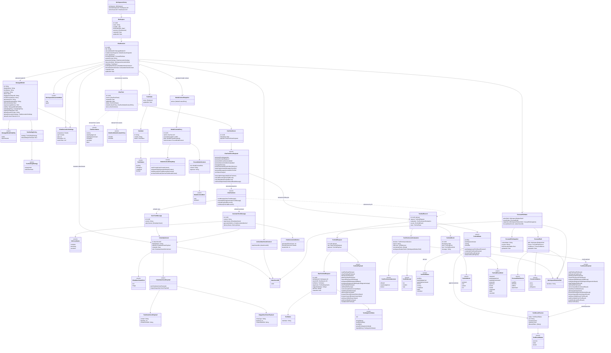

```mermaid
classDiagram
  direction TB

  class WorkspaceLibrary {
    workspaces: [Workspace]
    activeWorkspaceID: Workspace.ID?
    activeSessionID: ChatSession.ID?
  }

  class Workspace {
    id: UUID
    name: String
    rootURL: URL
    bookmarkData: Data?
    sessions: [ChatSession]
    createdAt: Date
    updatedAt: Date
  }

  class ChatSession {
    id: UUID
    title: String
    selectedModelID: ManagedModel.ID
    modelContextSnapshot: ModelContextSnapshot
    turns: [ChatTurn]
    focusedFileState: FocusedFileState
    systemPrompt: String
    generationSettings: ChatGenerationSettings
    interactionMode: WorkspaceInteractionMode
    todoState: TodoState?
    pendingAttachments: [ChatAttachment] transient
    activeAttachmentContext: ActiveAttachmentContext
    createdAt: Date
    updatedAt: Date
  }

  class ManagedModel {
    id: String
    displayName: String
    shortName: String
    summary: String
    detail: String
    huggingFaceRepoID: String
    localDirectoryName: String
    parameterSize: String
    estimatedDownloadSize: String
    isRecommended: Bool
    requiresLargeMemory: Bool
    stability: ManagedModelStability
    toolCallingPolicy: ToolCallingPolicy
    supportsImageInput: Bool
    defaultSystemPrompt: String
    defaultGenerationSettings: ChatGenerationSettings
    defaultContextTokenLimit: Int
  }

  class ManagedModelStability {
    <<enum>>
    stable
    experimental
  }

  class ToolCallingPolicy {
    strategy: ToolCallingStrategy
    allowsMultipleToolCalls: Bool
  }

  class ToolCallingStrategy {
    <<enum>>
    unsupported
    nativeGemma4
  }

  class ChatGenerationSettings {
    temperature: Double
    topP: Double
    topK: Int
    maxTokens: Int
    maxKVSize: Int?
  }

  class WorkspaceInteractionMode {
    <<enum>>
    chat
    agent
  }

  class ChatTurn {
    id: UUID
    events: [ChatTurnEvent]
    createdAt: Date
    updatedAt: Date
    status: ChatTurnStatus
    modelContextPolicy: ChatTurnModelContextPolicy
    items: [ChatTurnItem]
  }

  class ChatTurnEvent {
    id: UUID
    timestamp: Date
    payload: ChatTurnEventPayload
  }

  class ChatTurnEventPayload {
    <<enum>>
    transcriptItemAppended(ChatTurnItem)
    assistantChunkAppended
    assistantContentReplaced
    assistantDeliveryStatusUpdated
    assistantGenerationMetricsUpdated
    messageRemoved
    transientAssistantPlaceholdersRemoved
    streamingAssistantMessagesCancelled
    toolCallRecorded(ToolCallRecord)
    toolCallUpdated(ToolCallRecord)
    assistantMessageAnnotatedAsToolCall
    toolResultAppended(ToolResultModelMessage)
    turnStatusChanged
  }

  class ChatTurnStatus {
    <<enum>>
    running
    awaitingApproval
    awaitingUserAnswer
    completed
    cancelled
    failed
  }

  class ChatTurnModelContextPolicy {
    <<enum>>
    included
    excluded
  }

  class ChatTurnItem {
    <<enum>>
    userMessage(UserTurnMessage)
    assistantMessage(AssistantTurnMessage)
    toolCall(ToolCallRecord.ID)
    toolResult(ToolCallRecord.ID)
  }

  class UserTurnMessage {
    id: UUID
    content: String
    attachments: [ChatAttachment]
  }

  class AssistantTurnMessage {
    id: UUID
    content: String
    attachments: [ChatAttachment]
    generationMetrics: ChatGenerationMetrics?
    deliveryStatus: DeliveryStatus
  }

  class DeliveryStatus {
    <<enum>>
    complete
    streaming
    cancelled
  }

  class ChatAttachment {
    id: AttachmentID
    displayName: String
    payload: ChatAttachmentPayload
    createdAt: Date
    kind: ChatAttachmentKind derived
  }

  class ChatAttachmentKind {
    <<enum>>
    text
    image
  }

  class ChatAttachmentPayload {
    <<enum>>
    text(TextAttachmentPayload)
    image(ImageAttachmentPayload)
  }

  class TextAttachmentPayload {
    content: String
    byteSize: Int
    contentSHA256: String
  }

  class ImageAttachmentPayload {
    mimeType: String
    byteSize: Int
    contentSHA256: String
  }

  class ActiveAttachmentContext {
    attachmentIDs: [AttachmentID]
  }

  class AttachmentID {
    UUID
  }

  class ChatGenerationMetrics {
    generatedTokenCount: Int
    tokensPerSecond: Double
    durationMs: Int
  }

  class TodoState {
    items: [TodoItem]
    updatedAt: Date
  }

  class TodoItem {
    id: String
    content: String
    status: TodoStatus
  }

  class TodoStatus {
    <<enum>>
    pending
    inProgress
    completed
    blocked
  }

  class ToolCallRecord {
    id: UUID derived
    request: ToolCallRequest
    evaluation: ToolPermissionEvaluation
    events: [ToolCallEvent]
    state: ToolCallState
  }

  class ToolCallRequest {
    id: UUID derived
    raw: RawToolCallRequest
    payload: ToolCallPayload
  }

  class RawToolCallRequest {
    id: UUID
    workspaceID: Workspace.ID
    sessionID: ChatSession.ID
    toolName: ToolName
    arguments: ToolCallArguments
    originalToolName: String?
    rawText: String?
    createdAt: Date
  }

  class ToolName {
    rawValue: String
  }

  class ToolArgumentValue {
    <<enum>>
    string(String)
    number(Double)
    bool(Bool)
    array([ToolArgumentValue])
    object([String: ToolArgumentValue])
    null
  }

  class ToolCallPayload {
    <<enum>>
    readFile(ReadFileInput)
    showFile(ReadFileInput)
    listFiles(ListFilesInput)
    globFiles(GlobFilesInput)
    searchFiles(SearchFilesInput)
    workspaceDiff(WorkspaceDiffInput)
    workspaceDiagnostics(WorkspaceDiagnosticsInput)
    writeFile(WriteFileInput)
    editFile(EditFileInput)
    runCommand(RunCommandInput)
    todoWrite(TodoWriteInput)
    askUser(AskUserInput)
    browserRefresh(BrowserRefreshInput)
    browserInspect(BrowserInspectInput)
    webSearch(WebSearchInput)
    webFetch(WebFetchInput)
    invalid(InvalidToolInput)
  }

  class ToolPermissionEvaluation {
    decision: ToolPermissionDecision
    reason: String
    riskLevel: ToolRiskLevel
    normalizedPaths: [String]
    workspaceRelativePaths: [WorkspaceRelativePath]
  }

  class ToolPermissionDecision {
    <<enum>>
    allowed
    requiresApproval
    denied
  }

  class ToolRiskLevel {
    <<enum>>
    low
    medium
    high
  }

  class ToolCallState {
    <<enum>>
    pending
    awaitingApproval(ToolResultPreview?)
    awaitingUserAnswer
    running
    completed(ToolResultPayload)
    denied(ToolResultPayload)
    failed(ToolResultPayload)
    cancelled
  }

  class ToolCallStatus {
    <<enum>>
    pending
    awaitingApproval
    awaitingUserAnswer
    denied
    running
    completed
    failed
    cancelled
  }

  class ToolResultPayload {
    <<enum>>
    readFile(ReadFileResult)
    listFiles(ListFilesResult)
    globFiles(GlobFilesResult)
    searchFiles(SearchFilesResult)
    workspaceDiff(WorkspaceDiffResult)
    workspaceDiagnostics(WorkspaceDiagnosticsResult)
    writeFile(WriteFileResult)
    editFile(EditFileResult)
    runCommand(RunCommandResult)
    todoWrite(TodoWriteResult)
    askUser(AskUserResult)
    browserRefresh(BrowserRefreshResult)
    browserInspect(BrowserInspectResult)
    webSearch(WebSearchToolResult)
    webFetch(WebFetchToolResult)
    invalidTool(InvalidToolResult)
    failure(ToolFailure)
  }

  class ToolResultPreview {
    status: ToolResultStatus
    text: String
    truncated: Bool
    redacted: Bool
    affectedPaths: [String]
  }

  class ToolResultStatus {
    <<enum>>
    success
    failed
    denied
  }

  class ToolCallEvent {
    id: UUID
    timestamp: Date
    actor: ToolCallActor
    kind: ToolCallEventKind
    message: String
  }

  class ToolCallActor {
    <<enum>>
    assistant
    user
    system
    tool
  }

  class ToolCallEventKind {
    <<enum>>
    requested
    awaitingApproval
    awaitingUserAnswer
    answered
    approved
    denied
    started
    completed
    failed
    cancelled
  }

  class ModelContextSnapshot {
    entries: [ModelContextEntry]
  }

  class ModelContextEntry {
    id: UUID
    turnID: ChatTurn.ID?
    sourceMessageID: UUID?
    body: ModelContextEntryBody
    frozenContent: FrozenModelContent
  }

  class ModelContextEntryBody {
    <<enum>>
    userPrompt(UserPromptContext)
    assistantOutput(AssistantOutputContext)
    toolObservation(ToolObservationContext)
    terminalToolResult(TerminalToolResultContext)
  }

  class FrozenModelContent {
    role: ModelContextRole
    content: String
    signature: String
  }

  class ModelContextRole {
    <<enum>>
    user
    assistant
  }

  class FocusedFileState {
    activePath: WorkspaceRelativePath?
    recentPaths: [FocusedPath]
    snapshots: [WorkspaceRelativePath: FocusedFileSnapshot]
    focusedAttachments: [AttachmentID]
  }

  class FocusedPath {
    path: WorkspaceRelativePath
    source: FocusedPathSource
    confidence: FocusConfidence
    updatedAt: Date
  }

  class FocusedPathSource {
    <<enum>>
    readFile
    writeFile
    editFile
    attachment
  }

  class FocusConfidence {
    <<enum>>
    active
    recent
    ambiguous
  }

  class FocusedFileSnapshot {
    contentHash: String
    excerpt: String?
    fullContentAvailable: Bool
    updatedAt: Date
  }

  class WorkspaceRelativePath {
    rawValue: String
  }

  WorkspaceLibrary "1" --> "*" Workspace
  Workspace "1" --> "*" ChatSession

  ChatSession "1" --> "*" ChatTurn : canonical turn event log
  ChatSession "1" --> "1" ModelContextSnapshot : persisted model context
  ChatSession "1" --> "1" FocusedFileState
  ChatSession "1" --> "1" ActiveAttachmentContext
  ChatSession "0..1" --> "1" TodoState
  ChatSession --> ManagedModel : selected model ID
  ChatSession --> ChatGenerationSettings
  ChatSession --> WorkspaceInteractionMode
  ChatSession --> ChatAttachment : transient attachments

  ManagedModel --> ManagedModelStability
  ManagedModel --> ToolCallingPolicy
  ManagedModel --> ChatGenerationSettings
  ToolCallingPolicy --> ToolCallingStrategy

  ChatTurn "1" --> "*" ChatTurnEvent
  ChatTurnEvent --> ChatTurnEventPayload
  ChatTurnEventPayload --> ChatTurnItem : transcript projection
  ChatTurnEventPayload --> ToolCallRecord : derived tool lifecycle
  ChatTurn ..> ChatTurnStatus : derived from events
  ChatTurn ..> ChatTurnModelContextPolicy : derived from events
  ChatTurnItem --> UserTurnMessage : embeds user
  ChatTurnItem --> AssistantTurnMessage : embeds assistant
  ChatTurnItem ..> ToolCallRecord : references by ID
  UserTurnMessage --> ChatAttachment
  AssistantTurnMessage --> ChatAttachment
  AssistantTurnMessage --> ChatGenerationMetrics
  AssistantTurnMessage --> DeliveryStatus

  ChatAttachment --> AttachmentID
  ChatAttachment --> ChatAttachmentKind
  ChatAttachment --> ChatAttachmentPayload
  ChatAttachmentPayload --> TextAttachmentPayload
  ChatAttachmentPayload --> ImageAttachmentPayload
  ActiveAttachmentContext --> AttachmentID

  TodoState "1" --> "*" TodoItem
  TodoItem --> TodoStatus

  ToolCallRecord "1" --> "1" ToolCallRequest
  ToolCallRecord "1" --> "1" ToolPermissionEvaluation
  ToolCallRecord "1" --> "1" ToolCallState
  ToolCallRecord "1" --> "*" ToolCallEvent
  ToolCallRequest --> RawToolCallRequest
  ToolCallRequest --> ToolCallPayload
  RawToolCallRequest --> ToolName
  RawToolCallRequest --> ToolArgumentValue
  ToolPermissionEvaluation --> ToolPermissionDecision
  ToolPermissionEvaluation --> ToolRiskLevel
  ToolPermissionEvaluation --> WorkspaceRelativePath
  ToolCallState --> ToolCallStatus : derived
  ToolCallState --> ToolResultPreview : approval preview
  ToolCallState --> ToolResultPayload : result payload
  ToolResultPayload --> ToolResultPreview : derived preview
  ToolResultPreview --> ToolResultStatus
  ToolCallEvent --> ToolCallActor
  ToolCallEvent --> ToolCallEventKind

  ModelContextSnapshot "1" --> "*" ModelContextEntry
  ModelContextEntry --> ModelContextEntryBody
  ModelContextEntry --> FrozenModelContent
  FrozenModelContent --> ModelContextRole

  FocusedFileState --> WorkspaceRelativePath
  FocusedFileState --> FocusedPath
  FocusedFileState --> FocusedFileSnapshot
  FocusedFileState --> AttachmentID
  FocusedPath --> WorkspaceRelativePath
  FocusedPath --> FocusedPathSource
  FocusedPath --> FocusConfidence
```
