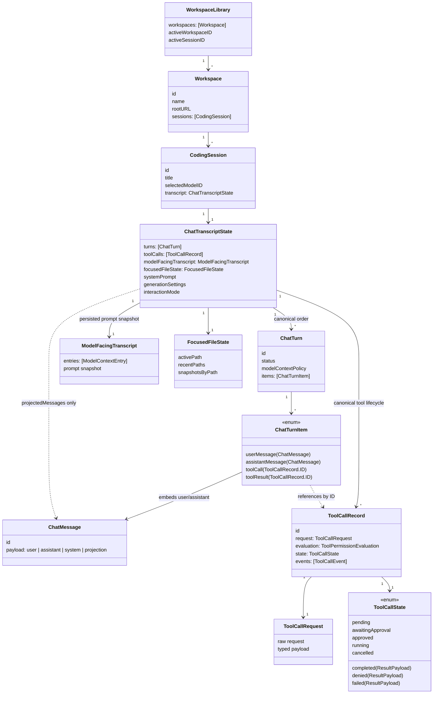

```mermaid
classDiagram
  direction TB

  class WorkspaceLibrary {
    workspaces: [Workspace]
    activeWorkspaceID
    activeSessionID
  }

  class Workspace {
    id
    name
    rootURL
    sessions: [CodingSession]
  }

  class CodingSession {
    id
    title
    selectedModelID
    transcript: ChatTranscriptState
  }

  class ChatTranscriptState {
    turns: [ChatTurn]
    toolCalls: [ToolCallRecord]
    modelFacingTranscript: ModelFacingTranscript
    focusedFileState: FocusedFileState
    systemPrompt
    generationSettings
    interactionMode
  }

  class ChatTurn {
    id
    status
    modelContextPolicy
    items: [ChatTurnItem]
  }

  class ChatTurnItem {
    <<enum>>
    userMessage(ChatMessage)
    assistantMessage(ChatMessage)
    toolCall(ToolCallRecord.ID)
    toolResult(ToolCallRecord.ID)
  }

  class ChatMessage {
    id
    payload: user | assistant | system | projection
  }

  class ToolCallRecord {
    id
    request: ToolCallRequest
    evaluation: ToolPermissionEvaluation
    state: ToolCallState
    events: [ToolCallEvent]
  }

  class ToolCallRequest {
    raw request
    typed payload
  }

  class ToolCallState {
    <<enum>>
    pending
    awaitingApproval
    approved
    running
    completed(ResultPayload)
    denied(ResultPayload)
    failed(ResultPayload)
    cancelled
  }

  class ModelFacingTranscript {
    entries: [ModelContextEntry]
    prompt snapshot
  }

  class FocusedFileState {
    activePath
    recentPaths
    snapshotsByPath
  }

  WorkspaceLibrary "1" --> "*" Workspace
  Workspace "1" --> "*" CodingSession
  CodingSession "1" --> "1" ChatTranscriptState

  ChatTranscriptState "1" --> "*" ChatTurn : canonical order
  ChatTranscriptState "1" --> "*" ToolCallRecord : canonical tool lifecycle
  ChatTranscriptState "1" --> "1" ModelFacingTranscript : persisted prompt snapshot
  ChatTranscriptState "1" --> "1" FocusedFileState

  ChatTurn "1" --> "*" ChatTurnItem
  ChatTurnItem --> ChatMessage : embeds user/assistant
  ChatTurnItem ..> ToolCallRecord : references by ID

  ToolCallRecord "1" --> "1" ToolCallRequest
  ToolCallRecord "1" --> "1" ToolCallState

  ChatTranscriptState ..> ChatMessage : projectedMessages only
```