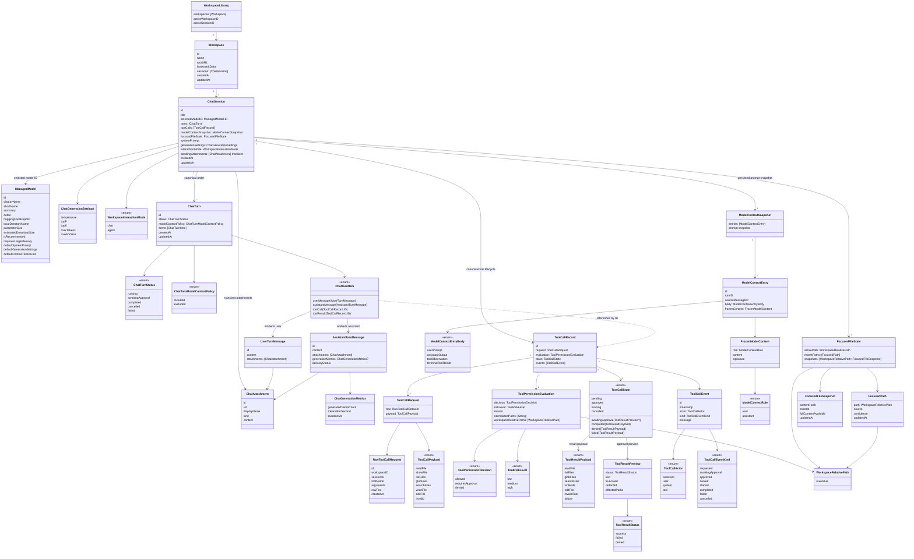

```mermaid
classDiagram
  direction TB

  class WorkspaceLibrary {
    workspaces: [Workspace]
    activeWorkspaceID
    activeSessionID
  } 

  class Workspace {
    id
    name
    rootURL
    bookmarkData
    sessions: [ChatSession]
    createdAt
    updatedAt
  }

  class ChatSession {
    id
    title
    selectedModelID: ManagedModel.ID
    turns: [ChatTurn]
    toolCalls: [ToolCallRecord]
    modelContextSnapshot: ModelContextSnapshot
    focusedFileState: FocusedFileState
    systemPrompt
    generationSettings: ChatGenerationSettings
    interactionMode: WorkspaceInteractionMode
    pendingAttachments: [ChatAttachment] transient
    createdAt
    updatedAt
  }

  class ManagedModel {
    id
    displayName
    shortName
    summary
    detail
    huggingFaceRepoID
    localDirectoryName
    parameterSize
    estimatedDownloadSize
    isRecommended
    requiresLargeMemory
    defaultSystemPrompt
    defaultGenerationSettings
    defaultContextTokenLimit
  }

  class ChatGenerationSettings {
    temperature
    topP
    topK
    maxTokens
    maxKVSize
  }

  class WorkspaceInteractionMode {
    <<enum>>
    chat
    agent
  }

  class ChatTurn {
    id
    status: ChatTurnStatus
    modelContextPolicy: ChatTurnModelContextPolicy
    items: [ChatTurnItem]
    createdAt
    updatedAt
  }

  class ChatTurnStatus {
    <<enum>>
    running
    awaitingApproval
    completed
    cancelled
    failed
  }

  class ChatTurnModelContextPolicy {
    <<enum>>
    included
    excluded
  }

  class ChatTurnItem {
    <<enum>>
    userMessage(UserTurnMessage)
    assistantMessage(AssistantTurnMessage)
    toolCall(ToolCallRecord.ID)
    toolResult(ToolCallRecord.ID)
  }

  class UserTurnMessage {
    id
    content
    attachments: [ChatAttachment]
  }

  class AssistantTurnMessage {
    id
    content
    attachments: [ChatAttachment]
    generationMetrics: ChatGenerationMetrics?
    deliveryStatus
  }

  class ChatAttachment {
    id
    url
    displayName
    kind
    content
  }

  class ChatGenerationMetrics {
    generatedTokenCount
    tokensPerSecond
    durationMs
  }

  class ToolCallRecord {
    id
    request: ToolCallRequest
    evaluation: ToolPermissionEvaluation
    state: ToolCallState
    events: [ToolCallEvent]
  }

  class ToolCallRequest {
    raw: RawToolCallRequest
    payload: ToolCallPayload
  }

  class RawToolCallRequest {
    id
    workspaceID
    sessionID
    toolName
    arguments
    rawText
    createdAt
  }

  class ToolCallPayload {
    <<enum>>
    readFile
    showFile
    listFiles
    globFiles
    searchFiles
    writeFile
    editFile
    invalid
  }

  class ToolPermissionEvaluation {
    decision: ToolPermissionDecision
    riskLevel: ToolRiskLevel
    reason
    normalizedPaths: [String]
    workspaceRelativePaths: [WorkspaceRelativePath]
  }

  class ToolPermissionDecision {
    <<enum>>
    allowed
    requiresApproval
    denied
  }

  class ToolRiskLevel {
    <<enum>>
    low
    medium
    high
  }

  class ToolCallState {
    <<enum>>
    pending
    awaitingApproval(ToolResultPreview?)
    approved
    running
    completed(ToolResultPayload)
    denied(ToolResultPayload)
    failed(ToolResultPayload)
    cancelled
  }

  class ToolResultPayload {
    <<enum>>
    readFile
    listFiles
    globFiles
    searchFiles
    writeFile
    editFile
    invalidTool
    failure
  }

  class ToolResultPreview {
    status: ToolResultStatus
    text
    truncated
    redacted
    affectedPaths
  }

  class ToolResultStatus {
    <<enum>>
    success
    failed
    denied
  }

  class ToolCallEvent {
    id
    timestamp
    actor: ToolCallActor
    kind: ToolCallEventKind
    message
  }

  class ToolCallActor {
    <<enum>>
    assistant
    user
    system
    tool
  }

  class ToolCallEventKind {
    <<enum>>
    requested
    awaitingApproval
    approved
    denied
    started
    completed
    failed
    cancelled
  }

  class ModelContextSnapshot {
    entries: [ModelContextEntry]
    prompt snapshot
  }

  class ModelContextEntry {
    id
    turnID
    sourceMessageID
    body: ModelContextEntryBody
    frozenContent: FrozenModelContent
  }

  class ModelContextEntryBody {
    <<enum>>
    userPrompt
    assistantOutput
    toolObservation
    terminalToolResult
  }

  class FrozenModelContent {
    role: ModelContextRole
    content
    signature
  }

  class ModelContextRole {
    <<enum>>
    user
    assistant
  }

  class FocusedFileState {
    activePath: WorkspaceRelativePath
    recentPaths: [FocusedPath]
    snapshots: [WorkspaceRelativePath: FocusedFileSnapshot]
  }

  class FocusedPath {
    path: WorkspaceRelativePath
    source
    confidence
    updatedAt
  }

  class FocusedFileSnapshot {
    contentHash
    excerpt
    fullContentAvailable
    updatedAt
  }

  class WorkspaceRelativePath {
    rawValue
  }

  WorkspaceLibrary "1" --> "*" Workspace
  Workspace "1" --> "*" ChatSession

  ChatSession "1" --> "*" ChatTurn : canonical order
  ChatSession "1" --> "*" ToolCallRecord : canonical tool lifecycle
  ChatSession "1" --> "1" ModelContextSnapshot : persisted prompt snapshot
  ChatSession "1" --> "1" FocusedFileState
  ChatSession --> ManagedModel : selected model ID
  ChatSession --> ChatGenerationSettings
  ChatSession --> WorkspaceInteractionMode
  ChatSession --> ChatAttachment : transient attachments

  ChatTurn "1" --> "*" ChatTurnItem
  ChatTurn --> ChatTurnStatus
  ChatTurn --> ChatTurnModelContextPolicy
  ChatTurnItem --> UserTurnMessage : embeds user
  ChatTurnItem --> AssistantTurnMessage : embeds assistant
  ChatTurnItem ..> ToolCallRecord : references by ID
  UserTurnMessage --> ChatAttachment
  AssistantTurnMessage --> ChatAttachment
  AssistantTurnMessage --> ChatGenerationMetrics

  ToolCallRecord "1" --> "1" ToolCallRequest
  ToolCallRecord "1" --> "1" ToolPermissionEvaluation
  ToolCallRecord "1" --> "1" ToolCallState
  ToolCallRecord "1" --> "*" ToolCallEvent
  ToolCallRequest --> RawToolCallRequest
  ToolCallRequest --> ToolCallPayload
  ToolPermissionEvaluation --> ToolPermissionDecision
  ToolPermissionEvaluation --> ToolRiskLevel
  ToolPermissionEvaluation --> WorkspaceRelativePath
  ToolCallState --> ToolResultPreview : approval preview
  ToolCallState --> ToolResultPayload : result payload
  ToolResultPreview --> ToolResultStatus
  ToolCallEvent --> ToolCallActor
  ToolCallEvent --> ToolCallEventKind
  ModelContextSnapshot "1" --> "*" ModelContextEntry
  ModelContextEntry --> ModelContextEntryBody
  ModelContextEntry --> FrozenModelContent
  FrozenModelContent --> ModelContextRole
  FocusedFileState --> WorkspaceRelativePath
  FocusedFileState --> FocusedPath
  FocusedFileState --> FocusedFileSnapshot
  FocusedPath --> WorkspaceRelativePath
```
