# Sumika Domain Model

This diagram is a curated view of the persisted chat/tool model and its derived
model-context projection. See [`data-model.md`](data-model.md) for the generated,
source-complete `SumikaCore` model inventory.

```mermaid
classDiagram
  direction TB

  class WorkspaceLibrary {
    workspaces: [Workspace]
    activeWorkspaceID: Workspace.ID?
    activeSessionID: ChatSession.ID?
  }

  class Workspace {
    id: UUID
    name: String
    rootURL: URL
    bookmarkData: Data?
    sessions: [ChatSession]
    createdAt: Date
    updatedAt: Date
  }

  class ChatSession {
    id: UUID
    title: String
    selectedModelID: ManagedModel.ID
    turns: [ChatTurn]
    focusedFileState: FocusedFileState
    modeSettings: ChatModeSettingsSet
    interactionMode: WorkspaceInteractionMode
    toolApprovalPolicy: ToolApprovalPolicy
    selectedMCPServerIDs: [UUID]
    todoState: TodoState?
    createdAt: Date
    updatedAt: Date
  }

  class ManagedModel {
    id: String
    displayName: String
    detail: String
    huggingFaceRepoID: String
    localDirectoryName: String
    estimatedDownloadSize: String
    isRecommended: Bool
    requiresLargeMemory: Bool
    stability: ManagedModelStability
    toolCallingPolicy: ToolCallingPolicy
    supportsImageInput: Bool
    reasoningTraceFormat: ReasoningTraceFormat
    supportsHistoricalReasoningPreservation: Bool
    reasoningCapability: ModelReasoningCapability
    defaultModeSettings: ChatModeSettingsSet
    defaultContextTokenLimit: Int
    maxToolLoopIterations: Int
  }

  class ManagedModelStability {
    <<enum>>
    stable
    experimental
  }

  class ToolCallingPolicy {
    isEnabled: Bool
    allowsMultipleToolCalls: Bool
  }

  class ReasoningTraceFormat {
    <<enum>>
    none
    gemmaChannel
    qwenThinkTags
  }

  class ChatGenerationSettings {
    temperature: Double
    topP: Double
    topK: Int
    maxTokens: Int
    repetitionPenalty: Double
    repetitionContextSize: Int
    presencePenalty: Double
    reasoningSelection: ReasoningSelection
  }

  class ReasoningEffort {
    <<enum>>
    low
    medium
    xhigh
  }

  class ReasoningSelection {
    <<enum>>
    off
    on
    effort(ReasoningEffort)
  }

  class ModelReasoningCapability {
    <<enum>>
    toggle
    selectableEffort(supported, defaultValue)
  }

  class ChatModeSettingsSet {
    chat: ChatModeSettings
    agent: ChatModeSettings
  }

  class ChatModeSettings {
    systemPrompt: String
    generationSettings: ChatGenerationSettings
  }

  class WorkspaceInteractionMode {
    <<enum>>
    chat
    agent
  }

  class ToolApprovalPolicy {
    <<enum>>
    manual
    automatic
  }

  class ChatTurn {
    id: UUID
    status: ChatTurnStatus
    modelContextPolicy: ChatTurnModelContextPolicy
    items: [ChatTurnItem]
    createdAt: Date
    updatedAt: Date
  }

  class ChatTurnStatus {
    <<enum>>
    running
    awaitingApproval
    awaitingUserAnswer
    completed
    cancelled
    failed
  }

  class ChatTurnModelContextPolicy {
    <<enum>>
    included
    excluded
  }

  class ChatTurnItem {
    <<enum>>
    userMessage(UserTurnMessage)
    assistantThinking(AssistantThinkingMessage)
    assistantMessage(AssistantTurnMessage)
    tool(ToolCallRecord)
  }

  class UserTurnMessage {
    id: UUID
    content: String
    attachments: [ChatAttachment]
    promptContext: CurrentPromptContext
  }

  class AssistantTurnMessage {
    id: UUID
    content: String
    modelProjectionPolicy: AssistantModelProjectionPolicy
    attachments: [ChatAttachment]
    generationMetrics: ChatGenerationMetrics?
    deliveryStatus: AssistantDeliveryStatus
  }

  class AssistantModelProjectionPolicy {
    <<enum>>
    visibleContent
    override(String)
    excluded
  }

  class AssistantThinkingMessage {
    id: UUID
    content: String
    deliveryStatus: AssistantDeliveryStatus
    startedAt: Date?
    completedAt: Date?
    reasoningDuration: TimeInterval? derived
  }

  class AssistantDeliveryStatus {
    <<enum>>
    complete
    streaming
    cancelled
  }

  class ChatAttachment {
    id: AttachmentID
    displayName: String
    payload: ChatAttachmentPayload
    createdAt: Date
    kind: ChatAttachmentKind derived
  }

  class ChatAttachmentKind {
    <<enum>>
    text
    image
  }

  class ChatAttachmentPayload {
    <<enum>>
    text(TextAttachmentPayload)
    image(ImageAttachmentPayload)
  }

  class TextAttachmentPayload {
    content: String
    byteSize: Int
    contentSHA256: String
  }

  class ImageAttachmentPayload {
    mimeType: String
    byteSize: Int
    contentSHA256: String
  }

  class AttachmentID {
    UUID
  }

  class ChatGenerationMetrics {
    generatedTokenCount: Int
    tokensPerSecond: Double
  }

  class TodoState {
    items: [TodoItem]
    updatedAt: Date
  }

  class TodoItem {
    id: String
    content: String
    status: TodoStatus
  }

  class TodoStatus {
    <<enum>>
    pending
    inProgress
    completed
    blocked
  }

  class ToolCallRecord {
    id: UUID derived
    request: ToolCallRequest
    evaluation: ToolPermissionEvaluation
    state: ToolCallState
    approvalSource: ToolApprovalSource?
    modelFollowUpNotice: String?
  }

  class ToolApprovalSource {
    <<enum>>
    manual
    automatic
  }

  class ToolCallRequest {
    id: UUID derived
    raw: RawToolCallRequest
    payload: ToolCallPayload
  }

  class RawToolCallRequest {
    id: UUID
    workspaceID: Workspace.ID
    sessionID: ChatSession.ID
    toolName: ToolName
    arguments: ToolCallArguments
    originalToolName: String?
    createdAt: Date
  }

  class ToolName {
    rawValue: String
  }

  class ToolArgumentValue {
    <<enum>>
    string(String)
    number(Double)
    bool(Bool)
    array([ToolArgumentValue])
    object([String: ToolArgumentValue])
    null
  }

  class ToolCallPayload {
    <<enum>>
    readFile(ReadFileInput)
    showFile(ReadFileInput)
    listFiles(ListFilesInput)
    globFiles(GlobFilesInput)
    searchFiles(SearchFilesInput)
    workspaceDiff(WorkspaceDiffInput)
    workspaceDiagnostics(WorkspaceDiagnosticsInput)
    writeFile(WriteFileInput)
    editFile(EditFileInput)
    runCommand(RunCommandInput)
    todoWrite(TodoWriteInput)
    askUser(AskUserInput)
    finishTask(FinishTaskInput)
    browserRefresh(BrowserRefreshInput)
    browserInspect(BrowserInspectInput)
    webSearch(WebSearchInput)
    webFetch(WebFetchInput)
    mcp(MCPToolInput)
    invalid(InvalidToolInput)
  }

  class ToolPermissionEvaluation {
    decision: ToolPermissionDecision
    reason: String
    riskLevel: ToolRiskLevel
    normalizedPaths: [String]
    workspaceRelativePaths: [WorkspaceRelativePath]
  }

  class ToolPermissionDecision {
    <<enum>>
    allowed
    requiresApproval
    denied
  }

  class ToolRiskLevel {
    <<enum>>
    low
    medium
    high
  }

  class ToolCallState {
    <<enum>>
    pending
    awaitingApproval(ToolResultPreview?)
    awaitingUserAnswer
    running
    completed(ToolResultPayload)
    denied(ToolResultPayload)
    failed(ToolResultPayload)
    cancelled
  }

  class ToolCallStatus {
    <<enum>>
    pending
    awaitingApproval
    awaitingUserAnswer
    denied
    running
    completed
    failed
    cancelled
  }

  class ToolResultPayload {
    <<enum>>
    readFile(ReadFileResult)
    listFiles(ListFilesResult)
    globFiles(GlobFilesResult)
    searchFiles(SearchFilesResult)
    workspaceDiff(WorkspaceDiffResult)
    workspaceDiagnostics(WorkspaceDiagnosticsResult)
    writeFile(WriteFileResult)
    editFile(EditFileResult)
    runCommand(RunCommandResult)
    todoWrite(TodoWriteResult)
    askUser(AskUserResult)
    finishTask(FinishTaskResult)
    browserRefresh(BrowserRefreshResult)
    browserInspect(BrowserInspectResult)
    webSearch(WebSearchToolResult)
    webFetch(WebFetchToolResult)
    mcp(MCPToolResult)
    duplicateToolCall(DuplicateToolCallResult)
    invalidTool(InvalidToolResult)
    failure(ToolFailure)
  }

  class ToolResultPreview {
    status: ToolResultStatus
    text: String
    truncated: Bool
    redacted: Bool
    affectedPaths: [String]
    resultPayload: ToolResultPayload?
  }

  class ToolResultStatus {
    <<enum>>
    success
    failed
    denied
  }

  class ModelPromptProjection {
    entries: [ModelContextEntry]
    projectedEntries(mode): [ProjectedModelContextEntry] derived
  }

  class ModelContextProjectionMode {
    <<enum>>
    fullHistory
    compactedHistoryForLaterTurns
  }

  class ProjectedModelContextEntry {
    role: ModelContextRole
    content: String
    imageSignatures: [String]
  }

  class ModelContextEntry {
    id: UUID
    turnID: ChatTurn.ID?
    sourceMessageID: UUID?
    body: ModelContextEntryBody
    frozenContent: FrozenModelContent
  }

  class ModelContextEntryBody {
    <<enum>>
    userPrompt(UserPromptContext)
    assistantOutput(AssistantOutputContext)
    toolObservation(ToolObservationContext)
  }

  class UserPromptContext {
    prompt: String
    attachmentNames: [String]
    imageSignatures: [String]
    currentPromptContext: CurrentPromptContext?
  }

  class CurrentPromptContext {
    <<enum>>
    empty(ContextBudget)
    selected(CurrentPromptContextSelection)
  }

  class CurrentPromptContextSelection {
    blocks: NonEmptyPromptContextBlocks
    budget: ContextBudget
    truncation: PromptContextTruncation
  }

  class NonEmptyPromptContextBlocks {
    values: [PromptContextBlock]
  }

  class PromptContextBlock {
    <<enum>>
    attachedFile(AttachedFilePromptContext)
    focusedFile(FocusedFilePromptContext)
    ambiguousRecentFiles(AmbiguousRecentFilesPromptContext)
    workspaceInstructions(WorkspaceInstructionsPromptContext)
  }

  class ContextBudget {
    maxCharacters: Int
  }

  class PromptContextTruncation {
    <<enum>>
    none
    byCharacterBudget
  }

  class AssistantOutputContext {
    content: String
  }

  class ToolObservationContext {
    callID: UUID
    toolName: ToolName
    status: ToolResultStatus
    content: String
    toolReceipt: ToolReceipt?
    toolCall: ToolCallModelMessage?
  }

  class ToolReceipt {
    callID: UUID
    toolName: ToolName
    status: ToolResultStatus
    affectedPaths: [WorkspaceRelativePath]
    summary: ToolReceiptSummary
    outputTruncated: Bool
    outputRedacted: Bool
  }

  class ToolReceiptSummary {
    text: String
    truncated: Bool
  }

  class ToolCallModelMessage {
    callID: UUID
    toolName: ToolName
    arguments: [ToolCallModelArgument]
    rawArguments: ToolCallArguments
  }

  class ToolCallModelArgument {
    name: String
    value: String
  }

  class FrozenModelContent {
    role: ModelContextRole
    content: String
    signature: String
  }

  class ModelContextRole {
    <<enum>>
    user
    assistant
    tool
  }

  class ModelContextDebugState {
    runtimeCacheDebugSnapshot: RuntimeCacheDebugSnapshot?
    documentRevision: Int
  }

  class RuntimeCacheDebugSnapshot {
    generationID: UUID
    recordedAt: Date
    cacheMode: String
    cacheReason: String
    reuseStrategy: String
    appendDeltaStartIndex: Int?
    contextSignature: String
    previousContextSignature: String?
    appendOnly: Bool
    reusedMessageCount: Int
    appendedMessageCount: Int
    mismatchReason: String?
    firstMismatchIndex: Int?
    systemPromptChanged: Bool?
  }

  class FocusedFileState {
    activePath: WorkspaceRelativePath?
    recentPaths: [FocusedPath]
    snapshots: [WorkspaceRelativePath: FocusedFileSnapshot]
  }

  class FocusedPath {
    path: WorkspaceRelativePath
    source: FocusedPathSource
    confidence: FocusConfidence
    updatedAt: Date
  }

  class FocusedPathSource {
    <<enum>>
    readFile
    writeFile
    editFile
    attachment
  }

  class FocusConfidence {
    <<enum>>
    active
    recent
    ambiguous
  }

  class FocusedFileSnapshot {
    contentHash: String
    excerpt: String?
    fullContentAvailable: Bool
    updatedAt: Date
  }

  class WorkspaceRelativePath {
    rawValue: String
  }

  WorkspaceLibrary "1" --> "*" Workspace
  Workspace "1" --> "*" ChatSession

  ChatSession "1" --> "*" ChatTurn : canonical turn records
  ChatSession ..> ModelPromptProjection : derived model input
  ChatSession "1" --> "1" FocusedFileState
  ChatSession "0..1" --> "1" TodoState
  ChatSession --> ManagedModel : selected model ID
  ChatSession --> ChatModeSettingsSet
  ChatSession --> WorkspaceInteractionMode
  ChatSession --> ToolApprovalPolicy

  ManagedModel --> ManagedModelStability
  ManagedModel --> ToolCallingPolicy
  ManagedModel --> ModelReasoningCapability
  ManagedModel --> ChatModeSettingsSet
  ChatModeSettingsSet --> ChatModeSettings
  ChatModeSettings --> ChatGenerationSettings
  ChatGenerationSettings --> ReasoningSelection
  ReasoningSelection --> ReasoningEffort
  ModelReasoningCapability --> ReasoningEffort

  ChatTurn "1" --> "*" ChatTurnItem : append-only membership
  ChatTurn --> ChatTurnStatus
  ChatTurn --> ChatTurnModelContextPolicy
  ChatTurnItem --> UserTurnMessage : embeds user
  ChatTurnItem --> AssistantThinkingMessage : embeds reasoning
  ChatTurnItem --> AssistantTurnMessage : embeds assistant
  ChatTurnItem --> ToolCallRecord : embeds tool lifecycle
  UserTurnMessage --> ChatAttachment
  UserTurnMessage --> CurrentPromptContext
  AssistantTurnMessage --> ChatAttachment
  AssistantTurnMessage --> ChatGenerationMetrics
  AssistantThinkingMessage --> AssistantDeliveryStatus
  AssistantTurnMessage --> AssistantDeliveryStatus
  AssistantTurnMessage --> AssistantModelProjectionPolicy

  ChatAttachment --> AttachmentID
  ChatAttachment --> ChatAttachmentKind
  ChatAttachment --> ChatAttachmentPayload
  ChatAttachmentPayload --> TextAttachmentPayload
  ChatAttachmentPayload --> ImageAttachmentPayload

  TodoState "1" --> "*" TodoItem
  TodoItem --> TodoStatus

  ToolCallRecord "1" --> "1" ToolCallRequest
  ToolCallRecord "1" --> "1" ToolPermissionEvaluation
  ToolCallRecord "1" --> "1" ToolCallState
  ToolCallRecord --> ToolApprovalSource
  ToolCallRequest --> RawToolCallRequest
  ToolCallRequest --> ToolCallPayload
  RawToolCallRequest --> ToolName
  RawToolCallRequest --> ToolArgumentValue
  ToolPermissionEvaluation --> ToolPermissionDecision
  ToolPermissionEvaluation --> ToolRiskLevel
  ToolPermissionEvaluation --> WorkspaceRelativePath
  ToolCallState --> ToolCallStatus : derived
  ToolCallState --> ToolResultPreview : approval preview
  ToolCallState --> ToolResultPayload : result payload
  ToolResultPayload --> ToolResultPreview : derived preview
  ToolResultPreview --> ToolResultPayload : optional approval payload
  ToolResultPreview --> ToolResultStatus

  ModelPromptProjection "1" --> "*" ModelContextEntry
  ModelPromptProjection --> ModelContextProjectionMode
  ModelPromptProjection --> ProjectedModelContextEntry : derived projection
  ModelContextEntry --> ModelContextEntryBody
  ModelContextEntry --> FrozenModelContent
  ModelContextEntryBody --> UserPromptContext
  ModelContextEntryBody --> AssistantOutputContext
  ModelContextEntryBody --> ToolObservationContext
  UserPromptContext --> CurrentPromptContext
  UserPromptContext --> ModelContextRole : model role derived
  CurrentPromptContext --> CurrentPromptContextSelection
  CurrentPromptContextSelection --> NonEmptyPromptContextBlocks
  CurrentPromptContextSelection --> ContextBudget
  CurrentPromptContextSelection --> PromptContextTruncation
  NonEmptyPromptContextBlocks --> PromptContextBlock
  ToolObservationContext --> ToolName
  ToolObservationContext --> ToolResultStatus
  ToolObservationContext --> ToolReceipt
  ToolObservationContext --> ToolCallModelMessage
  ToolReceipt --> ToolName
  ToolReceipt --> ToolResultStatus
  ToolReceipt --> WorkspaceRelativePath
  ToolReceipt --> ToolReceiptSummary
  ToolCallModelMessage --> ToolName
  ToolCallModelMessage --> ToolCallModelArgument
  ToolCallModelMessage --> ToolArgumentValue
  FrozenModelContent --> ModelContextRole
  ProjectedModelContextEntry --> ModelContextRole
  ModelContextDebugState --> RuntimeCacheDebugSnapshot

  FocusedFileState --> WorkspaceRelativePath
  FocusedFileState --> FocusedPath
  FocusedFileState --> FocusedFileSnapshot
  FocusedPath --> WorkspaceRelativePath
  FocusedPath --> FocusedPathSource
  FocusedPath --> FocusConfidence
```

