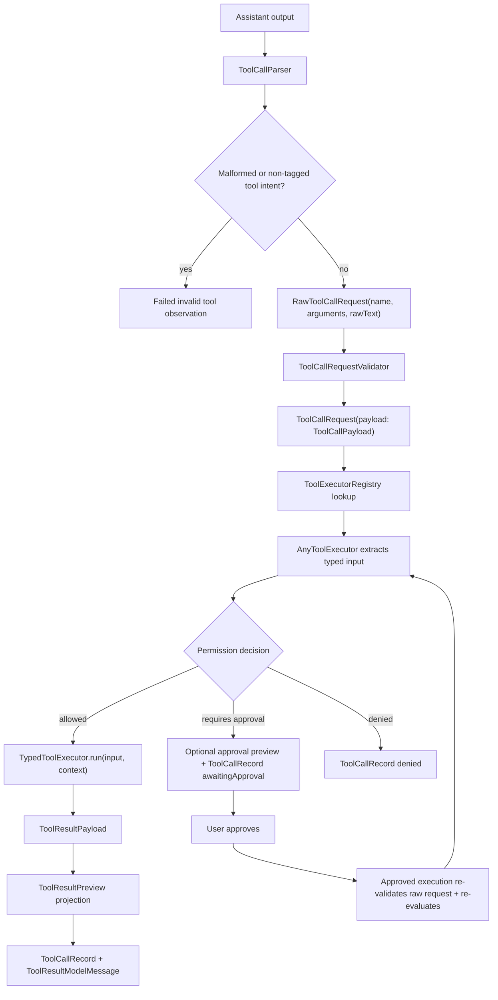

# Tool Runtime

The tool runtime is the boundary between model output and local side effects.
Tools are self-contained and type-safe: each tool owns its typed input,
definition, permission evaluation, and execution. Tools do not parse XML, JSON,
or provider-specific payloads.

## Flow



## Roles

- `ToolCallParser` understands the model-facing format, currently tagged
  action text. A future JSON or provider-native parser should still emit the
  same `RawToolCallRequest`. The tagged parser prefers explicit delimiter lines
  for multiline payloads. For `content`, `old_text`, and `new_text` payloads,
  it also accepts a bounded closing-tag fallback so small local models that omit
  delimiter lines can still produce auditable `write_file` and `edit_file`
  calls instead of raw transcript text.
- Malformed tagged tool attempts and strong non-tagged tool intent are not
  executed or reparsed as alternate protocols. The tool loop records an internal
  failed `invalid` tool observation containing the original tool name when it
  can be inferred and the parse/protocol error, then asks the model to continue
  within the normal tool-round budget.
- `RawToolCallRequest` is the parser handoff model: tool name,
  workspace/session, raw argument values, and optional raw text for debugging.
- `ToolCallRequest` is the validated execution-boundary model. It preserves the
  raw request and carries a typed `ToolCallPayload` for the built-in tool or an
  `invalid` payload with a precise reason.
- `ToolCallRequestValidator` is the only built-in boundary that decodes raw
  argument dictionaries into typed payloads. Invalid or unavailable tools become
  first-class invalid payloads before execution.
- `ToolExecutorRegistry` contains the executable tools for the active tool set
  and exposes their definitions for prompt rendering.
- `AnyToolExecutor` is the type-erased runtime boundary. It extracts the
  already-validated typed input from `ToolCallPayload`, evaluates permission,
  and runs the tool only when allowed. A `requiresApproval` decision can prepare
  a preview and becomes an awaiting-approval record without executing the tool.
  An approved execution path validates the raw request and evaluates permission
  again immediately before the side effect. Executed tools return a structured
  `ToolResultPayload`; the runtime stores that payload and derives
  `ToolResultPreview` for UI and model-facing observations.
- `TypedToolExecutor` is what every concrete tool implements. Its `run` method
  receives a concrete Swift input type, never raw argument dictionaries, and
  returns a typed result payload rather than UI text.
- `ToolResultPayload` is the domain result boundary. Built-in tool results carry
  typed success, failure, and recovery-relevant outcomes such as
  `edit_file` old-text misses, multiple matches, invalid calls, and common path
  failures.
- `ToolResultPreview` remains the compact rendering shape for the transcript,
  approval previews, UI summaries, and model observations. Controller and
  recovery logic should use `ToolResultPayload` where available instead of
  parsing preview text.
- `ToolContext` carries runtime context such as the active workspace.
- `ToolDefinition` describes a tool for prompts and provider adapters,
  including capability, risk, structured parameter metadata, and a
  provider-neutral function-tool schema projection. Provider-specific wire
  shapes should adapt from this model instead of becoming the core runtime
  representation.

## Adding A Tool

1. Define a typed input.

   ```swift
   struct ReadFileInput: Decodable, Sendable {
     let path: String
   }
   ```

2. Implement `TypedToolExecutor`.

   ```swift
   struct ReadFileToolExecutor: TypedToolExecutor {
     static let definition = ToolDefinition.readFile

     func evaluatePermission(
       _ input: ReadFileInput,
       context: ToolContext
     ) -> ToolPermissionEvaluation {
       // Resolve and validate affected paths here.
     }

     func run(
       _ input: ReadFileInput,
       context: ToolContext
     ) async -> ToolResultPayload {
       // Execute using typed input only and return domain result semantics.
     }
   }
   ```

3. Register the tool in the appropriate registry profile.

   ```swift
   static let readOnly = ToolExecutorRegistry([
     AnyToolExecutor(ReadFileToolExecutor()),
     AnyToolExecutor(ListFilesToolExecutor()),
     AnyToolExecutor(GlobFilesToolExecutor()),
     AnyToolExecutor(SearchFilesToolExecutor()),
   ])
   ```

4. Add tests for argument decoding, permission, execution, registry visibility,
   and any security-sensitive failure mode.

## Security Rules

- Tools must not parse XML, tagged text, JSON, or provider-native tool-call
  payloads themselves.
- Permission is evaluated after raw calls are validated into typed payloads and
  before execution.
- Registry membership controls prompt visibility, but it is not a complete
  security boundary.
- Tool-name repair is limited to deterministic canonicalization and exact
  aliases such as `Read` to `read_file`. Unknown names are not guessed; they
  become failed tool observations.
- Read-only tools may auto-run only after workspace/path validation.
- `glob_files` and `search_files` are read-only discovery tools. They validate
  the requested `path`, default it to `.`, skip project metadata/build
  directories, and cap returned results. `search_files` treats a valid pattern
  as a regular expression; invalid regular expressions fall back to literal
  substring matching.
- Write tools, and future command tools, must require explicit approval before
  execution.
- A tool that returns `.requiresApproval` must move to
  `ToolCallStatus.awaitingApproval`. It must not be marked as denied, failed,
  completed, or executed automatically.
- Tools that can preview an approval-sensitive operation should attach that
  preview before entering `awaitingApproval`. Preview generation must not
  mutate the workspace.
- Approved execution must re-validate the raw request and re-run
  permission/path evaluation immediately before the side effect.
- `write_file` writes the model-provided `content` directly. The model should
  not generate helper scripts to create files.
- `edit_file` replaces exactly one literal, case-sensitive `old_text` span in
  a UTF-8 workspace file with `new_text`. It does not support regexes or
  replace-all semantics. Zero matches, multiple matches, non-UTF-8 files, and
  identical old/new text fail before approval; approved execution re-reads and
  revalidates the file before writing atomically.
- `edit_file` is the only model-facing tool for changing existing files.
- Successful `write_file` and `edit_file` results are terminal for the chat
  turn. The controller should show the auditable tool result but must not
  request a follow-up model response that can restate the written file content.
- Tool results must report affected paths where possible so the UI can show a
  useful audit trail. Domain result payloads use canonical workspace-relative
  paths; UI renderers may decide how to display them.
- Tool result previews are projections. They must not be the source of truth for
  controller recovery decisions when a structured `ToolResultPayload` is
  available.
- Tool results from a cancelled chat turn may remain visible for auditability,
  but the chat model context must exclude them unless that same turn is still
  actively generating its direct follow-up response.
