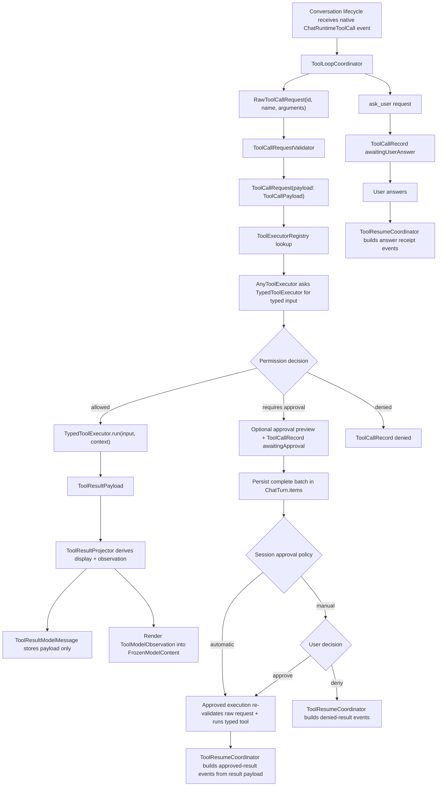

# Tool Runtime

The tool runtime is the boundary between model output and local side effects.
Tools are self-contained and type-safe: each tool owns its typed input,
definition, permission evaluation, and execution. Tools do not parse XML, JSON,
or provider-specific payloads.

## Flow



## Roles

- Native MLX tool-call events are the supported model-facing tool protocol when
  `ToolCallingPolicy.isEnabled` is true. MLX owns model-family tool-call format
  inference; `ToolLoopCoordinator` converts native events into the same neutral
  `RawToolCallRequest` execution boundary used by the rest of Core.
- When a native response contains multiple calls, `ToolLoopCoordinator` first
  validates and materializes the complete ordered batch. Approval or `ask_user`
  pauses only after every call has a canonical `ToolCallRecord`; no later call is
  dropped merely because an earlier call needs user interaction.
- `ToolCallingPolicy.allowsMultipleToolCalls` controls the instruction sent to
  the model, not runtime truncation. If a model emits siblings despite a
  single-call instruction, the runtime still materializes and validates every
  emitted call so unsafe or exclusive siblings cannot disappear silently.
- A `ToolCallBatch` is a transient projection derived from the canonical
  `ChatTurn.items` order. It is never persisted as a second queue or batch ID.
  User and assistant messages delimit batches, while assistant-thinking items
  are transparent. The batch anchor is the first record's final reserved call
  ID after native ID normalization, never the raw provider ID.
- Native tool-call IDs are normalized as `call_<uuid-without-dashes-lowercase>`
  at the MLX boundary. Parseable native IDs seed `RawToolCallRequest.id`; missing,
  malformed, duplicate, or already-used session IDs fall back to fresh UUIDs so
  execution records stay unique.
- Native tool-call boundaries are committed to the Core model ledger as canonical
  boundary text generated from the tool name and sorted arguments, with
  the typed raw arguments preserved next to that text. MLX replay renders those
  ledger entries as structured assistant `tool_calls` plus matching `tool`
  result messages, so provider history keeps the native call/result relationship
  without making SwiftUI or tools parse provider syntax.
- `ConversationEngine` owns the UI-free tool-loop lifecycle together
  with the canonical live `ChatSession` and active turn. Its internal
  `ChatTurnExecutionCoordinator` invokes `ToolLoopCoordinator`, applies
  `ChatWorkflowStep` continuations through workflow events, pauses on approval
  or `ask_user`, and resumes approved, denied, or answered tool flows.
- `ChatSession.toolApprovalPolicy` is persisted per session and defaults to
  `manual`. It is effective only while that same session is in Agent mode;
  switching to Chat preserves the preference without enabling workspace tools,
  and new or other sessions do not inherit it.
- With the `automatic` session policy, a `.requiresApproval` result enters the
  same approved execution path without showing Approve/Deny. The complete batch
  is first emitted into canonical `ChatTurn.items` with `awaitingApproval`
  records; only then may automatic execution start. The runtime reads the live
  policy before every not-yet-started sibling, so disabling it lets an
  already-running tool finish but restores the manual pause for later calls.
  `.denied` decisions and `ask_user` are never bypassed.
- `ToolCallRecord.approvalSource` records `manual` or `automatic` after an
  approval-required tool actually starts through the approved path. The
  transcript derives its `Auto-approved` indicator from this persisted
  provenance rather than the session's current policy.
- Approval and denial update one existing batch record in place. The turn stays
  paused while any sibling call is unresolved and starts exactly one model
  follow-up only after the whole batch has model-facing results. `Approve all`
  executes the remaining approved records sequentially in original model order;
  individual decisions may arrive in any order without changing result order.
- Immediately before approved execution, the tool input and permission scope are
  evaluated again. A manual approval returns to `awaitingApproval` when the
  normalized target paths or risk level changed since the preview (for example
  after a symlink change). Automatic approval accepts the freshly evaluated
  `.requiresApproval` scope, while a fresh `.denied` decision still prevents the
  side effect.
- `ChatModelContextBuilder` suppresses every result in a partially resolved
  batch. Only a model-ready batch is projected as one assistant tool-call group
  followed by one ordered tool message per call. Persisted partial records remain
  available to the transcript after reload. Loading a session never starts a
  pending side effect, even when its policy is automatic; the transcript exposes
  an explicit `Resume automation` action for that batch.
- `ToolResumeCoordinator` builds the workflow events for approved tool results,
  denied tool results, and answered `ask_user` receipts. It does not own async
  execution; the active turn task stays with the canonical conversation owner.
- An explicit user denial is stored as a normal result payload with
  `ToolFailureReason.userDenied`. Its stable model projection is non-success,
  `status: "denied"`, `kind: "user_denied"`, and the content
  `Tool call denied by user.`. MLX therefore receives one matching `tool`
  message for the denied call ID rather than a status-only transcript marker.
- `ask_user` and `finish_task` must each be the only call in a native response.
  A mixed batch is rejected in full and no sibling side effect runs. Other
  direct-result behavior is also limited to single-call responses. Invalid
  batches consume a normal loop iteration and receive a tool-capable correction
  generation only when budget remains. At the hard budget boundary, the next
  response is final and exposes no tools; no extra repair iteration is granted.
- The turn-wide budget is derived from the ordered tool-call batches in
  `ChatTurn.items`. A multi-call assistant response counts once, and approval,
  `ask_user`, persistence, or reload pauses do not reset the consumed count.
- Successful write/edit follow-ups use the normal tool loop and keep the active
  tool schema while budget remains. Explicit denial and other force-final rules
  may still select a no-tools follow-up.
- `finish_task` is an Agent-only terminal control tool. A valid call stores its
  typed request/result like every other tool, then projects the request's
  `summary` directly as visible assistant content and stops the turn without a
  model follow-up. It is not registered in the chat-web or read-only profiles.
- `RawToolCallRequest` is the runtime handoff model: stable call ID, tool name,
  workspace/session, raw argument values, and optional raw text for debugging.
- `ToolCallRequest` is the validated execution-boundary model. It preserves the
  raw request and carries a typed `ToolCallPayload` for the built-in tool or an
  `invalid` payload with a precise reason.
- `ToolCallRequestValidator` is the only built-in boundary that decodes raw
  argument dictionaries into typed payloads. Invalid or unavailable tools become
  first-class invalid payloads before execution.
- `ToolExecutorRegistry` contains the executable tools for the active tool set
  and exposes their definitions for prompt rendering.
- `AnyToolExecutor` is the type-erased runtime boundary. It verifies that the
  validated `ToolCallPayload` matches the executor definition, delegates typed
  input extraction to the concrete `TypedToolExecutor`, evaluates permission,
  and runs the tool only when allowed. A `requiresApproval` decision can prepare
  a preview and becomes an awaiting-approval record without executing the tool.
  An approved execution path validates the raw request and evaluates permission
  again immediately before the side effect. Executed tools return a structured
  `ToolResultPayload`.
- `TypedToolExecutor` is what every concrete tool implements. Its `run` method
  receives a concrete Swift input type, never raw argument dictionaries, and
  returns a typed result payload rather than UI text.
- `ToolResultPayload` is the domain result boundary. Built-in tool results carry
  typed success, failure, and recovery-relevant outcomes such as
  `edit_file` old-text misses, multiple matches, invalid calls, and common path
  failures. It is the only stored truth for an executed tool result.
- `ToolResultModelMessage` stores only `callID`, `toolName`, and
  `ToolResultPayload`. It does not persist UI display output or model
  observations.
- `todo_write` is an Agent-only state tool. It updates `ChatSession.todoState`
  through workflow events instead of writing a full plan into transcript text.
  Its model observation is intentionally limited to `Plan updated.`.
- `ToolResultProjector` derives transient projections from
  `payload + ToolCallRequest + ToolResultProjectionPolicy`: `ToolDisplayPayload`
  for transcript UI, `ToolModelObservation` for model-facing content blocks, and
  non-persisted `ToolResultModelMetadata` for the model-facing JSON envelope.
- `ToolDisplayPayload` may be large and rich because it is UI-only. It is never
  written to the model-facing ledger.
- `ToolModelObservation` is compact, capped, and purpose-specific. The prompt
  renderer renders it once into `FrozenModelContent` as a stable hybrid tool
  result: exactly one valid, single-line `TOOL_RESULT_JSON` control object
  followed by exactly one readable `CONTENT` section. The sparse JSON header
  always carries `tool`, `status`, and `kind`; it omits default or empty metadata
  such as `false`, `null`, empty arrays, and ordinary `duplicate: false` values.
  Non-empty `next_allowed_actions` remain as a short local routing signal for
  small models. Positive control signals such as truncation, redaction, duplicate
  replay, and forbidden repetition remain explicit. Long file contents, command
  stdout/stderr, HTML, Markdown, diffs, logs, fetched pages, and other raw bodies
  must stay in `CONTENT`, not escaped inside JSON. That frozen content is the
  stable model-facing ledger artifact.
- Duplicate safe read-like tool calls compare transient canonical signatures and
  reuse the previous completed `ToolResultPayload` instead of invoking the executor
  again. Workspace paths are resolved through the same workspace boundary as tool
  execution; root defaults and `read_file`'s default offset are normalized, while
  invalid or rejected paths are never reusable. The first duplicate carries a
  replayed `ToolModelObservation` so the prompt tail contains the prior result blocks
  again. From the second consecutive identical duplicate the payload
  is `blocked` (`DuplicateToolCallResult.blocked == true`): the replayed observation
  is withheld and the model-facing observation is framed non-success
  (`ok: false`, `status: "denied"`) to break the loop, while the persisted/UI
  preview stays a benign `success` (no failure chip). A blocked duplicate also
  forces the next generation into the tools-stripped final mode. Duplicate JSON
  metadata is structural, not parsed from summary prose: it always includes
  `kind: "duplicate_replay"`, `duplicate: true`, `not_reexecuted: true`, and
  `forbidden_repeat: true`. `replayed_result_kind` is emitted only when a replayed
  observation exists (i.e. not for blocked duplicates). Side-effect-capable tools
  such as `run_command` are never replayed as duplicates.
- `run_command` has its own loop brake instead of dedup (`RunCommandRepeatPolicy`).
  When the same command (`RunCommandResult.command`) fails on two consecutive
  `run_command` records in a turn, the next generation is forced into the
  tools-stripped final mode and `ToolFollowUpNoticePolicy` emits a user escalation
  (names the failing command and error, asks the user to run/fix it manually or
  rephrase) instead of the generic final notice. The model still gets one
  self-correction attempt: the brake fires only on the second consecutive identical
  failure, so a corrected or successful retry between the two resets the streak. The
  failed result is not withheld — only the follow-up mode and notice change. This is
  control flow only; no persisted schema field is added.
- Tool follow-up notices are prioritized model-facing additions stored on the
  canonical `ToolCallRecord.modelFollowUpNotice`, separate from
  `ToolResultPayload`. `ToolFollowUpNoticePolicy` derives exactly one notice for
  the target tool record before the follow-up generation is projected. Final
  no-tools guidance, failed `run_command`, repeated same-command `run_command`,
  listing/read-loop escalations, duplicate replays, and the generic same-turn
  follow-up are mutually exclusive within this slot.
- `ModelFacingPromptRenderer` renders a tool follow-up notice only in the
  model-facing `tool` message, inside the `TOOL_RESULT_JSON.next_step` field.
  Ordinary tools-enabled continuations use one short local instruction; detailed
  notices are reserved for failures, final no-tools generations, duplicate
  replays, and loop brakes. The notice must not appear in UI previews, receipts,
  transient user prompts, or `ToolResultPayload.content`, and rebuilds must derive
  it from `ChatTurn.items -> ToolCallRecord` instead of mutating rendered tool
  output.
- `ChatTurn.items` is the canonical source for tool turn membership. One
  `.tool(ToolCallRecord)` item carries the call, permission state, and eventual
  result payload. Code that needs reverse lookup derives `toolCallID -> turnID`
  from turn items instead of storing a turn pointer on `ToolCallRecord` or a
  second persisted tool list.
- Tool observations are untrusted tool output, not user instructions. Missing
  turn ownership is an invalid model-projection state and should fail clearly.
- `ToolResultPreview` is limited to approval previews and derived compatibility
  summaries. It must not be persisted as the result body or used as the source
  of truth when `ToolResultPayload` is available.
- `ToolContext` carries runtime context such as the active workspace, active
  session ID, read tracker, and latest command result store.
- `ToolDefinition` describes a tool for prompts and provider adapters,
  including capability, risk, structured parameter metadata, and a
  provider-neutral function-tool schema projection. Provider-specific wire
  shapes should adapt from this model instead of becoming the core runtime
  representation.
- When `SUMIKA_DEBUG_TRACE=1`, `tool_execute` `turn_trace` rows include
  compact tool-call diagnostics: `toolCallFormat`, `toolValidationStatus`,
  optional `toolValidationError`, optional `toolOriginalName`,
  `toolArgumentKeys`, and short typed `toolArguments` previews. These fields
  are for native provider and validation debugging and must stay compact; large write/edit
  payloads remain omitted from model history and should not be dumped into
  traces.

## What A Tool Consists Of

A built-in tool is not one type. It is a small set of typed pieces that connect
model-facing schema, validation, permission, execution, persistence, and
projection. The concrete tool file should contain the tool-local pieces; the
central runtime files keep the exhaustive cross-tool boundaries.

- `Input`: the Swift argument model for one tool. It must conform to
  `Decodable & Sendable` because `TypedToolExecutor` is generic over that
  shape. Public built-in inputs usually use `Codable, Equatable, Sendable` so
  tests and persisted payloads can compare and encode them. The input owns
  argument-specific decoding quirks such as accepting integer strings or
  numbered fields.
- `Result`: the Swift domain result model for one tool. Public built-in results
  usually use `Codable, Equatable, Sendable` because `ToolResultPayload` is
  persisted and tested structurally. Keep tool-specific result cases and result
  preview helpers next to the executor; keep shared result infrastructure such
  as `ToolResultPayload`, `ToolResultPreview`, `ToolFailure`, and
  `ToolTextOutput` central.
- `ToolDefinition.<tool>`: the model-facing contract. It declares the tool
  name, description, parameters, examples, capabilities, and risk level. Its
  `functionSchema` projection is what provider adapters render as a function
  schema. Keep this next to the tool so schema text and runtime validation stay
  reviewable together.
- `ToolCodec<Input>`: the bridge between raw model arguments and the central
  payload ADT. It owns raw argument decoding, input validation, `Input ->
  ToolCallPayload`, and `ToolCallPayload -> Input`. `ToolCallRequestValidator`
  uses the built-in codec catalog, so validation errors happen before permission
  or execution.
- `TypedToolExecutor`: the only protocol a concrete executor implements. It
  binds the typed input to permission and execution behavior. The required
  static `codec` also provides the default `definition` and `input(from:)`
  implementations.
- `evaluatePermission(_:context:)`: validates runtime access to the current
  workspace/session/settings and returns `.allowed`, `.requiresApproval`, or
  `.denied`. Read-only tools normally resolve workspace paths here. Write,
  edit, web, and command tools must express their risk here instead of running
  side effects.
- `previewApproval(_:context:)`: optional `TypedToolExecutor` method. Override
  it only when an approval-required tool can show a safe preview before
  execution, such as an edit diff or web request summary. The default
  implementation returns `nil`.
- `run(_:context:)`: executes the side effect or read operation using typed
  input only. It returns `ToolResultPayload`; it should not return UI text,
  mutate transcript state directly, or parse provider-native tool syntax.
- `ToolContext`: the runtime dependency bundle passed into permission,
  approval preview, and execution. It carries the active workspace, session ID,
  browser/web services, read tracker, command output store, and related runtime
  services.
- `AnyToolExecutor`: type erasure used by registries and the orchestrator.
  Concrete tools do not implement it; they are wrapped with
  `AnyToolExecutor(MyToolExecutor())` in a registry profile.
- `ToolExecutorRegistry`: controls availability. A tool can exist in the
  built-in codec catalog but still be unavailable in a given mode if its
  executor is not in the active registry.
- Registry composition keeps built-ins before dynamic MCP additions. Existing
  names win in `ToolExecutorRegistry.merging`, and built-in codecs win over
  dynamic codecs during validation, so dynamic tools cannot replace
  `finish_task`.
- `ToolCallPayload` and `ToolResultPayload`: central exhaustive ADTs. A new
  built-in tool needs cases here so validated calls and executed results remain
  type-safe, codable, and persistable.
- `ToolResultProjector`: derives UI display payloads and compact model
  observations from `ToolResultPayload`. Add projection behavior when the new
  result payload should render or feed back to the model differently from the
  generic failure/default paths.

Minimum tool-local code is usually: input, result, `ToolDefinition` extension,
`ToolCodec`, `TypedToolExecutor`, and private helpers. Minimum central updates
are usually: `ToolName`, `ToolCallPayload`, `ToolResultPayload`,
`ToolCodecCatalog`, the relevant `ToolExecutorRegistry` profile, projections,
and tests.

## Adding A Tool

1. Define a typed input in the concrete tool file.

   ```swift
   public struct ReadFileInput: Codable, Equatable, Sendable {
     public let path: String
   }
   ```

2. Define a typed result in the same tool file.

   ```swift
   public enum ReadFileResult: Codable, Equatable, Sendable {
     case success(path: WorkspaceRelativePath, content: ToolTextOutput)
     case failed(path: WorkspaceRelativePath?, reason: ToolFailureReason)
   }
   ```

3. Define the model-facing schema next to the tool.

   ```swift
   nonisolated extension ToolDefinition {
     public static let readFile = ToolDefinition(
       name: .readFile,
       description: "Read a workspace text file.",
       parameters: [
         ToolParameterDefinition(
           name: "path",
           description: "Workspace-relative file path.",
           isRequired: true
         )
       ],
       capabilities: [.readWorkspace],
       riskLevel: .low
     )
   }
   ```

4. Implement `TypedToolExecutor` with a `ToolCodec`.

   ```swift
   public struct ReadFileToolExecutor: TypedToolExecutor {
     public static let codec = ToolCodec<ReadFileInput>(
       definition: ToolDefinition.readFile,
       makePayload: ToolCallPayload.readFile,
       extractInput: { payload in
         guard case .readFile(let input) = payload else {
           throw ToolInputDecodingError.payloadMismatch(
             expected: ToolDefinition.readFile.name.rawValue,
             actual: payload.toolName.rawValue
           )
         }
         return input
       },
       validateInput: { input in
         try ToolArgumentValidation.requireNonEmptyPath(input.path)
       }
     )

     public func evaluatePermission(
       _ input: ReadFileInput,
       context: ToolContext
     ) -> ToolPermissionEvaluation {
       // Resolve and validate affected paths here.
     }

     public func run(
       _ input: ReadFileInput,
       context: ToolContext
     ) async -> ToolResultPayload {
       // Execute using typed input only and return domain result semantics.
     }
   }
   ```

5. Add the codec to `ToolCodecCatalog.builtIn` and register the executor in
   the appropriate registry profile.

   ```swift
   static let readOnly = ToolExecutorRegistry([
     AnyToolExecutor(ReadFileToolExecutor()),
     AnyToolExecutor(ShowFileToolExecutor()),
     AnyToolExecutor(ListFilesToolExecutor()),
     AnyToolExecutor(GlobFilesToolExecutor()),
     AnyToolExecutor(SearchFilesToolExecutor()),
     AnyToolExecutor(WorkspaceDiffToolExecutor()),
     AnyToolExecutor(WorkspaceDiagnosticsToolExecutor()),
   ])
   ```

6. Add tests for argument decoding, permission, execution, registry visibility,
   and any security-sensitive failure mode.

## MCP Tools

External MCP servers contribute dynamic tools at runtime. They flow through
the same validation, permission, approval, and projection pipeline as built-in
tools; only their definitions and codecs are instance state instead of static
declarations.

- `MCPServerConfig` is the persisted server description (name, enabled flag,
  and a tagged transport configuration), stored in `mcp-servers.json` through
  `MCPServersStore`. A transport is either stdio with command, arguments, and
  environment, or Streamable HTTP with one endpoint URL. Servers are configured
  globally in Settings; workspaces and repositories cannot contribute server
  configurations. The prototype does not decode the former flat stdio schema.
- `MCPServerConnection` owns one stdio or Streamable HTTP connection. For stdio,
  Sumika spawns `/usr/bin/env <command> <args>` with the same PATH conventions
  as `run_command` and the active workspace root as its current directory, then
  hands the child descriptors to the official MCP Swift SDK's `StdioTransport`.
  For HTTP, Sumika creates the SDK's `HTTPClientTransport` with streaming
  enabled; the SDK owns POST/SSE exchange, session IDs, protocol headers, and
  stream resumption. Only current Streamable HTTP is supported, not legacy
  HTTP+SSE, custom headers, bearer tokens, or OAuth. Remote endpoints must use
  HTTPS. Plain HTTP is accepted only for `localhost`, IPv4 loopback, and `::1`;
  endpoint URLs with credentials or fragments are rejected. The app declares
  `NSAllowsLocalNetworking` without disabling App Transport Security globally.
- The SDK `Client` owns JSON-RPC framing, lifecycle negotiation, request IDs,
  error decoding, typed `tools/list`/`tools/call`, notifications, and optional
  `roots/list` dispatch for both transports. stdio and loopback HTTP advertise
  roots and return only the active workspace URI; remote HTTPS servers receive
  neither the roots capability nor the local workspace path. Workspace names
  are never sent. Sumika owns stdio process lifetime, stderr diagnostics,
  request timeouts, the Darwin `F_SETNOSIGPIPE` guard, and whole process-tree
  shutdown. `tools/list` pagination is bounded by Sumika. SDK values are mapped
  at the connection boundary into the persisted Sumika tool models; result text
  is capped and marked truncated, and non-text content blocks become explicit
  unsupported placeholders.
- `MCPClientManager` stores global configuration but starts regular connections
  only for enabled server IDs selected by the active Agent session. Its scope is
  the active session ID plus workspace root. Leaving Agent mode, changing
  session/workspace, changing transport settings, or deselecting a server shuts
  down connections no longer in scope. The manager reports per-server statuses
  for Settings and projects every
  connected tool as an `AnyToolExecutor(dynamic:)`, grouped by the stable
  `MCPServerConfig.id`. It never reconnects on its own; a crashed server remains
  failed until the user explicitly tests/reconnects it or its scope changes.
- Settings `Test Connection` reconnects a server already active in the current
  Agent session. For any other enabled server it creates an isolated connection
  with the active workspace root, runs initialization and `tools/list`, reports
  the tool count, and always shuts the connection down. Probes do not change the
  session selection, Agent registry, regular status, or connection token. The
  action is unavailable without an open workspace.
- `DynamicToolExecutor` is the instance-codec sibling of `TypedToolExecutor`.
  Both run through one shared execution state machine in `AnyToolExecutor`;
  dynamic executors additionally carry their codec so
  `ToolCallRequestValidator` can decode raw arguments for tool names that have
  no built-in codec catalog entry. Built-in codecs still resolve first, which
  preserves the `unknown` versus `unavailable` distinction for built-in tools.
- MCP tool names are namespaced as `mcp__<server-slug>__<tool>`; slugs are
  deduplicated across servers. `ToolCallPayload.mcp` and
  `ToolResultPayload.mcp` are the generic persisted cases; the payload's
  `toolName` is the qualified name so request/payload cross-checks hold.
- MCP definitions carry the server's JSON Schema in
  `ToolDefinition.rawParametersSchema`, normalized by
  `MCPToolSchemaNormalizer` into a model-agnostic canonical shape: every
  property has a plain string `type`, pydantic-style optionals (`anyOf` with
  a null variant, `type` arrays, untyped properties) collapse to that type
  plus OpenAPI-style `nullable: true`, and composition keywords disappear.
  This is the lowest common denominator across chat-template styles —
  templates that dispatch structurally on the property type (Gemma) require
  it, templates that dump the schema as JSON (Qwen) render it shorter and
  cleaner. The normalization must not encode assumptions about one specific
  model family. Provider adapters (`MLXToolMapper`) pass the normalized
  schema through instead of deriving a flat one, dropping JSON `null` values
  because the shared Jinja engine cannot represent them regardless of model.
  Argument validation for dynamic tools enforces only the schema's explicit
  `required` list; the server owns full argument validation.
- Every MCP tool call requires approval before every execution, with a preview
  of server, tool, and arguments. `ChatSession.selectedMCPServerIDs` is the
  ordered, deduplicated per-session selection; new sessions select no MCP
  servers. The composer exposes configured servers in Agent mode, including
  disabled or disconnected servers, so a selection survives until that server
  reconnects. IDs removed from global configuration are pruned when the session
  becomes active.
- Tool availability is Agent-only: only executor groups selected by the active
  session are merged into the coding-agent registry through
  `ToolExecutorRegistry.merging`. The registry is recomposed on session or
  selection changes, server connect/disconnect/reconnect, and todo-write setting
  changes. Chat (web) sessions never expose MCP tools, and selection changes are
  blocked during generation or unresolved approval/user-input interactions.
- Each regular server connection has a non-persisted token captured by its
  `MCPToolExecutor`. Scope changes, deselection, shutdown, and reconnect rotate
  that token. Execution first compares the executor token with the manager's
  current token and fails with `staleConnection` on a mismatch; an old executor
  can never fall through to a replacement connection.
- A logical turn captures its profile-specific `ToolRegistry` once. Initial
  prompt rendering, runtime tool context, native-call parsing, duplicate checks,
  execution, and every model follow-up use that same registry. Registry changes
  during generation or an approval pause apply to the next turn; the snapshot is
  runtime-only and is never persisted. Changing selection still changes the next
  tool-schema cache identity and clears reusable runtime context. `turn_trace`
  records selected server IDs and the active MCP tool count on prompt rendering.
- Server-provided tool descriptions are untrusted prompt input and are capped
  before entering definitions. MCP results are untrusted tool output: the
  model observation is a capped summary block, and `is_error` results project
  as failed observations.

## Security Rules

- Tools must not parse XML, tagged text, JSON, or provider-native tool-call
  payloads themselves.
- Permission is evaluated after raw calls are validated into typed payloads and
  before execution.
- Registry membership controls prompt visibility, but it is not a complete
  security boundary.
- Tool-name repair is explicit at the tool-call boundary and limited to
  deterministic case, separator, and camelCase spelling variants that resolve
  to exactly one tool in the active registry. `RawToolCallRequest` preserves the
  canonical tool name plus the original model name when repair occurred.
  Unknown names and semantic aliases such as `run`, `write`, `edit`, or
  `search` are not guessed; they become failed tool observations unless an
  explicit unambiguous alias is registered.
- Read-only tools may auto-run only after workspace/path validation.
- `read_file` returns the current UTF-8 preview on the first read of a
  workspace-relative path/range. Re-reading the same unchanged path/range
  through the same tool orchestrator returns a compact `unchanged` observation
  on the second and third reads, then a repeated-read warning from the fourth
  read onward. Changed content or a different range returns fresh content and
  updates the tracker. Direct executor calls without a tracker remain
  stateless. If the requested file is missing, `read_file` fails without
  redirecting the call and may include up to five canonical workspace-relative
  path suggestions.
- `show_file` uses the same read-only path validation and file preview shape as
  `read_file`, but it represents a different workflow state: display the file
  directly to the user and stop the current tool turn without asking the model
  to restate the file. Its UI display projection includes file content; its
  default model observation records only that the file was displayed, with
  path/range/count/truncation metadata and no body text. Do not infer this
  behavior from raw user text; trigger it only from an explicit `show_file`
  tool call.
- `glob_files` and `search_files` are read-only discovery tools. They validate
  the requested `path`, default it to `.`, skip project metadata/build
  directories, and cap returned results. `search_files` treats a valid pattern
  as a regular expression; invalid regular expressions fall back to literal
  substring matching.
- `browser_refresh` and `browser_inspect` are Agent-only preview tools. They
  operate only on the current integrated HTML preview target, not arbitrary
  URLs or file paths. `browser_refresh` reloads the current preview page without
  approval. `browser_inspect` returns compact page metadata plus body text or a
  selector-scoped excerpt, with optional HTML when explicitly requested. If the
  preview navigation is still loading, `browser_inspect` waits for completion but
  fails the tool call after a fixed timeout instead of blocking the Agent loop
  indefinitely. If no preview page is active yet, both tools fail with a clear
  instruction to open `/preview <path-to-html-file>` first.
- `workspace_diff` is a read-only review tool available in the Agent registry.
  It validates the optional workspace-relative `path`, then runs
  Git through `Process` argv, not shell interpolation. The first version is
  Git-only: it returns `git status --short`, `git diff --stat`, and unified
  `git diff` output for tracked changes. Untracked files are reported in status
  without dumping their contents. Output is capped and marked when truncated.
- Write tools and command tools must enter the approval-required path before
  execution. The active Agent session's manual or automatic policy decides
  whether that path pauses for user input.
- `ask_user` is available only in the Agent registry. It is a read-only control
  tool for genuinely blocking clarification, not routine confirmation and not
  side-effect approval. Its model-facing answer options are plain string
  parameters: `option1` and `option2` are required, `option3` and `option4` are
  optional. The model-facing adapter parses those fields into
  `AskUserInput.options: [String]`; validated tool payloads and persisted input
  state must not store fixed `option1`/`option2` fields. Do not expose nested
  option objects, JSON-in-string, or a free-text parameter. Executing `ask_user`
  pauses the tool loop with `awaitingUserAnswer`. When the user answers, the turn
  resumes with a compact model-facing receipt containing only the answer.
- A tool that returns `.requiresApproval` must move to
  `ToolCallStatus.awaitingApproval` before the session policy is applied. It must
  not be marked as denied, failed, or completed at that point.
- Tools that can preview an approval-sensitive operation should attach that
  preview before entering `awaitingApproval`. Preview generation must not
  mutate the workspace.
- Approved execution must re-validate the raw request and re-run
  permission/path evaluation immediately before the side effect.
- When an approved execution returns, its record must be updated with the
  terminal result before cancellation or active-turn checks can stop the
  workflow. Cancellation must prevent every later unstarted batch member and
  the model follow-up from starting.
- `run_command` is available only in the Agent registry. It executes
  `/bin/bash -c <command>` in the active workspace root through the approved
  execution path. The
  approval preview and record must preserve the exact command string from the
  request. The command must never spawn before that path is entered, and denied
  approval must append a denied result without creating a process.
- The macOS app target currently builds without App Sandbox so developer
  toolchains such as Homebrew, `uv`, Python, Git, and project package managers
  can be launched by `run_command`. The command tool still owns explicit
  approval policy, request revalidation, foreground-only execution, timeout handling,
  output capture, and audit state.
- `run_command` uses an optional timeout that defaults to 120 seconds when
  omitted and is clamped to the supported range before execution. It captures
  stdout, stderr, exit code, duration, timeout, cancellation, preview truncation
  metadata, and an `outputRef` as a structured `RunCommandResult`. A non-zero
  process exit is still a completed tool execution so the model can inspect
  output and repair; it must not become a controller error. Display and
  model-observation projections derive command outcome separately: only exit
  code `0` without timeout or cancellation is `success`; non-zero, missing exit
  code, timeout, or cancellation is `failed`.
- A failed `run_command` observation must stay generic. It may say the command
  did not complete successfully and that the assistant must not report the
  requested task as complete from that failed result, but it must not infer
  command-specific side effects without a later verifying tool result.
- After an actual `run_command` process is started, the full stdout/stderr is
  recorded in ephemeral latest-command state keyed by workspace, session, and
  `outputRef`. The model-facing `RunCommandResult` contains only command
  metadata plus head/tail stdout/stderr previews. Awaiting-approval or denied
  command requests must not overwrite this state.
- `workspace_diagnostics` is a read-only tool available in Inspect and Agent
  registries. It takes `outputRef`, reads the stored full command output, and
  returns generic `path:line[:column]: error|warning|note: message`
  diagnostics for paths inside the workspace. It does not run commands or
  return raw stdout/stderr.
- `web_search` and `web_fetch` are web tools available to Chat and Agent
  through explicit tool profiles. Chat uses a web-only registry containing only
  these two tools; Agent uses the coding-agent registry. They are provider
  independent in the model-facing API and are gated by global
  `WebAccessPolicy`: off, ask each time, or allow. The model
  must not include private source code, secrets, full logs, or local paths in
  search queries. `web_fetch` accepts only public `http` and `https` URLs,
  rejects local/private/internal targets, validates resolved host addresses
  before requests, validates final redirect URLs, rejects non-2xx HTTP
  responses, rejects binary content, caps fetched text, and marks truncation in
  the stored result payload. By default, `web_fetch` returns extracted main page
  content from the built-in extractor instead of raw page text. Users may
  instead point fetch at a self-hosted Firecrawl instance; no Firecrawl API key
  is accepted or stored. Firecrawl scrape requests ask for `markdown` output,
  set `onlyMainContent` to `true`, and use a fixed `waitFor` of 1000 ms. The
  configured Firecrawl base URL may point at localhost or a private network
  address because it is an explicit provider setting, but the model-supplied
  target URL remains restricted to public `http` and `https` URLs before it is
  sent to Firecrawl. Completed `web_fetch` tool results record and display the
  fetch provider so users can distinguish built-in fetches from Firecrawl
  fetches when expanding a tool block.
  `web_search` keeps the same public-host boundary for model-provided data and
  DuckDuckGo, but the user-configured SearXNG base
  URL may point at localhost or a private network address because it is an
  explicit provider setting rather than model-supplied input. Public web
  requests also inspect `URLSessionTaskMetrics` remote addresses after the
  connection and discard responses connected to local/private addresses. This
  narrows DNS-rebinding and DNS TOCTOU exposure but does not fully pin DNS
  validation to the pre-connect endpoint because `URLSession` still opens the
  actual connection.
- `todo_write` is available only in the active Agent registry when the global
  app setting enables it. It accepts 2 to 6 short todo items and never requires
  approval because it mutates only session state. Registry membership controls
  prompt visibility, native tool schema exposure, and unavailable-tool
  validation. Chat prompts, and Agent prompts while the setting is disabled,
  must not render the todo tool or current todo plan. When enabled, the current
  todo plan is rendered as transient runtime prompt context, not as
  `ChatSession.instructions`, so todo updates do not change the cache identity.
  Model-facing `todo_write` calls pass `item1` and `item2` string fields, plus
  optional `item3` through `item6`. Optional `done1` through `done6` booleans
  mark completed items; missing `doneN` values map to `pending`. The typed
  runtime may still decode internal `[TodoItem]` object arrays and legacy
  `items` row strings, but model-facing prompts and schemas should present only
  the flat `itemN`/`doneN` contract.
- `write_file` writes the model-provided `content` directly. The model should
  not generate helper scripts to create files. Missing-path suggestions do not
  apply to `write_file`, because creating a new file is a normal write case.
- `edit_file` replaces exactly one safe `old_text` span in a UTF-8 workspace
  file with `new_text`. It tries an exact, case-sensitive match first, then a
  small deterministic fallback pipeline for normalized line endings, trailing
  whitespace, indentation, and line-trimmed blocks. It does not support regexes,
  semantic matching, guessing between candidates, or replace-all semantics. Zero
  matches, multiple matches, non-UTF-8 files, and identical old/new text fail
  before approval; approved execution re-reads and revalidates the file before
  writing atomically. Successful non-exact edits report the match strategy for
  auditability and preserve the matched file's line-ending style. If the target
  file is missing, `edit_file` fails before approval or during approved
  revalidation and may include bounded workspace-relative path suggestions.
- `edit_file` is the only model-facing tool for changing existing files.
- `finish_task` accepts exactly `status` and `summary`. `status` is one of
  `done`, `blocked`, or `needs_user`; `summary` must be non-empty after trimming
  and is the complete user-visible final response. A successful call must be
  emitted alone and stops the tool loop directly. Invalid calls remain normal
  failed observations and may use the remaining iteration budget for repair.
- Successful `write_file` and `edit_file` results are ordinary structured tool
  observations. They resume the normal tool loop with native tools available
  while the iteration budget remains, so the model can verify the change or
  request another independent mutation. Every later side effect is a new call
  and must pass validation and approval again. Large write/edit arguments remain
  omitted from the frozen textual boundary, while MLX preserves the structured
  assistant call and matching tool-result message. Follow-ups should not echo
  generated file contents, code blocks, diffs, or tool arguments unless the user
  explicitly asked to display them in chat. They must not say files changed
  unless a successful `write_file` or `edit_file` result exists in the turn;
  failed or invalid write/edit results mean no workspace change happened.
- Same-response write/edit calls are normalized and validated as one batch;
  conflicting targets prevent the whole batch from mutating the workspace.
  Cross-round semantic mutation deduplication is intentionally out of scope: the
  runtime does not infer that a later generated edit overlaps an earlier one.
  Revalidation and explicit approval protect each later mutation independently.
- Denied approval-sensitive tools may also receive one final no-tools assistant
  follow-up. The denied tool result stays auditable, no side effect occurs, and
  further tool attempts in the final response are recorded as structured
  failures instead of executed.
- Tool results must report affected paths where possible so the UI can show a
  useful audit trail. Domain result payloads use canonical workspace-relative
  paths; UI renderers may decide how to display them.
- Permission evaluation keeps absolute normalized paths for audit/debugging and
  also records canonical workspace-relative paths. Model-facing observations
  should prefer the workspace-relative paths.
- Missing-path suggestions are model-facing recovery hints only. They are
  bounded, skip project metadata/build directories, and must not be applied
  automatically by the runtime.
- Tool result projections are derived. They must not be persisted or used as the
  source of truth for workflow recovery decisions when `ToolResultPayload` is
  available.
- Tool results from a cancelled chat turn may remain visible for auditability,
  but the chat model context must exclude them unless that same turn is still
  actively generating its direct follow-up response.
