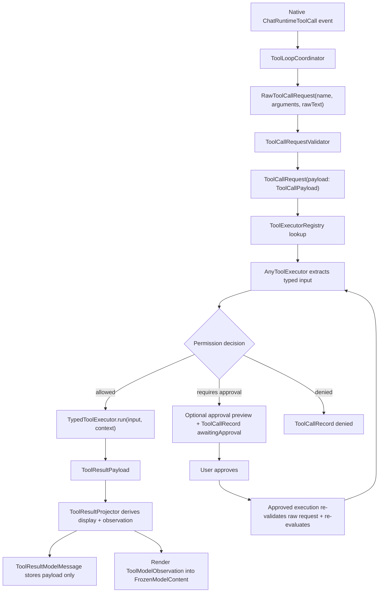

# Tool Runtime

The tool runtime is the boundary between model output and local side effects.
Tools are self-contained and type-safe: each tool owns its typed input,
definition, permission evaluation, and execution. Tools do not parse XML, JSON,
or provider-specific payloads.

## Flow



## Roles

- Native Gemma 4 tool-call events are the only supported model-facing tool
  protocol. `ToolLoopCoordinator` converts those native events into the same
  neutral `RawToolCallRequest` execution boundary used by the rest of Core.
- Native tool-call boundaries are committed to model history as canonical
  Gemma 4 boundary text generated from the tool name and sorted arguments. The
  boundary must stay stable so MLX append-only cache reuse can compare prefixes.
- Terminal follow-up prompts, such as approved write/edit follow-ups and denied
  tool follow-ups, do not expose tools to the runtime. If more work is needed,
  the model must ask the user for another turn rather than emitting more tools.
- `RawToolCallRequest` is the runtime handoff model: tool name,
  workspace/session, raw argument values, and optional raw text for debugging.
- `ToolCallRequest` is the validated execution-boundary model. It preserves the
  raw request and carries a typed `ToolCallPayload` for the built-in tool or an
  `invalid` payload with a precise reason.
- `ToolCallRequestValidator` is the only built-in boundary that decodes raw
  argument dictionaries into typed payloads. Invalid or unavailable tools become
  first-class invalid payloads before execution.
- `ToolExecutorRegistry` contains the executable tools for the active tool set
  and exposes their definitions for prompt rendering.
- `AnyToolExecutor` is the type-erased runtime boundary. It extracts the
  already-validated typed input from `ToolCallPayload`, evaluates permission,
  and runs the tool only when allowed. A `requiresApproval` decision can prepare
  a preview and becomes an awaiting-approval record without executing the tool.
  An approved execution path validates the raw request and evaluates permission
  again immediately before the side effect. Executed tools return a structured
  `ToolResultPayload`.
- `TypedToolExecutor` is what every concrete tool implements. Its `run` method
  receives a concrete Swift input type, never raw argument dictionaries, and
  returns a typed result payload rather than UI text.
- `ToolResultPayload` is the domain result boundary. Built-in tool results carry
  typed success, failure, and recovery-relevant outcomes such as
  `edit_file` old-text misses, multiple matches, invalid calls, and common path
  failures. It is the only stored truth for an executed tool result.
- `ToolResultModelMessage` stores only `callID`, `toolName`, and
  `ToolResultPayload`. It does not persist UI display output or model
  observations.
- `todo_write` is an Agent-only state tool. It updates `ChatSession.todoState`
  through workflow events instead of writing a full plan into transcript text.
  Its model observation is intentionally limited to `Plan updated.`.
- `ToolResultProjector` derives transient projections from
  `payload + ToolCallRequest + ToolResultProjectionPolicy`: `ToolDisplayPayload`
  for transcript UI and `ToolModelObservation` for model-facing context.
- `ToolDisplayPayload` may be large and rich because it is UI-only. It is never
  written to the model-facing ledger.
- `ToolModelObservation` is compact, capped, and purpose-specific. The prompt
  renderer renders it once into `FrozenModelContent`; that frozen content is the
  stable model-facing ledger artifact.
- `ChatTurn.items` is the canonical source for tool-call and tool-result turn
  membership. Code that needs reverse lookup derives `toolCallID -> turnID`
  from the transcript items instead of storing a turn pointer on
  `ToolCallRecord`.
- Tool observations are untrusted tool output, not user instructions. Missing
  turn ownership is an invalid model-projection state and should fail clearly.
- `ToolResultPreview` is limited to approval previews and derived compatibility
  summaries. It must not be persisted as the result body or used as the source
  of truth when `ToolResultPayload` is available.
- `ToolContext` carries runtime context such as the active workspace, active
  session ID, read tracker, and latest command result store.
- `ToolDefinition` describes a tool for prompts and provider adapters,
  including capability, risk, structured parameter metadata, and a
  provider-neutral function-tool schema projection. Provider-specific wire
  shapes should adapt from this model instead of becoming the core runtime
  representation.
- When `LOCAL_CODER_DEBUG_TRACE=1`, `tool_execute` `turn_trace` rows include
  compact tool-call diagnostics: `toolCallFormat`, `toolValidationStatus`,
  optional `toolValidationError`, optional `toolOriginalName`,
  `toolArgumentKeys`, and short typed `toolArguments` previews. These fields
  are for native provider and validation debugging and must stay compact; large write/edit
  payloads remain omitted from model history and should not be dumped into
  traces.

## Adding A Tool

1. Define a typed input.

   ```swift
   struct ReadFileInput: Decodable, Sendable {
     let path: String
   }
   ```

2. Implement `TypedToolExecutor`.

   ```swift
   struct ReadFileToolExecutor: TypedToolExecutor {
     static let definition = ToolDefinition.readFile

     func evaluatePermission(
       _ input: ReadFileInput,
       context: ToolContext
     ) -> ToolPermissionEvaluation {
       // Resolve and validate affected paths here.
     }

     func run(
       _ input: ReadFileInput,
       context: ToolContext
     ) async -> ToolResultPayload {
       // Execute using typed input only and return domain result semantics.
     }
   }
   ```

3. Register the tool in the appropriate registry profile.

   ```swift
   static let readOnly = ToolExecutorRegistry([
     AnyToolExecutor(ReadFileToolExecutor()),
     AnyToolExecutor(ShowFileToolExecutor()),
     AnyToolExecutor(ListFilesToolExecutor()),
     AnyToolExecutor(GlobFilesToolExecutor()),
     AnyToolExecutor(SearchFilesToolExecutor()),
     AnyToolExecutor(WorkspaceDiffToolExecutor()),
     AnyToolExecutor(WorkspaceDiagnosticsToolExecutor()),
   ])
   ```

4. Add tests for argument decoding, permission, execution, registry visibility,
   and any security-sensitive failure mode.

## Security Rules

- Tools must not parse XML, tagged text, JSON, or provider-native tool-call
  payloads themselves.
- Permission is evaluated after raw calls are validated into typed payloads and
  before execution.
- Registry membership controls prompt visibility, but it is not a complete
  security boundary.
- Tool-name repair is limited to deterministic canonicalization and exact
  aliases such as `Read` to `read_file`. Unknown names are not guessed; they
  become failed tool observations.
- Read-only tools may auto-run only after workspace/path validation.
- `read_file` returns the current UTF-8 preview on the first read of a
  workspace-relative path/range. Re-reading the same unchanged path/range
  through the same tool orchestrator returns a compact `unchanged` observation
  on the second and third reads, then a repeated-read warning from the fourth
  read onward. Changed content or a different range returns fresh content and
  updates the tracker. Direct executor calls without a tracker remain
  stateless. If the requested file is missing, `read_file` fails without
  redirecting the call and may include up to five canonical workspace-relative
  path suggestions.
- `show_file` uses the same read-only path validation and file preview shape as
  `read_file`, but it represents a different workflow state: display the file
  directly to the user and stop the current tool turn without asking the model
  to restate the file. Its UI display projection includes file content; its
  default model observation records only that the file was displayed, with
  path/range/count/truncation metadata and no body text. Do not infer this
  behavior from raw user text; trigger it only from an explicit `show_file`
  tool call.
- `glob_files` and `search_files` are read-only discovery tools. They validate
  the requested `path`, default it to `.`, skip project metadata/build
  directories, and cap returned results. `search_files` treats a valid pattern
  as a regular expression; invalid regular expressions fall back to literal
  substring matching.
- `workspace_diff` is a read-only review tool available in the Agent registry.
  It validates the optional workspace-relative `path`, then runs
  Git through `Process` argv, not shell interpolation. The first version is
  Git-only: it returns `git status --short`, `git diff --stat`, and unified
  `git diff` output for tracked changes. Untracked files are reported in status
  without dumping their contents. Output is capped and marked when truncated.
- Write tools and command tools must require explicit approval before
  execution.
- `ask_user` is available only in the Agent registry. It is a read-only control
  tool for genuinely blocking clarification, not routine confirmation and not
  side-effect approval. Its model-facing answer options are plain string
  parameters: `option1` and `option2` are required, `option3` and `option4` are
  optional. The model-facing adapter parses those fields into
  `AskUserInput.options: [String]`; validated tool payloads and persisted input
  state must not store fixed `option1`/`option2` fields. Do not expose nested
  option objects, JSON-in-string, or a free-text parameter. Executing `ask_user`
  pauses the tool loop with `awaitingUserAnswer`. When the user answers, the turn
  resumes with a compact model-facing receipt containing only the answer.
- A tool that returns `.requiresApproval` must move to
  `ToolCallStatus.awaitingApproval`. It must not be marked as denied, failed,
  completed, or executed automatically.
- Tools that can preview an approval-sensitive operation should attach that
  preview before entering `awaitingApproval`. Preview generation must not
  mutate the workspace.
- Approved execution must re-validate the raw request and re-run
  permission/path evaluation immediately before the side effect.
- `run_command` is available only in the Agent registry. It executes
  `/bin/bash -c <command>` in the active workspace root after approval. The
  approval preview and record must preserve the exact command string from the
  request. The command must never spawn before approval, and denied approval
  must append a denied result without creating a process.
- The macOS app target currently builds without App Sandbox so developer
  toolchains such as Homebrew, `uv`, Python, Git, and project package managers
  can be launched by `run_command`. The command tool still owns explicit
  approval, request revalidation, foreground-only execution, timeout handling,
  output capture, and audit state.
- `run_command` uses a required timeout that is clamped to the supported range
  before execution. It captures stdout, stderr, exit code, duration, timeout,
  cancellation, preview truncation metadata, and an `outputRef` as a structured
  `RunCommandResult`. A non-zero process exit is still a completed tool
  execution so the model can inspect output and repair; it must not become a
  controller error.
- After an actual `run_command` process is started, the full stdout/stderr is
  recorded in ephemeral latest-command state keyed by workspace, session, and
  `outputRef`. The model-facing `RunCommandResult` contains only command
  metadata plus head/tail stdout/stderr previews. Awaiting-approval or denied
  command requests must not overwrite this state.
- `workspace_diagnostics` is a read-only tool available in Inspect and Agent
  registries. It takes `outputRef`, reads the stored full command output, and
  returns generic `path:line[:column]: error|warning|note: message`
  diagnostics for paths inside the workspace. It does not run commands or
  return raw stdout/stderr.
- `web_search` and `web_fetch` are Agent-only web tools. They are provider
  independent in the model-facing API and are gated by global
  `WebAccessPolicy`: off, ask each time, or allow. The model
  must not include private source code, secrets, full logs, or local paths in
  search queries. `web_fetch` accepts only public `http` and `https` URLs,
  rejects local/private/internal targets, validates resolved host addresses
  before requests, validates final redirect URLs, rejects non-2xx HTTP
  responses, rejects binary content, caps fetched text, and marks truncation in
  the stored result payload. For HTML responses, `web_fetch` returns extracted
  main page content from the built-in extractor instead of raw page text.
  `web_search` keeps the same public-host boundary for model-provided data and
  DuckDuckGo, but the user-configured SearXNG base
  URL may point at localhost or a private network address because it is an
  explicit provider setting rather than model-supplied input. Public web
  requests also inspect `URLSessionTaskMetrics` remote addresses after the
  connection and discard responses connected to local/private addresses. This
  narrows DNS-rebinding and DNS TOCTOU exposure but does not fully pin DNS
  validation to the pre-connect endpoint because `URLSession` still opens the
  actual connection.
- `todo_write` is available only in the Agent registry. It accepts 2 to 6
  short todo items and never requires approval because it mutates only session
  state. Chat prompts must not render the todo tool or current todo plan.
  `todo_write` calls pass `items` as simple rows in `content:true|false`
  form, for example `Inspect files:false`. `true` maps to `completed`; `false`
  maps to `pending`. The typed runtime may still decode internal `[TodoItem]`
  object arrays, but model-facing prompts and schemas should present only the
  boolean row contract.
- `write_file` writes the model-provided `content` directly. The model should
  not generate helper scripts to create files. Missing-path suggestions do not
  apply to `write_file`, because creating a new file is a normal write case.
- `edit_file` replaces exactly one safe `old_text` span in a UTF-8 workspace
  file with `new_text`. It tries an exact, case-sensitive match first, then a
  small deterministic fallback pipeline for normalized line endings, trailing
  whitespace, indentation, and line-trimmed blocks. It does not support regexes,
  semantic matching, guessing between candidates, or replace-all semantics. Zero
  matches, multiple matches, non-UTF-8 files, and identical old/new text fail
  before approval; approved execution re-reads and revalidates the file before
  writing atomically. Successful non-exact edits report the match strategy for
  auditability and preserve the matched file's line-ending style. If the target
  file is missing, `edit_file` fails before approval or during approved
  revalidation and may include bounded workspace-relative path suggestions.
- `edit_file` is the only model-facing tool for changing existing files.
- Successful `write_file` and `edit_file` results are terminal for additional
  tool execution in the current chat turn. The controller may request one final
  no-tools assistant follow-up so the model can summarize the completed write,
  but any emitted tool attempt in that final response must be converted into a
  structured failure observation and must not execute.
- Denied approval-sensitive tools may also receive one final no-tools assistant
  follow-up. The denied tool result stays auditable, no side effect occurs, and
  further tool attempts in the final response are recorded as structured
  failures instead of executed.
- Tool results must report affected paths where possible so the UI can show a
  useful audit trail. Domain result payloads use canonical workspace-relative
  paths; UI renderers may decide how to display them.
- Permission evaluation keeps absolute normalized paths for audit/debugging and
  also records canonical workspace-relative paths. Model-facing observations
  should prefer the workspace-relative paths.
- Missing-path suggestions are model-facing recovery hints only. They are
  bounded, skip project metadata/build directories, and must not be applied
  automatically by the runtime.
- Tool result projections are derived. They must not be persisted or used as the
  source of truth for controller recovery decisions when `ToolResultPayload` is
  available.
- Tool results from a cancelled chat turn may remain visible for auditability,
  but the chat model context must exclude them unless that same turn is still
  actively generating its direct follow-up response.
