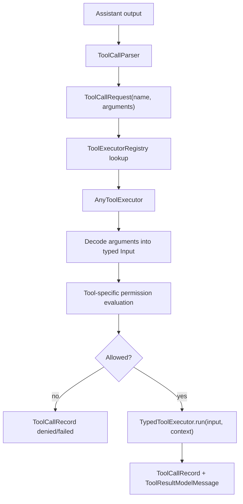

# Tool Runtime

The tool runtime is the boundary between model output and local side effects.
Tools are self-contained and type-safe: each tool owns its typed input,
definition, permission evaluation, and execution. Tools do not parse XML, JSON,
or provider-specific payloads.

## Flow



## Roles

- `ToolCallParser` understands the model-facing format, currently tagged
  action text. A future JSON or provider-native parser should still emit the
  same `ToolCallRequest`.
- `ToolCallRequest` is the neutral handoff model: tool name, workspace/session,
  and raw argument values.
- `ToolExecutorRegistry` contains the executable tools for the active tool set
  and exposes their definitions for prompt rendering.
- `AnyToolExecutor` is the type-erased runtime boundary. It validates argument
  names, decodes raw arguments into the tool's concrete input type, evaluates
  permission, and runs the tool only when allowed.
- `TypedToolExecutor` is what every concrete tool implements. Its `run` method
  receives a concrete Swift input type, never raw argument dictionaries.
- `ToolContext` carries runtime context such as the active workspace.
- `ToolDefinition` describes a tool for prompts and future provider schemas,
  including capability and risk metadata.

## Adding A Tool

1. Define a typed input.

   ```swift
   struct ReadFileInput: Decodable, Sendable {
     let path: String
   }
   ```

2. Implement `TypedToolExecutor`.

   ```swift
   struct ReadFileToolExecutor: TypedToolExecutor {
     static let definition = ToolDefinition.readFile

     func evaluatePermission(
       _ input: ReadFileInput,
       context: ToolContext
     ) -> ToolPermissionEvaluation {
       // Resolve and validate affected paths here.
     }

     func run(
       _ input: ReadFileInput,
       context: ToolContext
     ) async -> ToolResultPreview {
       // Execute using typed input only.
     }
   }
   ```

3. Register the tool in the appropriate registry profile.

   ```swift
   static let readOnly = ToolExecutorRegistry([
     AnyToolExecutor(ReadFileToolExecutor()),
     AnyToolExecutor(ListFilesToolExecutor()),
   ])
   ```

4. Add tests for argument decoding, permission, execution, registry visibility,
   and any security-sensitive failure mode.

## Security Rules

- Tools must not parse XML, tagged text, JSON, or provider-native tool-call
  payloads themselves.
- Permission is evaluated after typed decoding and before execution.
- Registry membership controls prompt visibility, but it is not a complete
  security boundary.
- Read-only tools may auto-run only after workspace/path validation.
- Write, patch, and command tools must require explicit approval before
  execution.
- Tool results must report affected paths where possible so the UI can show a
  useful audit trail.
- Tool results from a cancelled chat turn may remain visible for auditability,
  but the chat model context must exclude them unless that same turn is still
  actively generating its direct follow-up response.
